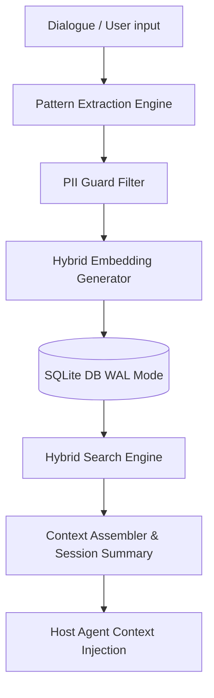

# Symaira Memory Core Architecture

This document describes the technical architecture and data pipelines inside **Symaira Memory** (`symmemory`).

---

## 💾 Core Components

### 1. SQLite WAL Storage
The database runs completely locally inside standard XDG directories:
- **Path**: `~/.local/share/symmemory/default.db`
- **Configuration**: Operates under **WAL (Write-Ahead Logging) mode** (`PRAGMA journal_mode=WAL;`). This guarantees concurrent agent read/write locks, preventing database corruption during rapid parallel agent inquiries.

### 2. Hybrid Word-Hash Vectorizer
To ensure 100% offline functionality, `symmemory` utilizes a two-layer embedding pipeline:
1. **Ollama Driver**: Automatically attempts to fetch semantic embeddings via a local Ollama daemon (`http://localhost:11434/api/embeddings` using the `nomic-embed-text` model).
2. **Local Hash Fallback**: If Ollama is inactive, a deterministic word-hash vectorizer (the "Hashing Trick" using FNV-1a hashes) distributes token signatures across a normalized 768-dimensional float32 vector in microseconds.

### 3. Pure Go Cosine Similarity Search
Since `sqlite-vec` requires dynamic C libraries and compiling CGO extensions, `symmemory` implements pure Go **Kosinus-Ähnlichkeit** over the float32 vectors. 
- Fast linear scan filters memories by directory-level project scopes.
- Cosine similarity scores are calculated in Go in microseconds.
- Results are ranked, capped, and passed to host connectors.

### 4. Extractive Dialogue Summarizer
To mitigate LLM prompt cost accumulation (quadratic context size degradation), the `summarizer` package extracts high-value sentences from dialog history (evaluating keyword density, action items, and intro/conclusion dialog weights). It provides **60-70% token reductions** while preserving core contexts.

### 5. PII Guard & Security Middleware
A regular-expression regex security pipeline catches, sanitizes, and redacts credit cards, email addresses, and API credentials (such as OpenAI keys, Google keys, or GitHub tokens) before they are persistently recorded in local SQLite states.

---

## 🔒 Scoping Boundaries

Scoping isolates memories across boundaries:
- **Global**: System-wide facts.
- **Project**: Associated with the active folder directory detected by parents of CWD containing `.git` or `.symmemory.toml`.
- **Agent**: Enforced via authorization configurations.
- **User**: User preference boundaries.
- **Session**: Volatile context entries.
