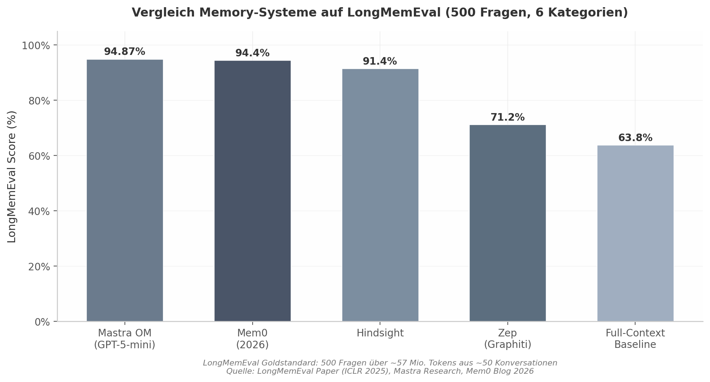
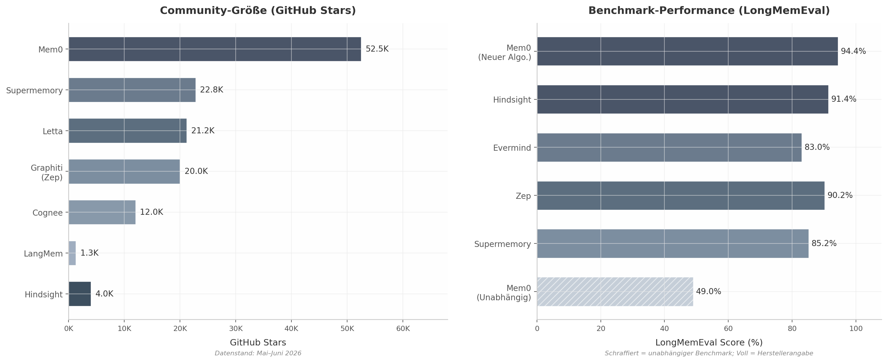
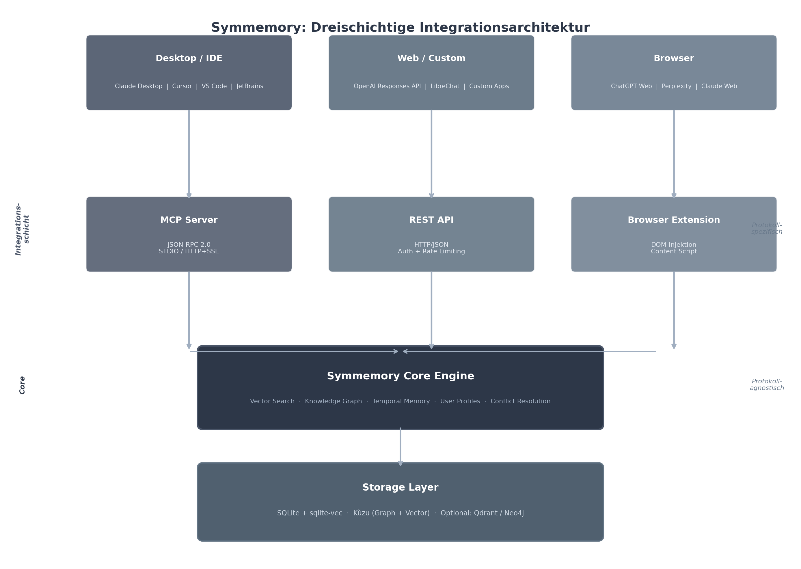
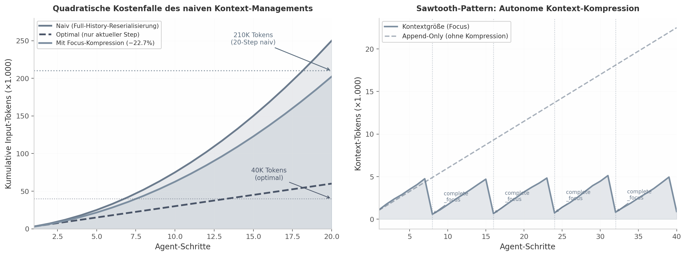
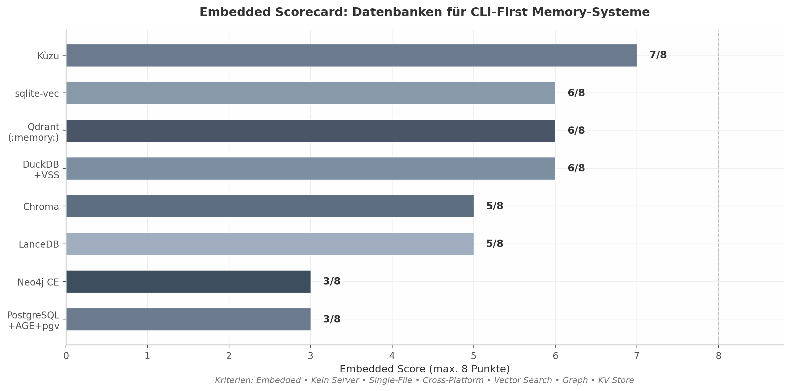
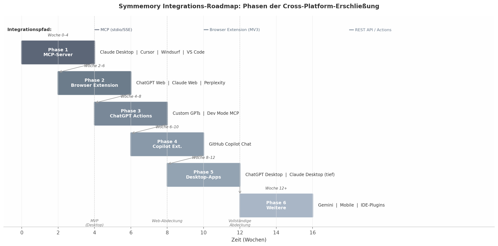
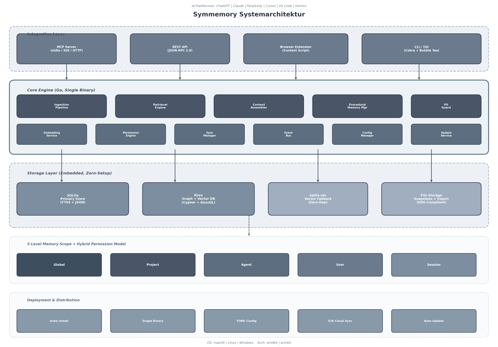
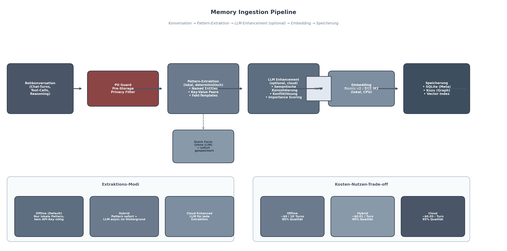

# Symmemory: Recherche und Architekturvorschlag fuer ein universelles AI-Agent Memory-System

**Autor:** Daniel Justus / Symaira Research

**Datum:** Juni 2026

---

## Executive Summary

### Symmemory: Ein universelles AI-Agent-Memory-System

Die AI-Memory-Landschaft hat sich zwischen 2024 und 2026 von einer akademischen Nische zu einem eigenen Marktsegment mit mehr als einem Dutzend aktiver Projekte entwickelt — doch ein kritisches Segment bleibt unversorgt. Die systematische Analyse von neun führenden Tools (Mem0, Zep/Graphiti, Letta, LangMem, Cognee, Hindsight, Supermemory, Evermind.ai und MemoryPlugin) offenbart eine strukturelle Fragmentierung: Schwere, managed Enterprise-Plattformen wie Mem0 (48–57K GitHub Stars, $24M Series A [^107^]) und Zep (bi-temporal Knowledge Graph [^45^]) erfordern Docker-Compose-Deployments mit PostgreSQL und Neo4j, die für Einzelnutzer prohibitiv komplex sind. Mem0s Preissprung von $19 auf $249 pro Monat — ein Faktor von 13 [^108^] — schließt zudem Power-User und kleine Teams vom vollständigen Funktionsumfang aus. Leichte SDKs wie LangMem bieten framework-spezifische Integration ohne Cross-Platform-Fähigkeit; die enge Kopplung an LangGraph macht das Tool für Teams ohne entsprechendes Investment unbrauchbar [^48^]. Konsumentenprodukte wie MemoryPlugin demonstrieren zwar die Nachfrage nach universeller Plattformabdeckung ($60/Jahr, ~3.800 zahlende Nutzer über 19 Plattformen [^17^]), sind aber proprietär und nicht self-hosted. Kein existierendes Tool bietet gleichzeitig universelle Cross-Platform-Synchronisation, Self-Hosting ohne komplexe Infrastruktur und token-effiziente, CLI-nahe Bedienung — die Konsequenz ist, dass 87% der Nutzer, die täglich zwischen mindestens zwei AI-Plattformen wechseln [^96^], ohne portables Memory arbeiten.

Der vorliegende Bericht schlägt mit **Symmemory** ein universelles AI-Memory-System vor, positioniert als „1Password für AI Memory" — universal, self-hosted und CLI-first. Die Architektur basiert auf vier konstituierenden Säulen.

**Erste Säule: Dreischichtige Integrationsarchitektur.** Die Analyse zeigt, dass kein einzelnes Integrationsprotokoll alle Nutzungsszenarien abdeckt. Das Model Context Protocol (MCP), seit Dezember 2025 unter der Linux Foundation mit 97M+ monatlichen SDK-Downloads [^227^], exzelliert für Desktop-Clients und IDEs (Claude Desktop, Cursor, VS Code), erreicht aber Web-basierte Chats wie ChatGPT Web und Perplexity nicht [^96^] [^98^]. Eine rein MCP-basierte Architektur würde schätzungsweise 60% der Nutzer ausschließen. Symmemory implementiert daher drei parallele Schichten: MCP (stdio/SSE/Streamable HTTP) für Desktop und IDE, REST API für Web-Integrationen und Custom Applications, sowie eine Browser Extension mit DOM-Injektion für Web-Chats ohne API-Unterstützung [^11^] [^156^]. Alle Schichten konvergieren in einer protokollagnostischen Core Engine.

**Zweite Säule: Fünfstufige progressive Memory-Hierarchie.** Die Kombination aktueller Forschungsergebnisse — Active Context Compression (22,7% Token-Einsparung [^10^]), LLMLingua (bis 20x Kompression [^268^]) und Stanford Generative Agents (Recency×Importance×Relevance Scoring [^301^]) — ermöglicht eine kaskadierte Architektur mit 90–95% Input-Token-Reduktion bei vollständiger Informationserhaltung. Die fünf Schichten umfassen: Layer 0 (Prompt-Kompression via LLMLingua-2), Layer 1 (Working Context mit 5–10 Turns), Layer 2 (Session Summary mit Sawtooth-Pattern), Layer 3 (Semantic Memory mit on-demand Retrieval) und Layer 4 (Archival Storage). Die kumulative Wirkung ist multiplikativ: Layer 0 reduziert statische Tokens um 50–80%, Layer 1–2 verhindern die quadratische Kostenakkumulation des Append-Only-Modus (210K kumulative Tokens bei 20 Steps vs. 40K im optimalen Fall [^330^]), und Layer 3 reduziert die zu ladende Historie um 80–90% durch Fakt- statt Chat-First-Speicherung [^145^] [^274^]. Ein nutzer-konfigurierbares Token-Budget steuert die automatische Schicht-Auswahl [^300^] [^302^].

**Dritte Säule: Go-basierte Single-Binary-Architektur.** Die technische Grundlage ist eine in Go implementierte Single Binary (<50 MB), die ohne externe Abhängigkeiten auskommt. Die Speicherschicht kombiniert SQLite (~600 KB Footprint, ACID-konform [^428^]) für strukturierte Daten und Kùzu (eingebettete Graph-Datenbank mit HNSW Vector Index [^338^]) für Entity-Relationships und semantische Embeddings. Dieser Stack eliminiert die Infrastrukturkomplexität existierender Lösungen (Mem0: drei Docker-Container, ~4 GB RAM [^572^]) und ermöglicht eine „Download-and-Run"-Erfahrung vergleichbar mit `brew install symmemory`.

**Vierte Säule: Fünf-Level-Governance mit hybridem Permission-Modell.** Das Memory-Scope-System definiert fünf hierarchische Ebenen — Global, Project, Agent, User, Session — wobei spezifischere Scopes allgemeinere überschreiben [^519^] [^526^]. Das dreischichtige Permission-Modell kombiniert RBAC für Rollenzuordnung, ABAC für kontextsensitive Entscheidungen und Capabilities für granularen Ressourcenzugriff. Eine integrierte PII Detection Pipeline mit lokalem Token-Classification-Modell [^532^] [^533^] und AES-256-GCM-Verschlüsselung gewährleistet Privacy-by-Design.

Die Kernkomponenten der Engine umfassen eine Memory Ingestion Pipeline mit zweistufiger Extraktion (Pattern-basiert lokal als Default, optionaler LLM-Enhancement), eine Retrieval Engine mit Hybrid Search (Vector + BM25 + Graph + Temporal) und Cross-Encoder Re-Ranking, einen Context Assembler mit Token-Budget-Steuerung, einen PII Guard sowie ein Procedural Memory für gelernte Verhaltensregeln. LangMem ist das einzige untersuchte Tool, das vergleichbares Procedural Memory implementiert [^25^] — die Integration als universelles, offenes Feature stellt einen differenzierenden Wettbewerbsvorteil dar. Die modulare Architektur erlaubt zudem das Deaktivieren einzelner Stages für ressourcenbeschränkte Umgebungen: auf einem Raspberry Pi kann der Cross-Encoder Re-Ranking entfallen, während Vector + BM25-Fusion weiterhin funktioniert.

Die Roadmap ist in drei Phasen gegliedert: **MVP** (Wochen 0–6) liefert lokale SQLite-Storage, CLI mit Cobra [^424^], MCP-Server für Claude Desktop/Cursor und pattern-basierte Fakt-Extraktion — mit einem Ziel von <60 Sekunden Setup-Zeit und >80% Token-Reduktion. **Erweiterung** (Wochen 6–14) fügt Browser Extension für ChatGPT Web, Claude Web und Perplexity, optionalen LLM-Enhancement sowie das fünf-stufige Permission-System hinzu. **Skalierung** (ab Monat 4) adressiert CRDT-basierte Multi-Device-Synchronisation mit Automerge und E2E-Verschlüsselung [^721^], REST API für Drittintegrationen (Custom GPT Actions, Zapier, Obsidian) und erweiterte Graph-Beziehungen via Kùzu.

Der strategische Erfolgsfaktor liegt in der sequenziellen Abdeckung einer bisher unbesetzten Marktlücke: ein schlankes, universelles Memory-System für Power-User und Entwickler, das das Mittelfeld zwischen schweren Enterprise-Plattformen und leichtgewichtigen Framework-SDKs besetzt — mit „One Memory, Every AI" als konstituierender Vision.


---

## 1. Stand der Technik: AI-Agent Memory-Systeme

Die Entwicklung von Memory-Systemen für AI-Agenten hat sich in den Jahren 2024 bis 2026 von einem akademischen Nischenforschungsgebiet zu einem zentralen Architekturbaustein entwickelt. Was mit einfachen Konversationshistorien begann, hat sich zu ausgefeilten hierarchischen Speichersystemen verändert, die direkt auf kognitionswissenschaftlichen Modellen des menschlichen Gedächtnisses fußen. Dieses Kapitel legt die wissenschaftlichen Grundlagen, analysiert die dominanten Architekturmuster und etabliert die Bewertungskriterien, an denen sich die Konzeption eines universellen Memory-Systems wie Symmemory zu messen hat.

### 1.1 Cognitive-Science-Grundlagen von AI Memory

#### 1.1.1 Das CoALA Framework und die vier Memory-Typen

Die Taxonomie der AI-Agent-Memory basiert auf einer direkten Übertragung kognitionswissenschaftlicher Einteilungen menschlicher Gedächtnissysteme auf technische Architekturen. Das CoALA Framework (*Cognitive Architectures for Language Agents*) der Princeton University formalisierte diese Taxonomie 2023 für LLM-basierte Agenten und definiert vier fundamentale Memory-Typen: *Working Memory* (Arbeitsgedächtnis als kurzfristiger Kontext), *Episodic Memory* (episodisches Gedächtnis für Erfahrungen), *Semantic Memory* (semantisches Gedächtnis für Fakten und Wissen) sowie *Procedural Memory* (prozedurales Gedächtnis für Fähigkeiten und Verhaltensregeln) [^123^]. Diese Einteilung wurde rasch zum de-facto-Standard der Branche und wird heute von IBM, MongoDB, LangChain, Letta und Mem0 als Referenzarchitektur verwendet [^74^].

Die kognitionswissenschaftlichen Wurzeln reichen fünf Jahrzehnte zurück. Endel Tulvings 1972 vorgestellte Unterscheidung zwischen episodischem und semantischem Gedächtnis lieferte den theoretischen Rahmen für die Differenzierung zeitverankerter Ereignisse gegenüber faktenbasiertem Wissen [^74^]. Larry Squire ergänzte 1987 das prozedurale Gedächtnis als eigenständige Kategorie für implizite Fähigkeiten und Routinen [^74^]. Baddeley und Hitch hatten bereits 1974 das Arbeitsgedächtnis als begrenztes System aktiver Informationshaltung formalisiert [^74^]. Die Übersetzung dieser drei Säulen der Gedächtnisforschung in eine kohärente Agent-Architektur durch das CoALA-Paper 2023 gab dem Forschungsfeld eine gemeinsame Sprache, die seither weitgehend akzeptiert ist.

| Memory-Typ | Cognitive-Science-Urheber | Jahr | AI-Entsprechung | Speicherort |
|------------|---------------------------|------|-----------------|-------------|
| Working Memory | Baddeley & Hitch | 1974 | Context Window, aktive Session | Im LLM-Kontext [^74^] |
| Episodic Memory | Endel Tulving | 1972 | Ereignisspeicher mit Zeitstempel | Vector DB, Message Log [^71^] |
| Semantic Memory | Endel Tulving | 1972 | Faktenspeicher, Konzepte, Präferenzen | Vector DB, Knowledge Graph [^76^] |
| Procedural Memory | Larry Squire | 1987 | Verhaltensregeln, Tool-Definitionen | System Prompts, Tool-Schemas [^79^] |

Die Tabelle zeigt die systematische Abbildung menschlicher Gedächtniskategorien auf technische Speichersysteme. Das *Working Memory* — alles, was sich aktuell im Context Window des LLM befindet — ist die einzige Memory-Form, die das Modell bei jedem Inference-Call direkt verarbeitet [^74^]. System Prompt, aktuelle Nachrichten, Tool-Outputs und abgerufene Memories müssen in diesen begrenzten Raum passen; alle anderen Memory-Typen müssen explizit abgerufen und injiziert werden. Die Größe des Working Memory ist durch die Context-Window-Limits des jeweiligen Modells fundamental beschränkt — typischerweise 128K bis 2M Tokens bei aktuellen Modellen, praktisch jedoch deutlich weniger pro Inference-Call aus Kostengründen.

Episodic Memory speichert zeitlich verankerte Ereignisse: *was passiert ist und wann* [^71^]. Dies umfasst vergangene Interaktionen, ihre Sequenz und ihre Ergebnisse. Ein Agent mit robustem episodischem Gedächtnis weiß nicht nur, was ein Nutzer bevorzugt, sondern auch, was bereits versucht wurde, was funktioniert hat und was nicht, sowie welche Zusagen in früheren Gesprächen getroffen wurden [^71^]. Für Aufgaben, die Kontinuität über lange Zeiträume erfordern — Multi-Step-Workflows, wiederkehrende Prozesse oder langfristige Projekte — ist dies der entscheidende Memory-Typ.

Semantic Memory speichert Fakten, Konzepte und Präferenzen unabhängig von deren zeitlichem Kontext [^76^]. Ein semantischer Fakt könnte lauten: "Der Nutzer bevorzugt vegetarische Mahlzeiten" oder "Der Nutzer arbeitet mit Python 3.12 und Type-Annotations" [^76^]. Diese Form des Gedächtnisses bildet die Grundlage der Personalisierung und wird typischerweise in Vector-Datenbanken oder Knowledge Graphen persistiert. Procedural Memory wiederum umfasst Verhaltensregeln, Fähigkeiten und Routinen — das *Wie* des Handelns [^79^]. Es ist die am wenigsten diskutierte, aber am weitreichendsten einflussreiche Memory-Form: sie bestimmt alles, was der Agent tut, lebt jedoch typischerweise implizit in System Prompts, Tool-Definitions und den Gewichten des LLM selbst [^79^].

#### 1.1.2 Erweiterte Taxonomien und jüngere Forschung

Jüngere Arbeiten erweitern die vier Grundtypen um zusätzliche Kategorien, die insbesondere für Enterprise-Szenarien relevant sind. Atlan führte 2026 ein *Organizational Context Memory* als fünften Typ ein, das Governance-Daten, Zertifizierungsstatus, Datennachverfolgung und Zugriffsrichtlinien umfasst — notwendig für Agenten, die auf Live-Unternehmensdaten operieren [^74^]. Der umfassende *Agentic Memory Survey* vom Dezember 2025 dekomponiert Memory entlang dreier orthogonaler Dimensionen: *Forms* (token-level, parametric, latent als drei dominante Realisierungsformen), *Functions* (factual, experiential, working memory als feingranulare Zweck-Taxonomie) und *Dynamics* (wie Memory gebildet, entwickelt und abgerufen wird über seine Lebenszeit) [^72^]. Die Form-Dimension unterscheidet, ob Memory als explizite Tokens im Kontextfenster, als gelernte Parameter im Modellgewicht oder als latente Repräsentation in Hidden States vorliegt — eine Unterscheidung mit direkten Konsequenzen für Retrieval-Geschwindigkeit und Mutierbarkeit. Die Dynamics-Dimension analysiert den vollständigen Lebenszyklus von der Formation über die Evolution bis zum Abruf. Diese erweiterte Perspektive verdeutlicht die zunehmende Fragmentierung des Feldes und die Notwendigkeit einer vereinheitlichten Taxonomie — ein Defizit, das die Entwicklung interoperabler Memory-Systeme erschwert und das Symmemory als integrativer Ansatz adressieren könnte.

### 1.2 Hierarchische Memory-Architekturen

Die praktische Umsetzung der kognitionswissenschaftlichen Taxonomie in technische Systeme hat zu einer Reihe hierarchischer Architekturen geführt, die sich an unterschiedlichen Vorbildern orientieren. Drei dominante Muster lassen sich identifizieren: Betriebssystem-inspirierte Tier-Architekturen, kontextuelle Compaction-Pipelines und zyklische Read-Write-Loops.

#### 1.2.1 Letta: OS-inspirierte 3-Tier-Architektur

Letta (ehemals MemGPT), entstanden aus der Forschung an der UC Berkeley, implementiert eine selbst-editierende Memory-Architektur, die an das virtuelle Memory-Management von Betriebssystemen angelehnt ist [^80^]. Das System organisiert den Speicher in drei Tiers: *Core Memory* (immer im Context Window des Agenten, editierbar), *Archival Memory* (Langzeit-Vektor-Datenbank für semantische Suche) und *Recall Memory* (vollständige Konversationshistorie mit Datums- und Textsuche) [^27^] [^85^] [^88^]. Der entscheidende architektonische Durchbruch liegt in der Autonomie des Agenten: dieser entscheidet selbstständig via Tool-Calls wie `core_memory_append`, `archival_memory_insert` und `conversation_search`, wann Informationen zwischen den Ebenen transferiert werden [^85^]. Diese *self-editing memory* verwandelt den Agenten von einem passiven Konsumenten vorgefilterter Kontexte in einen aktiven Kurator seines eigenen Gedächtnisses. Tim Kellogg beschreibt Lettas Hierarchie als *Rate-Distortion-Leiter*: Core Memory hat minimale Rate (wenige Tokens) bei null Distortion für kritische Fakten; der Message Buffer hat größere Rate (voller Dialog) aber begrenzte Kapazität; Archival Memory hat effektiv unendliche Kapazität bei hoher Distortion, da alles in Embeddings und Summaries komprimiert ist [^397^].

#### 1.2.2 Mem0, Zep und Mastra: Alternative Architekturmuster

Mem0 implementiert eine hierarchische Memory-Struktur über User-, Session- und Agent-Levels mit hybridem Vector- und Graph-Retrieval [^3^] [^68^]. Das System kombiniert semantische Suche mit Beziehungsmodellierung und erreichte auf LongMemEval 94,4% mit nur etwa 6{,}787 Tokens pro Query — eine Verbesserung von +27 Punkten gegenüber dem vorherigen Algorithmus, mit besonders starken Gewinnen bei temporalen Queries (+29,6) und Multi-Hop-Reasoning (+23,1) [^37^] [^127^].

Zep (basierend auf Graphiti) verwendet einen temporalen Knowledge Graph mit bi-temporalem Datenmodell (Event Time und Ingestion Time), das Fakten mit Gültigkeitsfenstern speichert [^45^] [^84^] [^89^]. Wenn ein neuer Fakt einen bestehenden widerspricht, wird der alte als *superseded* markiert, aber nicht gelöscht — eine Form temporaler Invalidation, die als ausgefeiltester Konsolidierungsmechanismus aktueller Frameworks gilt [^105^]. Zep erreichte auf LongMemEval 71,2% bei nur 1,6K Kontext-Tokens und 2,58s Median-Latenz, was einer Reduktion um 90% gegenüber Full-Context (115K Tokens, 28,9s) entspricht [^136^].

Mastra verfolgt einen radikal vereinfachten Ansatz: zwei Background-Agenten (Observer und Reflector) komprimieren Konversationen in einen dichten, datierten Observation-Log — ohne Vector-Datenbank oder Knowledge Graph [^114^] [^115^] [^116^]. Der Observer komprimiert bei einem 30K-Token-Threshold, der Reflector kondensiert bei 40K Tokens weiter, unter Verwendung einer Emoji-Priorisierung (🔴 wichtig, 🟡 vielleicht wichtig, 🟢 nur Kontext) [^117^] [^122^]. Mastra erreichte 94,87% auf LongMemEval mit GPT-5-mini — den höchsten je gemessenen Wert — bei nur etwa 30K durchschnittlicher Context-Window-Größe und 5-40x Komprimierung [^122^].

#### 1.2.3 Claude Code: 5-Layer Compaction und Context Assembly

Claude Code implementiert die ausgefeilteste Context-Assembly-Pipeline aktueller Produktionssysteme. Der Context Window wird aus neun Quellen assembliert: System Prompt, Environment Information, CLAUDE.md-Hierarchie (vier Ebenen), Pfad-spezifische Regeln, Auto Memory, Tool-Metadata, Konversationshistorie, Tool-Ergebnisse und kompakte Summaries [^155^] [^380^]. Die CLAUDE.md-Hierarchie selbst ist vierstufig angelegt: Managed Memory auf OS-Ebene (`/etc/claude-code/CLAUDE.md`), User Memory (`~/.claude/CLAUDE.md`), Project Memory (`CLAUDE.md` bzw. `.claude/CLAUDE.md`) und Local Memory (`CLAUDE.local.md`, git-ignored) [^380^].

Um Context Overflow zu verhindern, operiert eine 5-Layer Compaction Pipeline: pre-compact hooks, GrowthBook Feature Flags, eigentliche Compaction (Summary Generation), Attachment Builders (State Re-Announcement) und Boundary Marker mit preserved-segment Metadata [^155^]. Das Design ist überwiegend append-only — zuvor geschriebene Transkript-Linien werden nie modifiziert, nur neue Summary-Events angehängt. Diese Architektur ermöglicht cache-aware Kontextmanagement, bei dem frühere Kontextteile im KV-Cache des Modells verbleiben und nicht neu berechnet werden müssen.

| Architektur | Memory-Tiers | Konsolidierungsmechanismus | Automatisierung | Besonderheit |
|-------------|-------------|---------------------------|-----------------|--------------|
| Letta | Core / Archival / Recall | Agent-directed via Tool-Calls | Nur wenn Agent entscheidet | Selbst-editierende Agenten [^80^] |
| Mem0 | User / Session / Agent | Deduplication (ADD/UPDATE/DELETE) | Automatisch bei Schreiben | Hybrid Vector + Graph [^3^] |
| Zep (Graphiti) | Episode / Semantic / Community | Temporale Invalidation | Automatisch bei Konflikt | Bi-temporales Datenmodell [^45^] |
| Mastra OM | Observation Log (1 Tier) | Reflector Agent | Asynchron bei Threshold | Keine Vector DB [^116^] |
| Claude Code | 9 Source-Layer + 4-Level CLAUDE.md | 5-Layer Compaction | Automatisch bei Context-Limit | Cache-aware, append-only [^155^] |

Die Tabelle vergleicht fünf dominante Architekturmuster nach ihren Speicherebenen, Konsolidierungsstrategien und Automatisierungsgrad. Ein gemeinsames Muster lässt sich extrahieren: alle Systeme implementieren eine Form progressiver Kompression, bei der Information von einer schnellen, nah am Modell liegenden Ebene in tiefere, kapazitivere aber langsamer zugängliche Ebenen wandert. Der Unterschied liegt in der Steuerung — Letta delegiert die Entscheidung an den Agenten, Mem0 und Zep automatisieren sie, Mastra vereinfacht sie radikal, und Claude Code optimiert sie für Caching-Effizienz.

#### 1.2.4 Der Read-Write-Loop als formale Grundlage

Unabhängig von der konkreten Architektur lassen sich alle Agent-Memory-Systeme durch einen kontinuierlichen Zyklus charakterisieren: Memory lesen → Verarbeiten → Handeln → Beobachten → Memory schreiben. Dieser *Write-Manage-Read Loop* wurde 2026 formal als POMDP-Style Agent Cycle spezifiziert: a_t = π_θ(x_t, R(M_t, x_t), g_t) und M_{t+1} = U(M_t, x_t, a_t, o_t, r_t), wobei π_θ die Policy, R die Lesefunktion, U die Schreib-/Verwaltungsfunktion, g_t aktive Ziele, o_t Environment-Feedback und r_t ein reward-ähnliches Signal repräsentieren [^70^]. Der Manage-Schritt — Umfassend Pruning, Compression, Consolidation, Deduplication und Konfliktlösung — ist der am meisten vernachlässigte in der Praxis: die meisten Systeme implementieren Write und Read, aber nicht Manage, was zu Noise, Contradictions und bloated context führt [^75^].

Der ReAct-Zyklus (*Reasoning + Acting*), 2022 von Yao et al. (Princeton und Google) vorgestellt, bildet das de-facto-Standard-Pattern für diese Architekturen: alternierendes Reasoning (Thought) und Acting (Action), mit Observation als Feedback [^391^] [^392^]. In diesem Rahmen lässt sich Memory als integraler Bestandteil jedes Schritts verstehen: Perceive (Kontext laden aus Working Memory und abgerufenem Long-term Memory), Reason (LLM verarbeitet Kontext), Act (Tool-Call ausführen), Observe (Ergebnis in Memory schreiben) und Manage (Memory komprimieren und konsolidieren) [^393^] [^394^]. Die Verwaltungskomponente U ist dabei kein primitives Append — sie umfasst Summary-Generation, Deduplication, Scoring, Konfliktlösung und selektives Löschen [^70^]. Gerade dieser Manage-Schritt trennt produktionsreife Systeme von Prototypen: während nahezu alle Frameworks das Schreiben und Lesen von Memory implementieren, scheitert die Mehrzahl an der aktiven Kuratierung des gespeicherten Wissens, was zu inkohärenten Kontexten und wachsendem Noise führt.

### 1.3 Context Assembly und Progressive Summarization

Die effiziente Zusammenstellung des Context Windows ist ein kritischer Engineering-Schritt, der die Performance eines Agenten maßgeblich beeinflusst. Dieser Abschnitt behandelt Kompressionsmodelle, virtuelles Memory-Management und Bewertungsfunktionen für Memory-Retrieval.

#### 1.3.1 Tiago Fortes Layered Compression als menschliches Vorbild

Die intellektuelle Grundlage für Agent-Memory-Kompression stammt aus dem Bereich Personal Knowledge Management. Tiago Fortes *Progressive Summarization* (2017) beschreibt einen mehrstufigen Destillationsprozess: beim ersten Lesen werden die wichtigsten Sätze hervorgehoben, beim zweiten Lesen die wichtigsten Highlights fett markiert, beim dritten Lesen eine Zusammenfassung der markierten Sätze als Bullet Points verfasst [^86^]. Jede Ebene destilliert die vorherige weiter, akzeptiert Informationsverlust zugunsten der Erhaltung dessen, was am relevantesten ist. Dieses Modell der *Layered Compression* findet sich in modernen Agent-Systemen direkt wieder: Mastra implementiert es mit Observer/Reflector-Agenten [^116^], Claude Code mit seiner 5-Layer Compaction [^155^], und MemGPT mit explizitem Paging zwischen Kontextebenen [^86^] [^397^].

#### 1.3.2 MemGPTs virtuelles Memory-Management

MemGPT brachte Progressive Summarization als Erstes formal in den LLM-Agent-Kontext. Die Architektur behandelt das Context Window als *Main Memory* und externen Storage als *Disk* [^86^] [^397^]. Wenn Main Memory voll wird, fasst der Agent Inhalte zusammen, bevor er sie archiviert — eine explizite Kompressionsstufe vor dem Paging. Funktionsaufrufe dienen als "Interrupts" für Datentransfer zwischen den Tiers; der LLM entscheidet selbstständig, wann Daten in den Working Context geladen oder in den External Storage ausgelagert werden sollen [^284^] [^296^]. Diese OS-inspirierte Virtualisierung war der erste systematische Versuch, die Lücke zwischen begrenztem Kontextfenster und unendlichem Speicherbedarf zu schließen. Das Konzept der expliziten Kompressionsstufe vor dem Paging — Inhalte werden zusammengefasst, bevor sie archiviert werden — unterscheidet MemGPT grundlegend von späteren Systemen, die Kompression entweder dem Agenten überlassen (Letta) oder vollständig automatisieren (Mastra).

#### 1.3.3 Stanford Generative Agents: Recency × Importance × Relevance

Stanfords *Generative Agents* (Park et al., 2023) demonstrierten ein fundamentales Scoring-Modell für Memory-Retrieval, das in abgewandelter Form in nahezu allen modernen Systemen wiederzufinden ist [^86^] [^120^]. Der Retrieval-Score berechnet sich als gewichtete Kombination dreier Dimensionen: *Recency* (Aktualität, mit exponentiellem Decay), *Importance* (von einem LLM bei Speicherzeit zugewiesener numerischer Wert zwischen 0 und 1) und *Relevance* (semantische Ähnlichkeit via Embedding-Cosine-Similarity zur aktuellen Query) [^301^] [^281^]. Das ursprüngliche Modell verwendete einen Decay-Faktor von 0,995 pro Zeiteinheit, wobei Agenten ohne Importance Weighting flaches, generisches Verhalten produzierten, während Agents mit diesem Scoring menschenähnlicher agierten — sie erinnerten sich, was wichtig war, und vergaßen, was unwichtig war [^281^].

Mem0 erweitert dieses dreidimensionale Modell um *custom criteria*: Entwickler definieren Kriterien mit Name, Beschreibung und Gewichtung (beispielsweise "Freundlichkeit", "Dringlichkeit", "Empathie"), gegen die jede abgerufene Memory bewertet wird [^279^]. Dies ermöglicht kontextuelles Importance-Scoring über reine semantische Ähnlichkeit hinaus. Die optimalen Gewichtungsprofile variieren nach Agent-Typ: Conversational Agents priorisieren Recency, Knowledge Agents Relevance, Alert/Monitoring-Systeme Recency und Importance gleichermaßen, und Research Agents semantische Verwandtschaft [^301^].

### 1.4 Benchmarks und Evaluationsmethoden

Die Bewertung von Memory-Systemen erfordert spezialisierte Benchmarks, die über generische LLM-Evaluationsmetriken hinausgehen. Drei Benchmarks definieren aktuell den Stand der Technik, jede mit unterschiedlichem Fokus auf Skalierung, Interaktivität und Realismus.

#### 1.4.1 LongMemEval: Der Goldstandard für Fakt-Retrieval

LongMemEval (ICLR 2025) evaluiert fünf Kernfähigkeiten über 500 Fragen in sechs Kategorien: Single-Session User/Assistant/Preference Recall, Knowledge Update, Temporal Reasoning und Multi-Session Recall [^125^] [^129^]. Der Benchmark testet über etwa 57 Millionen Tokens aus circa 50 Konversationen und unterscheidet zwei Skalierungsstufen: LongMemEval-S (etwa 115K Tokens, circa 50 Sessions) und LongMemEval-M (etwa 1,5M Tokens, circa 500 Sessions) [^125^]. LongMemEval ist derzeit der am weitesten verbreitete Benchmark für Memory-Systeme, da er sowohl temporale als auch knowledge-update-Szenarien abdeckt, die für praktische Agent-Deployment essentiell sind.



Das Diagramm zeigt die Scores führender Memory-Systeme auf LongMemEval. Mastra Observational Memory erreichte mit 94,87% den höchsten je gemessenen Wert [^122^], gefolgt von Mem0 mit 94,4% [^37^] und Hindsight mit 91,4%. Zep (Graphiti) erzielte 71,2% bei deutlich niedrigerem Token-Verbrauch [^136^], während der Full-Context-Baseline lediglich 63,8% erreichte. Die Differenz zwischen spezialisierten Memory-Systemen und naivem Full-Context beträgt damit über 30 Prozentpunkte — ein quantitativer Beweis für die Notwendigkeit ausgefeilter Memory-Architekturen.

#### 1.4.2 MemoryArena: Agentische Evaluation

MemoryArena (ICML 2026) geht über reine Recall-Tests hinaus und evaluiert Memory in einem *Memory-Agent-Environment Loop* — mit 766 Tasks über vier Domains (Web Shopping, Travel Planning, Web Search, Formal Reasoning) [^257^] [^258^]. Die zentrale Erkenntnis: Agenten mit nahezu saturierter Performance auf statischen Benchmarks wie LoCoMo schneiden in der agentischen Umgebung schlecht ab [^257^]. Diese Lücke zwischen statischen Recall-Tests und agentischer Deployment-Realität ist signifikant: sie legt nahe, dass viele optimierte Memory-Systeme für kontrollierte Benchmarkbedingungen überfittingen, ohne die dynamischen Anforderungen echtzeitfähiger Agent-Loops zu erfüllen. MemoryArena deckt damit eine kritische Evaluationslücke, die für die Praxisrelevanz von Memory-Architekturen entscheidend ist.

#### 1.4.3 Extreme-Long-Context Benchmarks: LoCoMo und BEAM

LoCoMo (*Long Context and Multi-hop Question Answering*) evaluiert über 1{,}540 Fragen in fünf Kategorien auf Konversationskontexten von etwa 7K Tokens, mit Fokus auf Single- und Multi-Hop-Reasoning sowie temporale Fragen [^346^]. BEAM (*Benchmark for Extremely long-context Agent Memory*) operiert auf einer völlig anderen Skalenebene: 1M bis 10M Tokens, mit zehn Kategorien in produktionsnahen Szenarien [^37^]. Die Skalierungsdifferenz zwischen diesen Benchmarks ist beachtlich: während LoCoMo konversationsnahe Kontexte testet, simuliert BEAM die Extreme-Long-Context-Szenarien, die bei persistenten Agenten über Wochen und Monate entstehen. Mem0 erreichte auf BEAM (1M) 64,1% und auf BEAM (10M) 48,6%, jeweils mit unter 7{,}000 Tokens pro Query [^37^] — ein Indikator dafür, dass selbst optimierte Systeme bei extremen Kontextlängen an Grenzen stoßen.

| Benchmark | Fragen | Domains | Skalierung | Besonderheit | Referenz |
|-----------|--------|---------|------------|--------------|----------|
| LoCoMo | 1{,}540 | Conversational QA | ~7K Tokens | Single/Multi-Hop, Temporal | [^346^] |
| LongMemEval | 500 | Chat Assistant | 115K–1,5M Tokens | Knowledge Update, Abstention | [^125^] |
| BEAM | ~300 | Production Scale | 1M–10M Tokens | 10 Kategorien, extrem groß | [^37^] |
| MemoryArena | 766 | Agent Tasks | ~40K–122K Tokens | Memory-Agent-Environment Loop | [^257^] |

Die Tabelle systematisiert die vier führenden Benchmarks für Agent-Memory-Evaluation. Kein einzelner Benchmark deckt alle relevanten Dimensionen ab: LongMemEval etablierte sich als Goldstandard für Fakt-Retrieval über lange Zeiträume, MemoryArena als erster agentischer Evaluationsrahmen, LoCoMo für konversationsnahe Reasoning-Aufgaben und BEAM für Extreme-Long-Context-Szenarien. Für die Entwicklung eines universellen Memory-Systems wie Symmemory impliziert dies, dass eine Kombination mehrerer Benchmarks notwendig ist, um die Leistungsfähigkeit über das gesamte Spektrum von Kurzzeit- bis Langzeitkontexten zu verifizieren. Die Abwesenheit eines Benchmarks, der spezifisch Cross-Platform-Kontinuität, Multi-Agent-Isolation oder Token-Effizienz über lange Zeiträume misst, markiert darüber hinaus eine Lücke im aktuellen Evaluationsökosystem, die kunftige Arbeiten adressieren sollten. Für die Architekturentscheidungen in Kapitel 2 leitet sich aus dieser Analyse ein zentrales Kriterium ab: ein universelles Memory-System muss nicht nur hohe Scores auf etablierten Benchmarks erreichen, sondern auch den Manage-Schritt des Memory-Loops aktiv implementieren — durch automatisierte Konsolidierung, Deduplication und Konfliktlösung. Die Systeme, die diesen Schritt am ausgefeiltesten umsetzen (Mem0 mit ADD/UPDATE/DELETE-Operationen, Zep mit temporaler Invalidation, Mastra mit Reflector-Agenten), dominieren die Leaderboards. Ein universeller Memory-Stack, der diese Fähigkeiten plattformübergreifend und self-hosted bereitstellt, würde einen bisher unbesetzten Architektursweetspot treffen.


---

## 2. Vergleichende Analyse bestehender Memory-Tools

Die Landschaft der AI-Memory-Systeme hat sich im Zeitraum 2024–2026 von einer experimentellen Nische zu einem eigenen Marktsegment mit mehr als einem Dutzend aktiver Projekte entwickelt. Dieses Kapitel analysiert neun führende Tools — Mem0, Zep/Graphiti, Letta, LangMem, Cognee, Evermind.ai, Hindsight, Supermemory und MemoryPlugin — entlang der Dimensionen Architektur, Community-Ökosystem, Integrationsfähigkeit, Preisgestaltung und Self-Hosting-Optionen. Ziel ist nicht eine vollständige Produktbewertung, sondern die Identifikation architektonischer Muster, Preisstrategien und Marktlücken, die für das Design von Symmemory relevant sind.

### 2.1 Marktführer: Mem0

Mem0 (mem0.ai) hat sich als das am weitesten verbreitete Memory-Tool etabliert und dominiert nahezu jede öffentliche Metrik von GitHub Stars bis SDK-Downloads. Das Unternehmen ging aus der Y-Combinator-Initiative hervor und hat nach eigenen Angaben eine Series-A-Finanzierung über $24M erhalten. [^107^]

#### 2.1.1 Hybrid-Architektur: Vector + Graph + Key-Value

Mem0 implementiert eine **hybride Memory-Architektur**, die drei Speicherlayer kombiniert: einen Vektor-Store für semantische Ähnlichkeitssuche, eine optionale Graph-Datenbank (Mem0g) für Beziehungsmodellierung zwischen Entitäten, und einen Key-Value-Store für strukturierte Daten. [^24^] Diese Poly-Store-Strategie unterscheidet Mem0 von frühen Vektor-only-Ansätzen, die keine Entitätsbeziehungen modellieren können.

Das zentrale Architekturmerkmal ist ein LLM-basierter Extraktionsprozess. Jede Benutzerinteraktion durchläuft einen Vergleich gegen existierende Erinnerungen, bei dem das System eine von vier Operationen wählt: **ADD** (neuer Fakt), **UPDATE** (Existierender Fakt hat sich geändert), **DELETE** (Fakt ist obsolet) oder **NOOP** (keine Änderung erforderlich). [^48^] Dieser CRUD-ähnliche Ansatz ermöglicht es Mem0, Erinnerungen selbst-editierend zu verwalten — ein wesentlicher Vorteil gegenüber statischen Append-only-Systemen.

Die Graph-Variante Mem0g übersetzt Konversationen in einen gerichteten Graphen, bei dem Entitäten zu Knoten und Beziehungen zu Kanten werden. [^24^] Diese Struktur ermöglicht **Multi-Hop-Reasoning** — die Fähigkeit, über mehrere Verbindungsschritte hinweg zu schlussfolgern, etwa "Der Nutzer arbeitet bei Firma X → Firma X hat Standort Y → Der Nutzer bevorzugt Meetings am Standort Y". Diese Fähigkeit ist in der Open-Source-Version jedoch nicht verfügbar.

Benchmark-Ergebnisse zeigen eine deutliche Diskrepanz zwischen unabhängigen und Herstellerangaben. In unabhängigen Tests erreichte Mem0 67.13% auf dem LOCOMO-Benchmark bei einer p95-Latenz von 0.200 Sekunden — eine 91%ige Latenzreduktion gegenüber Full-Context-Baseline bei vergleichbarer Genauigkeit. [^38^] Mit einem Algorithmen-Update im April 2026 meldete Mem0 eigenständig 92.5% auf LoCoMo und 94.4% auf LongMemEval. [^37^] Die Divergenz zwischen unabhängig gemessenen 49.0% [^48^] und eigenveröffentlichten 94.4% auf LongMemEval unterstreicht die Notwendigkeit standardisierter Benchmark-Verfahren.

#### 2.1.2 Community und Ökosystem

Mit 47.538 bis 57.100 GitHub Stars (je nach Zählzeitpunkt) sowie über 5.271 Forks und 421 offenen Issues [^107^] [^59^] hat Mem0 die größte Entwicklercommunity aller Memory-Tools. Diese Community-Größe übersetzt sich in konkrete ökosystemische Vorteile: offizielle SDKs für Python und JavaScript, Unterstützung für mehr als 20 Vektor-Datenbanken einschließlich Qdrant, Chroma, Pinecone und Milvus, [^55^] sowie eine AWS-Partnerschaft als exklusiver Memory-Provider für das Agent SDK. [^107^]

Mem0 ist zudem das einzige Memory-Tool mit vollständiger **SOC 2 Type II**- und **HIPAA**-Zertifizierung, [^42^] was es für Enterprise-Einsätze in regulierten Branchen präqualifiziert. Die Integration in bestehende Agent-Frameworks ist mit drei Zeilen Code möglich — ein Entwicklererlebnis, das die Adoption beschleunigt.

#### 2.1.3 MCP Server und Desktop-Integration

Mem0 bietet einen offiziellen MCP (Model Context Protocol) Server mit 11 Memory-Tools an, der mit Claude, Claude Code, Cursor, Windsurf, VS Code und OpenCode kompatibel ist. [^46^] Die MCP-Server-Architektur ermöglicht es Desktop-Clients, Memory-Operationen als native Tool-Calls auszuführen — ohne separate API-Integration. Der Server unterstützt CRUD-Operationen, semantische Suche und kontextuelle Abfragen, was ihn zur umfassendsten MCP-Implementation im Memory-Bereich macht.

#### 2.1.4 Preismodell: Der kritische 13x-Sprung

Mem0 nutzt ein gestaffeltes Preismodell mit vier Tiers: **Hobby** (kostenlos, 10.000 Erinnerungen, 1.000 Retrieval/Monat), **Starter** ($19/Monat, 50.000 Erinnerungen, 5.000 Retrieval/Monat), **Pro** ($249/Monat, unbegrenzte Erinnerungen plus Graph Memory), und **Enterprise** (individuell). [^107^]

Der Preissprung von $19 auf $249 pro Monat — ein Faktor von 13 — ist der größte in der Kategorie und ein wiederkehrender Kritikpunkt in Entwicklerforen. [^108^] Graph Memory, das für Multi-Hop-Reasoning und Entitätsbeziehungen erforderlich ist, liegt hinter der Pro-Paywall. Für Teams, die Beziehungsmodellierung benötigen aber nicht das Budget für einen $249/Monat-Plan haben, entsteht eine Lücke, die von der Open-Source-Community nicht geschlossen wird, da Mem0g nicht im Apache-2.0-Repository enthalten ist.

#### 2.1.5 Self-Hosting: Vollständig Open Source mit Infrastruktur-Voraussetzungen

Mem0 ist unter Apache 2.0 lizenziert und kann vollständig selbst gehostet werden. [^42^] Die Open-Source-Version unterstützt alle 20+ Vektor-Datenbanken und den vollständigen Funktionsumfang der Memory-Extraktion. Self-Hosting erfordert jedoch eine PostgreSQL-Datenbank und optional Neo4j für Graph-Funktionen — eine Infrastruktur-Komplexität, die für Einzelnutzer und kleine Teams signifikant ist. Die Kosten für Self-Hosting setzen sich aus Vektor-DB-Hosting, LLM-API-Zugriff und Server-Infrastruktur zusammen, was bei niedrigen Volumen die Cloud-Tarife oft überschreitet. Diese Infrastrukturabhängigkeit ist kein Designfehler, sondern eine konsequente Entscheidung für Enterprise-Skalierbarkeit: PostgreSQL bietet ACID-Transaktionen für Multi-User-Szenarien, Neo4j ermöglicht komplexe Graph-Traversierungen bei Millionen von Entitäten. Für einen Einzelnutzer, der lediglich persönliche Fakten über Plattformen hinweg speichern möchte, ist dieser Stack jedoch ökonomisch und operativ überdimensioniert — vergleichbar mit dem Einsatz eines Kubernetes-Clusters für eine statische Webseite.

### 2.2 Temporal Reasoning: Zep/Graphiti

Während Mem0 auf universeller Verbreitung setzt, positioniert sich Zep (getzep.com) als Spezialist für temporales Reasoning — die Fähigkeit, Fakten nicht nur zu speichern, sondern zu wissen, *wann* sie wahr waren.

#### 2.2.1 Bi-temporal Knowledge Graph mit Validitätsfenstern

Zeps Kernarchitektur basiert auf der Open-Source-Engine **Graphiti**, die einen **bi-temporalen Knowledge Graph** implementiert. Jede Tatsache wird mit einem Gültigkeitsfenster gespeichert: nicht nur *was* gesagt wurde, sondern *wann* es wahr wurde, *wann* es aufhörte wahr zu sein, und *wann* das System es gelernt hat. [^45^] Dieses Modell verwendet zwei separate Zeitlinien: Timeline **T** für die chronologische Reihenfolge der Ereignisse und Timeline **T'** für die transaktionale Reihenfolge der Datenaufnahme — ein Konzept, das aus der Datenbanktheorie stammt und in der AI-Memory-Forschung durch eine peer-reviewte Veröffentlichung (arXiv 2501.13956) formalisiert wurde. [^45^]

Die praktische Konsequenz dieser Architektur ist beispielsweise: "Der Nutzer lebt in Berlin" ist ein Fakt mit Validitätsfenster [2023-01-01, 2025-06-01]; nach Juni 2025 lebt der Nutzer in München. Ein System ohne temporales Modell würde beide Fakten gleichzeitig zurückgeben und dem LLM überlassen, welcher aktuell ist. Zep/Graphiti kann gezielt den zur Abfragezeit gültigen Fakt zurückgeben.

Graphiti erreichte 20.000 GitHub Stars innerhalb von 14 Monaten (Stand November 2025) [^51^] und unterstützt Neo4j, FalkorDB und Amazon Neptune als Graph-Backends sowie OpenAI, Azure OpenAI, Google Gemini und Anthropic als Modelle. [^39^]

#### 2.2.2 Context Assembly Engine: Token-optimierte Kontext-Blöcke

Zeps Retrieval-Architektur kombiniert drei Suchmodalitäten in einem einzigen Aufruf: Vektor-Semantik, Volltext-Suche (BM25) und Graph-Traversierung. [^49^] Ein entscheidender Architekturentscheid ist das Fehlen eines LLM-in-the-Loop-Reranking: Zep führt alle Retrieval-Operationen ohne zusätzliche LLM-Calls durch, was die Latenz reduziert und Kosten vorhersagbar macht.

Die **Context Assembly Engine** generiert personalisierte, token-optimierte Kontext-Blöcke statt ungefilterter Memory-Listen. Auf dem LOCOMO-Benchmark erreicht Zep 94.7% Genauigkeit bei 155 ms Retrieval-Latenz und 5.760 Tokens Kontextgröße; auf LongMemEval 90.2% bei 162 ms und 4.408 Tokens. [^49^] Die Kontextgröße von ~5.000 Tokens liegt im Vergleich zu Full-Context-Baselines (~26.000 Tokens) um den Faktor 4.5 darunter — eine tokenökonomische Effizienz, die für produktive Agent-Systeme relevant ist.

#### 2.2.3 Graphiti OSS vs. Zep Cloud

Graphiti steht unter Apache 2.0 und kann mit Neo4j selbst gehostet werden. [^39^] Die vollständige Zep-Plattform mit verwaltetem Memory, Retrieval-Orchestration und Enterprise-Features ist jedoch ausschließlich als Cloud-Service verfügbar. Das Preismodell ist Credit-basiert: 1.000 Credits/Monat kostenlos, $25/Monat für 20.000 Credits, und $475/Monat für Flex Plus. [^39^] Ein Credit entspricht einer Episode oder Nachricht, was bei intensiver Nutzung schwer vorherzusagbare Kosten erzeugt.

Der unvollständige Self-Hosting-Pfad ist eine strategische Einschränkung: Entwickler können die Graphiti-Engine lokal betreiben, müssen aber Retrieval-Orchestration, Multi-User-Management und Enterprise-Governance selbst implementieren.

### 2.3 Agent-Runtime: Letta

Letta (letta.com, vormals MemGPT) repräsentiert eine grundlegend andere architektonische Philosophie: Memory nicht als Zusatzkomponente, sondern als Kern des Agenten-Designs.

#### 2.3.1 OS-inspirierte Memory-First-Architektur

Letta implementiert eine **OS-inspirierte, mehrstufige Memory-Architektur** mit drei expliziten Ebenen: **Core Memory** (vergleichbar mit RAM — immer im LLM-Kontextfenster), **Archival Memory** (vergleichbar mit Festplatte — externer Vektor-Store für Langzeitspeicher), und **Recall Memory** (vergleichbar mit Cache — vollständige Konversationshistorie). [^27^] Diese Metapher ist nicht nur nomenklatorisch: Agenten entscheiden autonom, wann sie Informationen zwischen den Ebenen verschieben, indem sie explizite Tool-Calls ausführen. [^48^] Ein Agent kann beispielsweise eine wichtige Nutzerpräferenz aus der Konversation in die Core Memory verschieben, um sie dauerhaft im Kontext zu halten — oder alte Informationen ins Archival Memory auslagern, um Token-Platz freizugeben.

Dieser Ansatz macht Agenten zu aktiven Teilnehmern im eigenen Memory-Management statt passiven Empfängern injizierter Kontexte. Das Forschungspedigree ist tiefgreifend: Letta entstand am UC Berkeley BAIR Lab, das zugehörige MemGPT-Paper ist eines der am häufigsten zitierten in der Agent-Memory-Forschung. Das Unternehmen hat $10M Seed-Finanzierung von Felicis, Founders Fund und Y Combinator erhalten und wurde im September 2024 mit einer Post-Money-Bewertung von $70M aus der Stealth-Phase geholt. [^27^]

#### 2.3.2 Selbst-modifizierende Agenten

Ein Alleinstellungsmerkmal von Letta ist die Fähigkeit von Agenten, ihren eigenen **Core Memory in Echtzeit zu editieren** — einschließlich ihrer eigenen Persona und Schlüsselinformationen über den aktuellen Nutzer. [^27^] Dies ermöglicht eine Form der Selbstmodifikation, die über bloße Faktspeicherung hinausgeht: Ein Coding-Agent kann beispielsweise erkennen, dass ein Nutzer TypeScript-Annotationen bevorzugt, und diese Information dauerhaft in seine Core Memory aufnehmen, wo sie sein zukünftiges Verhalten direkt beeinflusst.

Letta Code, ein auf Letta basierender Coding-Agent, wurde als **#1 model-agnostischer Agent** auf Terminal-Bench gerankt. [^27^] Die Architektur ist vollständig model-agnostisch und unterstützt OpenAI, Anthropic, Mistral und Ollama.

#### 2.3.3 Vollständig Open Source mit BYOK-Modell

Letta ist unter Apache 2.0 lizenziert und kann vollständig selbst gehostet werden. [^27^] Die Cloud-Plattform ergänzt gehostete Infrastruktur, eine visuelle Agent Development Environment (ADE) und Managed Scaling. Das Preismodell umfasst: Free (3 Agenten, BYOK, ADE), Pro ($20/Monat, unbegrenzte Agenten, $20 API Credits), Max ($200/Monat) und Enterprise. [^27^]

Das **BYOK-Modell** (Bring Your Own Key) ist bemerkenswert: Letta nutzt den API-Key des Nutzers für LLM-Calls, was bedeutet, dass die vollständige Retrieval-Tiefe auf allen Memory-Tiers im Free-Tier verfügbar ist — ohne durch künstliche Limits eingeschränkt zu werden. Dies unterscheidet Letta von Tools, die Features hinter Paywalls platzieren.

Der Nachteil dieser Architektur ist die enge Kopplung: Letta ist nicht als drop-in Memory-Komponente konzipiert, sondern erfordert die Adoption der gesamten Letta-Runtime. Teams, die bereits ein bestehendes Agent-Framework nutzen, müssen eine substantielle Architekturentscheidung treten.

### 2.4 Weitere Tools im Überblick

Neben den drei primären Architekturansätzen existieren fünf weitere Werkzeuge mit spezifischen Differenzierungsstrategien.

#### 2.4.1 LangMem: LangGraph-native Procedural Memory

LangMem, das offizielle Memory-Framework des LangChain-Ökosystems, ist die einzige Implementation von **procedural memory** im untersuchten Feld. Während semantisches Memory Fakten speichert ("Der Nutzer bevorzugt TypeScript") und episodisches Memory vergangene Interaktionen ("In Session X haben wir über Y diskutiert"), speichert *procedurales* Memory gelernte Verhaltensregeln: "Wenn der Nutzer Python-Code fragt, verwende immer Type-Annotations" oder "Bevorzuge deutsche Antworten für diesen Nutzer". [^25^] Kein äquivalentes Feature existiert in Mem0 oder Zep. [^25^]

LangMem ist unter MIT-Lizenz verfügbar und bietet austauschbare Storage-Backends (PostgreSQL, Redis, InMemoryStore, MongoDB, pgvector). [^48^] Ein **Background Memory Manager** extrahiert, konsolidiert und aktualisiert Erinnerungen asynchron außerhalb des Konversationsflusses. [^33^] Die enge Kopplung an LangChain/LangGraph macht LangMem jedoch für Teams ohne LangChain-Investment unbrauchbar. Die p95-Suchlatenz von 59.82 Sekunden [^25^] disqualifiziert das Tool für interaktive Echtzeit-Agenten. Für Symmemory ist das Konzept des proceduralem Memorys jedoch relevant: Die Fähigkeit, nicht nur Fakten zu speichern, sondern gelernte Verhaltensregeln abzuleiten, die automatisch in den System-Prompt injiziert werden, stellt eine höhere Abstraktionsebene dar als reine Faktextraktion. Ein Universal-Memory-System, das diese Ebene integriert, könnte Agenten nicht nur *informieren*, sondern *verhaltenssteuernd* prägen.

#### 2.4.2 Cognee: Poly-store Memory Control Plane

Cognee positioniert sich als **Memory Control Plane**, die drei Storage-Layer — relational, vektorbasiert und graphbasiert — in einer einzigen Engine vereint. Die ECL-Pipeline (Extract, Cognify, Load) verarbeitet Daten aus über 38 Quellen, strukturiert sie in Knowledge Graphen mit Embeddings und Beziehungen, und macht sie durchsuchbar. [^62^] Das Unternehmen wurde 2024 in Berlin gegründet und hat eine $7.5M Seed-Runde unter Führung von Pebblebed (co-founded by Pamela Vagata, OpenAI) erhalten. [^62^]

Mit über 12.000 GitHub Stars, 80+ Contributorn und Einsatz in mehr als 70 Unternehmen — darunter Bayer und die University of Wyoming [^62^] — hat Cognee eine beachtliche Early-Traction erreicht. Die Architektur läuft vollständig lokal mit SQLite, LanceDB und Kuzu als Default-Backends. [^31^] Die Cloud-Plattform bietet Developer ($35/Monat) und Team ($200/Monat) Tiers. [^36^] Der Fokus liegt jedoch auf Dokumenten-Wissensgraphen, nicht auf Konversations-Personalisierung — ein Unterschied, der die direkte Vergleichbarkeit mit Mem0 oder Zep einschränkt.

#### 2.4.3 Hindsight: Höchste Benchmark-Scores durch Reflection

Hindsight (vectorize.io) organisiert Agenten-Memory in **vier logische Netzwerke**: World (objektive Fakten), Experience (Agenten-Erfahrungen), Opinion (subjektive Überzeugungen mit Confidence Scores) und Observation (präferenzneutrale Zusammenfassungen). [^29^] Die Architektur besteht aus zwei Kernkomponenten: **TEMPR** (Temporal Entity Memory Priming Retrieval) für Retain und Recall, und **CARA** (Coherent Adaptive Reasoning Agents) für Reflect. [^29^]

TEMPR führt vier parallele Suchstrategien durch — semantische Vektor-Suche, BM25-Keyword-Matching, Graph-Traversierung und temporale Filterung — kombiniert mit Reciprocal Rank Fusion und neuronalem Reranking. [^31^] CARA integriert konfigurierbare Verhaltensparameter (Skepticism, Literalism, Empathy) in den Reasoning-Prozess. [^29^]

Hindsight erreichte 91.4% auf LongMemEval — das erste Memory-System, das die 90%-Schwelle überschritt. [^111^] Das Projekt ist MIT-lizenziert, bietet Python-, TypeScript- und Go-SDKs, und kann mit einem einzigen Docker-Befehl selbst gehostet werden. [^31^] Die Reflexionskomponente CARA fügt jedoch Latenz hinzu (ein zusätzlicher LLM-Call), und mit nur ~4.000 GitHub Stars [^31^] ist das Ökosystem noch jung.

#### 2.4.4 Supermemory: Leichtgewichtiger Hybrid-Ansatz

Supermemory kombiniert einen Hybrid-RAG-Ansatz mit LLM-basierter Faktextraktion und ist explizit auf **Leichtgewichtigkeit und Geschwindigkeit** ausgelegt. Das Projekt wurde von Dhravya Shah (19 Jahre alt) gebaut und erreichte schnell 50.000+ Nutzer, Millionen gespeicherter Items und 22.800 GitHub Stars. [^60^] Eine $2.6M Pre-Seed-Runde wurde von Susa Ventures angeführt. [^60^]

Supermemory erreicht 85.2% auf LongMemEval (Gemini-3) bei einer Retrieval-Latenz von ~50 Millisekunden — der schnellste Wert im gesamten Feld. [^110^] Das Tool unterstützt multimodale Inhalte (PDFs, OCR, Video) und bietet eingebaute Connectoren für Google Drive, Notion, Gmail und GitHub. [^110^] Ein MCP-Server mit Plugins für Claude Code, Cursor und VS Code ist verfügbar. [^66^]

Die Preisstruktur umfasst: Free ($5/Monat eingebaut), Pro ($19/Monat), Scale ($399/Monat mit Self-Hosting-Option) und Enterprise. [^44^] Self-Hosting ist nur ab dem Scale-Tier verfügbar, und die Cloud-Plattform ist Closed Source — eine Einschränkung für datenschutzsensitive Anwendungen.

#### 2.4.5 MemoryPlugin: Einziger Cross-Platform-Memory-Anbieter

MemoryPlugin (memoryplugin.com) unterscheidet sich fundamental von allen anderen untersuchten Tools: Es ist das einzige Produkt, das **Cross-Platform-Memory-Synchronisation** über 19+ KI-Plattformen anbietet — von ChatGPT und Claude über Gemini, Perplexity, Grok und DeepSeek bis hin zu TypingMind und LibreChat. [^8^] Das Tool agiert als persistente Schicht zwischen Nutzer und KI-Assistent und speichert keine vollständigen Chat-Verläufe, sondern extrahierte Fakten und Kontexte. [^12^]

Fünf Integrationswege sind verfügbar: Browser-Erweiterung (Chrome, Safari), MCP-Server, Custom GPT, TypingMind-Plugin und REST API. [^17^] Das Setup dauert nach Herstellerangaben 30 Sekunden und erfordert keine API-Keys. [^17^] Memory-Einträge werden in "Buckets" (Personal, Work, Projects, Custom) organisiert, die manuelles Kontext-Switching ermöglichen. [^17^] Das Preismodell ist mit $60/Jahr für Core und $120/Jahr für Pro das günstigste aller kommerziellen Anbieter; ein Lifetime-Deal für $400 ist ebenfalls verfügbar. [^57^]

Die fundamentalen Einschränkungen sind: Kein Open Source (Closed Source), [^61^] kein API-first-Design für Entwickler, keine Enterprise-Funktionen (SSO, Audit, On-Prem), [^61^] und ein Fokus auf Konsumenten/Prosumers statt Produktions-Agenten. Mit ~3.800 aktiven Nutzern in 50+ Ländern [^17^] hat MemoryPlugin jedoch bewiesen, dass Cross-Platform-Memory ein reales Nutzerbedürfnis ist.



*Abbildung 2.1: Links: GitHub Stars als Proxy für Community-Größe (Datenstand: Mai–Juni 2026). Mem0 dominiert mit mehr als dem Doppelten der Stars des nächstplatzierten Tools. Rechts: LongMemEval-Benchmark-Scores, wobei die schraffierte Säule für unabhängig gemessene und die vollen Säulen für Herstellerangaben stehen. Die Diskrepanz zwischen Mem0s unabhängig gemessenen 49.0% und eigenveröffentlichten 94.4% unterstreicht die Notwendigkeit standardisierter Benchmark-Protokolle.*

### 2.5 Synthese: Learnings für Symmemory

#### 2.5.1 Vollständiger Feature-Vergleich aller neun Tools

Die folgende Tabelle fasst die neun untersuchten Tools entlang zehn Vergleichsdimensionen zusammen.

| Dimension | Mem0 | Zep/Graphiti | Letta | LangMem | Cognee | Evermind | Hindsight | Supermem. | Mem.Plugin |
|:---|:---|:---|:---|:---|:---|:---|:---|:---|:---|
| **Kernarchitektur** | Hybrid: Vector + Graph + KV [^24^] | Temporal KG (bi-temporal) [^45^] | OS-Tiered (Core/Archival/Recall) [^27^] | LangGraph-native (3 Memory-Typen) [^48^] | Poly-store (Graph + Vector + Rel.) [^62^] | Engram-Lifecycle (3 Phasen) [^26^] | 4 Networks + TEMPR/CARA [^29^] | Hybrid RAG + Extraktion [^110^] | Cross-Platform Sync-Layer [^8^] |
| **GitHub Stars** | ~48–57K [^107^] | ~20K (Graphiti) [^51^] | ~21.2K [^27^] | ~1.3K [^109^] | ~12K [^62^] | N/A | ~4K [^31^] | ~22.8K [^66^] | N/A (Closed) |
| **Lizenz** | Apache 2.0 [^42^] | Apache 2.0 (Graphiti) [^39^] | Apache 2.0 [^27^] | MIT [^48^] | Apache 2.0 [^31^] | Open Source [^34^] | MIT [^111^] | Open Source (Engine) [^66^] | Proprietär |
| **Self-Hosting** | Vollständig (OSS) [^42^] | Nur Graphiti [^39^] | Vollständig (OSS) [^27^] | Via LangGraph [^48^] | Vollständig local-first [^31^] | Einfacher Pfad [^1^] | Docker (1 Befehl) [^31^] | Scale+ Enterprise [^44^] | Nicht verfügbar |
| **MCP-Server** | Ja (11 Tools) [^46^] | Ja [^49^] | Nein | Nein | Nein [^28^] | Nein | Ja (MCP-first) [^31^] | Ja [^66^] | Ja [^12^] |
| **Temporales Reasoning** | Limitiert [^48^] | Nativ (bi-temporal) [^45^] | Via Agent-Logic [^48^] | Nicht nativ [^48^] | Partiell | Ja (Lifecycle) | Ja (TEMPR) [^29^] | Limitiert | Nein |
| **Entry-Preis** | Free / $19/mo [^107^] | Free / $25/mo [^39^] | Free / $20/mo [^27^] | Free (MIT) [^48^] | Free / $35/mo [^36^] | Free (OSS) | Free (Self-Host) [^31^] | Free / $19/mo [^44^] | $60/Jahr [^57^] |
| **Pro-Preis** | $249/mo [^107^] | $475/mo [^39^] | $200/mo [^27^] | LangSmith $39–259 [^48^] | $200/mo [^36^] | Custom | Usage-based | $399/mo [^44^] | $120/Jahr [^57^] |
| **SDKs** | Python, JS [^42^] | Python, TS, Go [^39^] | Python, TS [^27^] | Python only [^109^] | Python only [^31^] | Python | Python, TS, Go [^31^] | TypeScript [^66^] | Browser Ext., MCP |
| **LongMemEval** | 49.0% / 94.4% [^38^] [^37^] | 63.8–90.2% [^48^] [^49^] | N/A | N/A | N/A | 83.0% [^26^] | 91.4% [^111^] | 85.2% [^110^] | N/A |

Die Tabelle offenbart drei Muster. Erstens: **Apache 2.0 ist die dominante Lizenz** — sechs von acht Open-Source-Tools verwenden sie. Nur LangMem (MIT) und Hindsight (MIT) brechen aus diesem Muster aus, was für Symmemory eine klare Lizenzentscheidung suggeriert. Zweitens: **MCP-Unterstützung korreliert nicht mit Community-Größe** — sowohl kleinere Projekte (Hindsight, Supermemory) als auch der Marktführer (Mem0) bieten MCP-Server an, während Tools wie Letta und LangMem diesen Integrationsweg (noch) nicht verfolgen. Drittens: **der Preissprung zwischen Entry- und Pro-Tier ist in jedem Tool signifikant**, aber nirgends so extrem wie bei Mem0s 13-fachem Anstieg.

#### 2.5.2 Identifizierte Marktlücke

Die systematische Analyse der neun Tools offenbart eine strukturelle Marktlücke, die entlang vier Dimensionen beschrieben werden kann.

**Kein Tool bietet gleichzeitig Cross-Platform-Fähigkeit, Self-Hosting, CLI-Nähe und Token-Effizienz.** Die existierenden Lösungen fragmentieren sich in drei Kategorien: (1) Schwere, managed Enterprise-Plattformen (Mem0, Zep) mit umfassender Funktionalität aber hoher Deployment-Komplexität und Paywall-geschützten Kernfeatures; (2) Leichte, framework-spezifische SDKs (LangMem für LangGraph) ohne Cross-Platform-Fähigkeit; und (3) Konsumenten-Produkte (MemoryPlugin) mit universeller Plattformabdeckung aber proprietärer Technologie und fehlender API-Zugänglichkeit.

Die Konsequenz dieser Fragmentierung ist, dass Entwickler und Power-User, die über mehrere KI-Plattformen hinweg ein universelles, selbstkontrolliertes Memory-System benötigen, derzeit keine adäquate Lösung finden. Die Marktlücke lässt sich präzise beschreiben: Ein Tool, das die Plattformabdeckung von MemoryPlugin (Cross-Platform), die Architekturtiefe von Letta (OS-inspiriert), die Benchmark-Performance von Hindsight (91.4% LongMemEval), und die Deploymentsimplizität von Supermemory (50ms Retrieval) in einem einzigen, vollständig Open-Source-Paket vereint — mit lokaler Erstinstallation und optionaler Cloud-Synchronisation.

Die technische Wurzel dieser Lücke liegt in einem fundamentalen Architektur-Trade-off. Tools wie Mem0 und Zep optimieren für *skalierte Cloud-Infrastruktur* — PostgreSQL, Neo4j, Kubernetes — was Self-Hosting für Einzelnutzer prohibitiv komplex macht. Tools wie LangMem und Letta optimieren für *spezifische Frameworks* — LangGraph bzw. die eigene Runtime — was universelle Einsetzbarkeit verhindert. Tools wie MemoryPlugin optimieren für *Endnutzer-Konvenienz* — Browser-Erweiterung, 30-Sekunden-Setup — was API-Zugänglichkeit und Programmierbarkeit opfert. Keines optimiert für den *CLI-nahen Entwickler*, der ein einzelnes Binary herunterlädt, sofort loslegt, und bei Bedarf Cloud-Synchronisation aktiviert — ohne Framework-Lock-in, ohne Docker-Compose, ohne Infrastruktur-Overhead.

Drei Beobachtungen stützen diese Lückenanalyse. Erstens: MemoryPlugins ~3.800 zahlende Nutzer [^17^] belegen Nachfrage nach Cross-Platform-Memory, auch bei einem proprietären, nicht self-hosted Produkt. Zweitens: Mem0s 48.000+ Stars [^107^] bei gleichzeitig wiederkehrenden Beschwerden über den $249-Preissprung [^108^] deuten auf eine unbefriedigte Nachfrage im mittleren Preissegment hin. Drittens: Hindsights MIT-Lizenz und einfaches Self-Hosting [^31^] haben trotz SOTA-Performance nur ~4.000 Stars generiert — was darauf hindeutet, dass reine Performance allein nicht ausreicht, sondern Entwicklererfahrung und Ökosystem mindestens gleich wichtig sind.

Ein zusätzlicher Faktor verstärkt die Lückenanalyse: die **Benchmark-Inkompatibilität** zwischen den Tools. LongMemEval und LOCOMO — die beiden am häufigsten zitierten Benchmarks — messen unterschiedliche Aspekte (LongMemEval: Retrieval-Qualität über Tausende von Sessions; LOCOMO: Kontinuität über 100+ Konversationsrunden). Mem0s unabhängig gemessene 49.0% auf LongMemEval [^48^] stehen im direkten Widerspruch zu eigenveröffentlichten 94.4%, [^37^] während Zep sowohl 63.8% [^48^] als auch 90.2% [^49^] meldet — je nach Testbedingung und Modell. Diese Inkonsistenz macht objektive Vergleiche unmöglich und schafft einen strategischen Vorteil für ein neues Tool, das von Anfang an transparente, reproduzierbare Benchmark-Methodik implementiert.

#### 2.5.3 Preisstrategie: Learnings aus dem Markt

Die Preisanalyse der neun Tools liefert konkrete Implikationen für Symmemory.

| Preisdimension | Mem0 | Zep | Letta | Cognee | Supermemory | MemoryPlugin |
|:---|:---|:---|:---|:---|:---|:---|
| **Free-Tier-Umfang** | 10K Memories [^107^] | 1K Credits [^39^] | 3 Agenten [^27^] | Unlimitiert (OSS) [^62^] | $5 Credits [^44^] | N/A |
| **Entry-Tier** | $19/mo | $25/mo | $20/mo | $35/mo | $19/mo | $5/mo (eff.) |
| **Sprung zu Pro** | 13.1x ($249) [^108^] | 19x ($475) [^39^] | 10x ($200) [^27^] | 5.7x ($200) [^36^] | 21x ($399) [^44^] | 2x ($120/yr) |
| **Feature-Lock-in** | Graph Memory | Flex Plus | Max-Tier | Team-Tier | Self-Hosting | Keines |

Zwei Muster sind aus dieser Preismatrix ableitbar. Das erste ist die **komplementäre Open-Source/Cloud-Strategie**: Mem0 und Letta — die beiden erfolgreichsten Tools im Feld — bieten die vollständige Open-Source-Version mit allen Kernfunktionen an und monetarisieren über gehostete Infrastruktur, skalierte Agentenzahlen und Enterprise-Features. Dieses Modell ermöglicht es Nutzern, das Produkt unbegrenzt kostenlos zu evaluieren und zu nutzen, während die Cloud-Tarife Convenience und Skalierung monetarisieren. Für Symmemory suggeriert dies: **Free Self-Hosted (alle Features) + optionaler Cloud-Sync-Tier**, analog zu Mem0 OSS und Letta.

Das zweite Muster betrifft den **Preissprung zwischen Tiers**. Jeder untersuchte Anbieter — mit Ausnahme von MemoryPlugin — implementiert einen Sprung von mindestens 5x zwischen Entry- und Pro-Tier. Diese Sprünge reflektieren nicht Produktionskosten, sondern eine klassische Preisdifferenzierungsstrategie, bei der Enterprise-Features (Graph Memory, Self-Hosting-Option, Analytics) hinter hohe Paywalls platziert werden. Die User-Kritik an Mem0s 13x-Sprung [^108^] zeigt jedoch, dass dieser Ansatz bei technischen Nutzern — die die Open-Source-Alternative kennen — auf Widerstand stößt. Eine flachere Preiskurve mit transparentem, usage-basiertem Modell könnte hier einen Wettbewerbsvorteil darstellen.

Die dritte Erkenntnis betrifft **MemoryPlugin als Preisanker**. Mit $60/Jahr für Cross-Platform-Memory setzt MemoryPlugin eine psychologische Preisvorstellung für Endnutzer, die eine universelle Memory-Schicht über alle KI-Tools erwarten. Ein Symmemory-Produkt, das deutlich darüber liegt (z. B. $19/Monat), müsste substantiell mehr Wert bieten — Self-Hosting, API-Zugang, höhere Token-Effizienz — um diese Preisvorstellung zu überschreiten.

Für Symmemory ergibt sich aus dieser Marktanalyse ein konkretes Preismodell: **Free Self-Hosted (alle Features, unbegrenzt) → Cloud Lite ($5–8/Monat, Cloud-Sync + Cross-Device) → Cloud Pro ($15–20/Monat, Team-Sharing + erweiterte Analytics)**. Diese Struktur vermeidet den kritischen Fehler Mem0s (kein 10x+ Sprung), positioniert unterhalb des MemoryPlugin-Jahrespreises ($5/Monat ≈ $60/Jahr), und monetarisiert ausschließlich Convenience — Cloud-Sync und Multi-Device — nicht Funktionalität. Die strategische Annahme ist, dass technische Nutzer die Open-Source-Version bevorzugen und nur dann zu einem Cloud-Tier wechseln, wenn die Mehrwertigkeit (Cross-Device-Synchronisation, automatische Backups, Team-Sharing) den Preis rechtfertigt. Dieses Modell spiegelt erfolgreiche Vorbilder wie Obsidian (kostenlos lokal, $8/Monat Sync) und 1Password (nicht freemium, aber klare Wertpositionierung) wider.

Zusammenfassend lässt sich festhalten, dass das Memory-Tool-Ökosystem im Jahr 2026 keinen universellen "Gewinner" hervorgebracht hat, sondern eine fragmentierte Landschaft von Spezialisten. Mem0 dominiert durch Community und Integration, Zep durch temporales Reasoning, Letta durch autonome Agenten-Architektur, und Hindsight durch reine Benchmark-Performance. Die Lücke — ein universelles, self-hosted, CLI-nahes und token-effizientes Memory-System mit Cross-Platform-Fähigkeit — bleibt unbesetzt. Diese Beobachtung bildet den strategischen Ausgangspunkt für die in den folgenden Kapiteln detaillierte Architektur von Symmemory.

Die architektonischen Entscheidungen, die aus dieser Analyse ableitbar sind, lassen sich in drei Prioritäten bündeln: **Erstens**, eine Einzelbinary-Deployment ohne externe Datenbankabhängigkeiten, um die Infrastrukturhürde von Mem0 und Zep zu eliminieren. **Zweitens**, eine Multi-Modal-Integrationsstrategie (MCP + REST API + Browser Extension), die sowohl Desktop-Clients als auch Web-basierte KI-Plattformen abdeckt — ein Ansatz, den allein MemoryPlugin vorweggenommen hat, jedoch ohne Offenheit und API-Zugänglichkeit. **Drittens**, ein Free-Self-Hosted-Grundmodell mit Cloud-Sync als optionalem, nicht als erzwungenem Upgrade-Weg — eine Preisstrategie, die Mem0 und Letta erfolgreich demonstrieren, jedoch ohne den kritischen Preissprung, der Mem0s Pro-Tier zu einer Barriere macht.


---

## 3. MCP und Integrationsarchitektur

Das Model Context Protocol (MCP) hat sich binnen zwölf Monate von einem experimentellen Anthropic-Projekt zu einem industrieweiten Integrationsstandard entwickelt. Für ein universelles Memory-System stellt MCP den vielversprechendsten Pfad dar, um KI-Agents mit persistenter Kontextspeicherung zu verbinden — doch der Standard allein deckt nicht alle Nutzungsszenarien ab. Dieses Kapitel analysiert MCP als Integrationsweg, vergleicht existierende Memory-spezifische MCP-Server und leitet eine dreischichtige Architektur ab, die MCPs Stärken im Desktop-/IDE-Bereich mit REST-API- und Browser-Extension-Ansätzen für Web-Clients vereint.

### 3.1 Model Context Protocol Grundlagen

#### 3.1.1 MCP als "USB-C für AI"

Das Model Context Protocol (MCP) ist ein offenes Protokoll, das standardisiert, wie KI-Anwendungen mit externen Datenquellen, Tools und Systemen interagieren [^203^]. Anthropic veröffentlichte MCP im November 2024 als Antwort auf das "NxM-Problem": N Tools multipliziert mit M Clients erzeugen eine exponentiell wachsende Zahl von Einzelintegrationen. MCP löst dies durch einen universellen Standard — analog zu USB-C für Peripheriegeräte, jedoch für KI-Anwendungen [^207^] [^194^].

Protokolltechnisch baut MCP auf drei bewährten Säulen auf. Das Nachrichtenformat ist **JSON-RPC 2.0** [^193^] [^198^], ein zustandsloses Remote-Procedure-Call-Protokoll, das leicht zu parsen und zu debuggen ist. Die Architektur folgt dem **Client-Server-Modell**, inspiriert vom Language Server Protocol (LSP) [^197^], das bereits in nahezu allen modernen IDEs etabliert ist. Die semantische Ebene definiert **drei Kernprimitive**: *Tools* (modellgesteuerte Funktionsaufrufe), *Resources* (anwendungsgesteuerter Read-only-Datenzugriff) und *Prompts* (benutzergesteuerte Vorlagen) [^221^].

Ein zentraler designprinzipienbezogener Aspekt verdient Hervorhebung: MCP ersetzt keine APIs, sondern kapselt sie. Wie in der offiziellen Dokumentation formuliert: "MCP does not replace APIs — it wraps them. It adds a discovery and session layer on top so LLMs interact with tools without hardcoded integrations." [^207^] Das bedeutet, dass ein MCP-Server für ein Memory-System intern weiterhin eine REST-API oder Datenbankverbindung nutzt, nach außen jedoch eine standardisierte, von KI-Modellen direkt konsumierbare Schnittstelle präsentiert.

#### 3.1.2 Transport Layer

Die Kommunikation zwischen MCP-Client und MCP-Server erfolgt über einen austauschbaren Transport Layer, der drei Modi unterscheidet [^193^] [^200^]. Die Wahl des Transports hat direkte Auswirkungen auf Sicherheit, Latenz und Deployability.

**STDIO (Standard Input/Output)** ist der einfachste Modus: Der Server läuft als Subprozess des Hosts, Kommunikation erfolgt über stdin/stdout. Dieser Modus eignet sich für lokale Integrationen, erfordert keinen Netzwerk-Stack und bietet die höchste Sicherheit, da keine externe Erreichbarkeit besteht. Typische Clients sind Cursor, VS Code Extensions und Claude Desktop [^193^]. Die Startzeit eines STDIO-Servers ist nahezu instantan, da kein TCP-Handshake oder HTTP-Parser involviert ist. Für Memory-Systeme, die im Offline-Betrieb funktionieren sollen, ist STDIO die bevorzugte Transportmethode.

**HTTP + SSE (Server-Sent Events)** ermöglicht Remote-Integrationen über das Netzwerk. Der Client sendet Requests per HTTP POST, der Server streamt Responses über SSE. Dieser Modus ist für Cloud-Deployments und Team-Szenarien gedacht, in denen mehrere Clients auf einen zentralen MCP-Server zugreifen. Der Nachteil liegt im komplexeren Session-Management und der erforderlichen Authentifizierung [^193^] [^200^]. Ein Memory-Server, der über SSE betrieben wird, muss zudem Session-State persistieren, was bei horizontalem Scaling (mehrere Server-Instanzen hinter einem Load Balancer) zu Sticky-Session-Anforderungen oder verteiltem Session-Storage führt [^213^].

**Streamable HTTP**, neu ab 2025, ist die Weiterentwicklung für moderne Deployments. Er unterstützt einen optionalen Stateless-Modus, bei dem kein Initialisierungs-Handshake erforderlich ist und jeder Request unabhängig verarbeitet wird. Das macht ihn besser für serverlose Infrastrukturen und horizontale Skalierung geeignet. Die MCP Transport Working Group treibt diese Spezifikation aktiv voran, zusammen mit Elevated Sessions (cookie-ähnliches Session-Modell) und asynchronen Operationen für langlaufende Tasks [^237^].

#### 3.1.3 Zeitlinie der Adoption

Die Adoption von MCP verläuft signifikant schneller als bei vergleichbaren Protokollen der KI-Infrastruktur. Anthropic veröffentlichte MCP im November 2024 als Open Source [^203^]. Im ersten Quartal 2025 folgte die Integration in OpenAIs Agents SDK und Responses API [^252^], im März 2025 wurde OAuth 2.1 in die Spezifikation aufgenommen [^234^], und im Juni 2025 erhielt VS Code native MCP-Unterstützung. Bis August 2025 unterstützten auch JetBrains IDEs, Xcode und Eclipse das Protokoll [^197^]. Der entscheidende Governance-Meilenstein erfolgte im Dezember 2025: Anthropic spendete MCP an die Linux Foundation, wo es als Gründungsprojekt der Agentic AI Foundation (AAIF) — gemeinsam mit goose von Block und AGENTS.md von OpenAI — mit Unterstützung von Google, Microsoft, AWS, Cloudflare und Bloomberg verankert wurde [^226^] [^227^].

Das ökosystembezogene Wachstum ist beachtlich: Ende 2025 existieren über 10{,}000 öffentliche MCP-Server, die offiziellen SDKs verzeichnen 97 Millionen monatliche Downloads [^227^]. SDKs sind für Python, TypeScript, Java, Kotlin, C#, Go und Rust verfügbar. Die MCP Registry fungiert als zentrale Discovery-Plattform [^370^]. Zum Vergleich: Das Python SDK für MCP wurde im Dezember 2024 noch als Beta beworben; fünf Monate später zählte es über 2 Millionen wöchentliche Downloads allein auf PyPI. Diese Zahlen positionieren MCP als den am schnellsten adoptierten Integrationsstandard im KI-Bereich, mit einer Adoptionsgeschwindigkeit, die der frühen Phase von REST APIs (2000–2005) oder Docker (2013–2015) vergleichbar ist.

### 3.2 MCP für Memory-Systeme

#### 3.2.1 mem0-mcp als Referenzimplementierung

Mem0, das im Tool-Vergleich (Kapitel 2) als marktführende Plattform identifiziert wurde, bietet einen offiziellen cloud-gehosteten MCP-Server an. Das ursprüngliche Open-Source-Repository wurde archiviert und durch einen SaaS-Dienst ersetzt [^206^] [^205^]. Der mem0-mcp Server stellt elf Tools bereit, die das vollständige Spektrum der Memory-Operationen abdecken: `add_memory` und `search_memories` für das Kern-CRUD, `get_memory` / `get_memories` für gezieltes und paginiertes Abrufen, `update_memory` und `delete_memory` für Modifikation, `delete_all_memories` für Bulk-Operationen sowie `list_entities`, `list_events` und `get_event_status` für administrative Aufgaben [^205^].

Die Installation erfolgt per Single-Command-Setup über `npx mcp-add`, das den Server gleichzeitig für Claude, Cursor, Windsurf, VS Code und OpenCode konfiguriert [^205^]. Für datenschutzsensible Szenarien existiert ein Community-Fork namens mem0-mcp-selfhosted, der Qdrant als Vector-Datenbank und Ollama für lokale Embeddings nutzt, alle Daten lokal speichert und MIT-lizenziert ist [^208^]. Dieser Fork liest das Claude Code OAT-Token automatisch aus `~/.claude/.credentials.json` aus, was eine nahtlose Authentifizierung ohne manuelle Schlüsselverwaltung ermöglicht. Er unterstützt ebenfalls elf MCP-Tools, inklusive optionalem Neo4j-Backend für Knowledge-Graph-Funktionalität. Die Wahl zwischen Cloud- und Selfhosted-Variante stellt einen grundlegenden Trade-off dar: Einfachheit und sofortige Verfügbarkeit versus Datenhoheit und Kostenkontrolle.

#### 3.2.2 Weitere MCP Memory Server

Neben mem0-mcp existiert ein wachsendes Ökosystem spezialisierter Memory-Server. Tabelle 1 führt die relevantesten Implementierungen zusammen und vergleicht sie nach Speicherort, Stärken und Hosting-Modell.

| Server | Speicherbackend | Stärke | Self-Host | Lizenz |
|--------|----------------|--------|-----------|--------|
| mem0-mcp (cloud) | Cloud-API (Mem0) | 11 Tools, einfachste Integration | Nein (SaaS) | Proprietär |
| mem0-mcp-selfhosted [^208^] | Qdrant + Ollama | Vollständig lokal, Zero-Config-Auth | Ja | MIT |
| @modelcontextprotocol/server-memory [^183^] | Lokale JSON/KG | Offiziell von Anthropic, Knowledge Graph | Ja | MIT |
| memory-mcp [^360^] | CLAUDE.md + JSON | Zwei-Stufen-Memory, Git-Snapshots | Ja | Open Source |
| mcp-knowledge-graph | Lokaler Graph | Strukturierte Beziehungen, einfach | Ja | Open Source |
| Supermemory [^224^] | Vector + Graph | 85.4% LongMemEval, MCP-native | Nein (SaaS) | Proprietär |

Tabelle 1: Vergleich MCP-basierter Memory-Server (Stand: Q1 2026)

Die Analyse der Tabelle offenbart eine Fragmentierung in zwei Lager. Auf der einen Seite stehen vollständig selbsthostbare, Open-Source-Lösungen (mem0-mcp-selfhosted, server-memory, memory-mcp), die den Vorteil der Datenhoheit bieten, jedoch in der Regel manuelle Konfiguration erfordern. Auf der anderen Seite stehen SaaS-Angebote (mem0-mcp Cloud, Supermemory), die eine reibungslosere Benutzererfahrung bieten, aber externe Datenabhängigkeit und laufende Kosten mit sich bringen. Der offizielle Anthropic-Server [^183^] nutzt einen lokalen Knowledge Graph mit Entity-Relation-Observation-Strukturen, was für strukturierte Domänen geeignet ist, aber keine semantische Vektorsuche bietet. memory-mcp [^360^] implementiert ein ausgefeiltes Zwei-Stufen-System mit einem kompakten CLAUDE.md-Briefing (~150 Zeilen) als schnellem Arbeitsspeicher und einer vollständigen JSON-Datei als Langzeitarchiv, ergänzt durch automatische Git-Commits bei jeder Memory-Operation. Supermemory [^224^] erreicht mit 85.4% den höchsten LongMemEval-Score unter den MCP-nativen Systemen, ist jedoch Closed Source.

#### 3.2.3 Security: OAuth 2.1, PKCE und Sandboxing

Die Integration von Memory-Systemen über MCP wirft spezifische Sicherheitsfragen auf, da gespeicherte Inhalte potenziell sensible Informationen (PII, API-Keys, persönliche Daten) enthalten. Seit März 2025 definiert MCP eine Authorization Specification basierend auf **OAuth 2.1** mit verpflichtendem PKCE (Proof Key for Code Exchange) für Public Clients [^234^] [^232^]. Der Flow umfasst sieben Schritte: Initiierung durch den MCP-Client, Weiterleitung zum Authorization Server, Benutzerautorisierung, Redirect mit Authorization Code, Token-Tausch, Access-Token-Generierung und Abschluss des Flows [^234^]. Zusätzliche Sicherheitsmechanismen wie Dynamic Client Registration (RFC 7591), Resource Indicators (RFC 8707) und Protected Resource Metadata (RFC 9728) sind spezifiziert [^232^].

Neben der Authentifizierungsebene existieren jedoch Angriffsvektoren, die das Protokoll selbst nicht abdeckt. Prompt Injection — böswillige Anweisungen in Benutzereingaben oder Tool-Beschreibungen — kann zu unbeabsichtigten Aktionen des LLM führen [^202^] [^204^]. Tool Poisoning beschreibt die Manipulation von Tool-Definitionen nach der Installation, ein "Rug Pull" genannter Angriff [^204^]. Tool Shadowing nutzt Namenskollisionen, um legitime Tool-Aufrufe abzufangen [^204^]. Consent Fatigue wiederum beschreibt das Phänomen, bei dem wiederholte Zustimmungsanfragen zu unkritischer Berechtigungsvergabe führen [^202^].

Als essenzielle Gegenmaßnahme gilt **Sandboxing**. MCP selbst enthält kein natives Sandboxing; es obliegt dem Betreiber, MCP-Server in isolierten Umgebungen auszuführen. Docker-basierte Sandboxing mit read-only volumes, deaktiviertem Netzwerkzugriff, Memory-Caps und gedroppten Linux Capabilities ist der etablierte Best Practice [^199^] [^202^]. Die zentrale Erkenntnis lautet: "The sandbox acts as a strong security boundary around the MCP server. Even if the AI agent is compromised and attempts to misuse the server's tools, the sandbox prevents the malicious instructions from having a significant impact." [^202^]

### 3.3 Limitierungen und Ergänzungen

#### 3.3.1 MCPs eingeschränkter Reichweite: Desktop ja, Web nein

Trotz der rasanten Adoption hat MCP eine fundamentale Einschränkung: Es ist primär für Desktop-Anwendungen, IDEs und CLI-Tools designed. Die nativen Web-Chat-Interfaces ChatGPT (chatgpt.com) und Perplexity bieten **keine** direkte MCP-Unterstützung [^361^] [^363^]. Für diese Plattformen existieren maximal indirekte Integrationswege: Die OpenAI Responses API unterstützt Remote MCP-Server [^252^], erfordert jedoch, dass der Server öffentlich über HTTPS erreichbar ist, und OpenAI ruft den MCP-Server von eigenen Servern aus auf — nicht lokal [^256^]. LibreChat als selbstgehostete Open-Source-Alternative bietet vollständige MCP-Unterstützung in der Web-Oberfläche, erfordert jedoch eigene Infrastruktur [^233^]. Perplexity selbst bietet keine native MCP-Integration; existierende MCP-Server für Perplexity arbeiten in umgekehrter Richtung und nutzen Perplexity als Tool innerhalb von MCP-Clients [^361^] [^363^].

Diese Einschränkung ist kein Implementierungsmangel, sondern ein architektonisches Designmerkmal. MCP basiert auf persistenten Sessions, die einen bidirektionalen Kanal zwischen Client und Server voraussetzen — ein Modell, das in Browser-Umgebungen mit ihrer sandboxbasierten Sicherheitsarchitektur und fehlenden persistenen Verbindungen nicht trivial abbildbar ist. Die Konsequenz ist quantifizierbar: Ein rein MCP-basierter Ansatz würde einen signifikanten Anteil der Nutzer ausschließen, die ausschließlich oder primär Web-basierte KI-Chat-Dienste nutzen. Exakte Nutzungszahlen sind proprietär, aber Marktanalysen zufolge liegt der Anteil Web-basierter KI-Nutzung (ChatGPT Web, Claude Web, Perplexity) deutlich über dem Desktop-nativer Clients. Ein universelles Memory-System, das diese Nutzergruppe ignorieren würde, verfehlte seinen universellen Anspruch.

#### 3.3.2 Dreischichtige Integrationsarchitektur

Aus der Analyse der MCP-Stärken (Desktop/IDE) und -Schwächen (Web) ergibt sich zwingend eine dreischichtige Integrationsarchitektur. Abbildung 1 zeigt diese Architektur für das Symmemory-System.



**Abbildung 1:** Dreischichtige Integrationsarchitektur mit MCP (Desktop/IDE), REST API (Web/Custom) und Browser Extension (DOM-Injektion) als Protokoll-schichten, die alle über eine gemeinsame Core Engine auf die Storage Layer zugreifen.

Die **erste Schicht** ist der MCP-Server, der über STDIO (lokal) oder HTTP+SSE (remote) mit Desktop-Anwendungen wie Claude Desktop, Cursor und VS Code kommuniziert. Diese Schicht nutzt JSON-RPC 2.0 und bietet vollständige Tool-Discovery sowie typisierte Schnittstellen. Das LLM entscheidet basierend auf Tool-Namen und Beschreibungen, welche Memory-Funktion aufgerufen wird — ein Mechanismus, der die Integration deutlich entkoppelt [^221^]. Die **zweite Schicht** ist eine REST API für Web-Clients, Custom Applications und Integrationen, bei denen ein Protokoll-Overhead unerwünscht ist. Sie bietet direkte HTTP/JSON-Endpunkte mit Authentifizierung und Rate-Limiting. Für Web-Chats, die eine öffentliche API bereitstellen (wie die OpenAI Responses API), kann diese Schicht direkt vom Client konsumiert werden, ohne MCP-Bridge [^252^]. Die **dritte Schicht** ist eine Browser Extension, die für Web-Chats ohne API-Unterstützung (ChatGPT Web, Perplexity) DOM-Injektion und Content-Script-basierte Kontextextraktion ermöglicht. Diese Schicht operiert vollständig clientseitig im Browser und kommuniziert asynchron mit der Core Engine über die REST API.

Alle drei Schichten konvergieren in einer **protokollagnostischen Core Engine**, die Vector Search, Knowledge Graph, Temporal Memory, User Profiles und Conflict Resolution umfasst. Die Storage Layer darunter verwendet SQLite mit sqlite-vec als Default, Kùzu für Graph- und Vector-Operationen und optional Qdrant oder Neo4j für Power-User-Szenarien. Diese Trennung zwischen protokollspezifischer Integrationsschicht und protokollagnostischer Kernlogik ist entscheidend: Neue Integrationsprotokolle lassen sich hinzufügen, ohne die Core Engine zu modifizieren.

#### 3.3.3 Entscheidungsmatrix: Wann MCP, wann API, wann Extension

Tabelle 2 systematisiert die Auswahl zwischen den drei Integrationswegen anhand konkreter Entscheidungskriterien.

| Kriterium | MCP-Server | REST API | Browser Extension |
|-----------|-----------|----------|-------------------|
| Zielplattform | Desktop/IDE (Claude, Cursor, VS Code) | Web-Apps, Custom Clients, Mobile | Web-Chats ohne API (ChatGPT, Perplexity) |
| Discovery | Automatische Tool-Erkennung durch LLM | Manuelle Integration, dokumentierte Endpunkte | Keine Discovery, injiziertes Script |
| Authentifizierung | OAuth 2.1 + PKCE [^234^] | API-Key, JWT, OAuth 2.0 | Cookie-basiert, Session-Hijacking-Risiko |
| Latenz | Niedrig (STDIO) bis mittel (HTTP+SSE) | Niedrig, direkter Request-Response | DOM-abhängig, asynchron |
| Skalierbarkeit | Stateful, Session-Overhead [^213^] | Stateless, horizontal skalierbar | Client-seitig, nicht skalierbar |
| Sicherheitsmodell | Sandboxing empfohlen [^202^] | Standard-API-Security | Content-Script-Isolation |
| Nutzeranteil | ~35-40% (Desktop-Power-User) | ~30-35% (Web/Custom-Entwickler) | ~25-30% (Web-Chat-Nutzer) |
| Implementierungsaufwand | Mittel (FastMCP SDK) | Niedrig (Standard-HTTP) | Hoch (DOM-Manipulation, Anti-Detection) |

Tabelle 2: Entscheidungsmatrix für Integrationsweg nach Zielplattform und Anforderungsprofil

Die Analyse der Matrix zeigt, dass kein einzelner Integrationsweg alle Nutzer abdeckt. MCP-Server bieten den höchsten Komfort für KI-gesteuerte Discovery — ein LLM erkennt automatisch, welche Memory-Tools verfügbar sind, und entscheidet selbstständig über deren Einsatz [^221^]. Dieser Vorteil amortisiert sich jedoch erst bei drei oder mehr Tools im Workflow [^207^]. Für einfache Key-Value-Szenarien oder deterministische Operationen ohne AI-Orchestrierung ist eine direkte REST-API überlegen: Sie ist latenzärmer, einfacher zu debuggen und erfordert kein Session-Management [^207^]. Die Browser Extension ist der Kraftakt mit dem höchsten Implementierungsaufwand, aber unverzichtbar für die Abdeckung von ChatGPT Web und Perplexity, die zusammen einen erheblichen Anteil des KI-Chat-Marktes ausmachen.

Die ökosystembasierte Empfehlung für ein universelles Memory-System lautet daher komplementär: MCP als primäre Integrationsoption für Desktop- und IDE-Umgebungen, da hier die Nutzerdichte unter Power-Usern und Entwicklern am höchsten ist und die Tool-Discovery den größten Mehrwert bietet. Parallel dazu eine REST API für Web-Integrationen und Custom Applications, die direktere Kontrolle und breitere Kompatibilität bietet. Die Browser Extension ergänzt das Portfolio für Web-Chats, die weder MCP noch eine öffentliche API unterstützen. Dieser dreischichtige Ansatz maximiert die Reichweite über alle Nutzungskontexte und vermeidet Lock-in-Effekte in ein einzelnes Protokoll oder eine einzelne Plattform.

Die Implementierungssequenz sollte der Nutzerverteilung folgen: MCP-Server zuerst, da die technischen Voraussetzungen (FastMCP SDK, JSON-RPC 2.0) reif sind und die Zielgruppe (Entwickler in Cursor, VS Code, Claude Desktop) am ehesten frühzeitig adoptiert. REST API als zweite Schicht, da sie das Fundament für alle weiteren Integrationen bildet und auch vom MCP-Server intern konsumiert wird. Browser Extension als dritte Schicht, da sie den höchsten Pflegeaufwand durch DOM-Änderungen der Zielplattformen und Anti-Detection-Maßnahmen mit sich bringt. In den meisten Enterprise-Architekturen laufen beide Ansätze parallel [^207^]: MCP als AI-facing Integration Layer, APIs als zugrunde liegende Ausführungsschicht, wobei MCP-Server intern APIs aufrufen und nach außen eine einheitliche, discoverable Schnittstelle präsentieren.


---

## 4. Token-Effizienz und Kontext-Kompression

Jeder Token, der an ein Large Language Model gesendet wird, erzeugt direkte Kosten und indirekte Latenz. In agentischen Systemen, bei denen ein ReAct-Loop (Reasoning-Acting-Loop) über 20 oder mehr Schritte iteriert, akkumuliert sich dieser Overhead nicht linear, sondern quadratisch — ein Effekt, der naives Kontext-Management im industriellen Maßstab untragbar macht. Die Forschung zeigt jedoch, dass durch die Kombination mehrerer Kompressionsstrategien Reduktionen von 90-95% der effektiven Input-Tokens möglich sind, ohne dass die Task-Performance signifikant leidet [^10^][^268^][^145^]. Dieses Kapitel analysiert die ökonomische und latente Kostenstruktur langer Kontexte, vergleicht verfügbare Kompressionsverfahren und leitet daraus die optimale hierarchische Architektur für Symmemory ab.

### 4.1 Das Token-Kosten-Problem

#### 4.1.1 Quadratische Kostenfalle

Ein fundamental missverstandener Aspekt des Agent-Loop-Designs ist die Kostenstruktur der Kontextverwaltung. Standard-Agenten operieren im sogenannten *Append-Only*-Modus: Jeder Gedanke (Reasoning-Trace), jeder Tool-Aufruf und jede Systemantwort wird permanent zur Konversationshistorie hinzugefügt. Bei jedem neuen LLM-Aufruf wird die gesamte Historie — inklusive aller vorangegangenen Steps — neu serialisiert und als Input übertragen [^10^].

Dies führt zu einer quadratischen Kostenakkumulation, die sich mathematisch wie folgt beschreiben lässt:

$$\text{Total Input Tokens} = S \cdot N + H \cdot \frac{N(N+1)}{2}$$

Dabei repräsentiert $S$ den System-Prompt (einschließlich Tool-Beschreibungen), $H$ die durchschnittliche Historie pro Step und $N$ die Anzahl der Agent-Schritte. Ein 20-Step-Loop mit 1{,}000 Tokens History pro Step und 2{,}000 Tokens System-Prompt produziert nicht die intuitiv erwarteten 20{,}000 Tokens, sondern **210{,}000 kumulative Input-Tokens** — eine 10,5-fache Überbeanspruchung [^330^]. Prompt-Caching, wie es von Anthropic und anderen Anbietern angeboten wird, adressiert lediglich den linearen $S \cdot N$-Term; der quadratische Term bleibt vollständig unberührt [^330^].

Die praktische Konsequenz ist erheblich: Ein Debugging-Agent, der 20 API-Calls mit durchschnittlich 10K Tokens Kontextlänge durchführt, verbraucht bei naiver Implementierung über 200K Input-Tokens. Bei aktuellen API-Preisen für Claude Sonnet 4.6 ($3 pro Million Input-Tokens) summiert sich allein der Kontext-Overhead auf $0{,}63 pro Task — multipliziert mit hunderten oder tausenden täglicher Ausführungen entstehen Kostenstrukturen, die den Geschäftsbetrieb gefährden.

#### 4.1.2 Latenz-Degradation

Die Time-to-First-Token (TTFT) — die Zeitspanne zwischen Absenden der Anfrage und Erhalt des ersten Output-Tokens — verschlechtert sich linear mit der Kontextlänge. Für autonome Agenten, deren gesamte Arbeitsweise auf der sequentiellen Ausführung von Reasoning-Steps basiert, kumuliert sich diese Latenz multiplikativ über den gesamten Loop. Mem0-Benchmarks demonstrieren die Spannbreite: Während ein Full-Context-Ansatz eine p95-Latenz von **17 Sekunden** aufweist, reduziert ein komprimierter Memory-Ansatz diese auf **1{,}44 Sekunden** — eine Verbesserung um 91% [^145^][^337^].

Die Latenz-Degradation betrifft nicht nur den einzelnen API-Call, sondern die Gesamtdurchlaufzeit des Agent-Loops. Ein 20-Step-Agent mit einer durchschnittlichen TTFT von 2 Sekunden verbringt 40 Sekunden allein auf das Warten auf den Beginn der Modellantwort — unabhängig von der eigentlichen Generation-Time. Die Ursache liegt in der Aufmerksamkeitsmechanik des Transformers: Die Self-Attention-Computation wächst quadratisch mit der Sequenzlänge, was bedeutet, dass die Vorwärtsberechnung durch das Modell bei doppelt so langem Kontext mehr als doppelt so lange dauert. Selbst bei optimierter KV-Cache-Wiederverwendung, wie sie moderne Inference-Engines bereitstellen, bleibt der Pre-Fill-Schritt — die Verarbeitung des neuen Input-Prompts — sequenziell und damit linear mit der Kontextlänge skalierend. Dies macht effiziente Kontextverwaltung zu einer zwingenden Architekturentscheidung, nicht bloß zu einer Optimierung.

#### 4.1.3 Lost in the Middle

Lange Kontexte leiden unter dem Phänomen *Lost in the Middle* (LiM): LLMs weisen eine **U-förmige Performance-Kurve** auf, bei der Informationen am Anfang und am Ende eines Prompts zuverlässig verarbeitet werden, während Informationen in der Mitte des Kontextfensters systematisch unterrepräsentiert werden [^287^][^288^]. Experimentelle Untersuchungen zeigen Performance-Einbußen von **bis zu 30%** bei der Nutzung mittig platzierter Kontextinformationen [^288^].

Dieses Phänomen ist für Agenten-Loops besonders destabilisierend. In einer 20-Step-Session, bei der die gesamte Historie sequentiell angehängt wird, befinden sich kritische frühe Entscheidungen und wichtige Tool-Ergebnisse typischerweise in der Mitte des resultierenden Kontexts — exakt dort, wo das Modell sie am wenigsten zuverlässig verarbeitet. Zusätzlich führt das Anhäufen von Trial-and-Error-Logs, fehlgeschlagenen Tool-Aufrufen und verbose System-Outputs zu *Context Poisoning*: Der Kontext wird mit irrelevanten Informationen angereichert, die die Modell-Performance weiter degradieren [^10^]. Die Konsequenz für die Architektur ist klar: Kritische Instruktionen müssen an den Anfang der System Message platziert werden, wichtiger Kontext direkt vor dem Model-Turn [^300^].



*Abbildung 4.1: Links — Die quadratische Kostenfalle zeigt die kumulative Token-Akkumulation über 20 Agent-Schritte. Der naive Full-History-Ansatz generiert 210K kumulative Tokens gegenüber 40K im optimalen Fall. Rechts — Das Sawtooth-Pattern der Focus-Architektur: Kontext wächst während der Exploration und kollabiert während der Konsolidierung, während der Append-Only-Ansatz monoton steigt.*

### 4.2 Kompressions-Techniken

Die Forschung hat in den Jahren 2023-2025 mehrere Kompressionsverfahren hervorgebracht, die sich in ihrer Strategie, Kompressionsrate und Einsatzdomäne unterscheiden. Die folgenden Abschnitte analysieren die vier für Symmemory relevantesten Ansätze.

#### 4.2.1 Active Context Compression: Die Focus-Architektur

Das Paper *Active Context Compression: Autonomous Memory Management in LLM Agents* (Verma, 2026) [^10^] stellt die **Focus**-Architektur vor — einen biologisch inspirierten Ansatz, bei dem der Agent eigenständig entscheidet, wann er seine Interaktionshistorie komprimiert. Inspiriert von *Physarum polycephalum* (Schleimpilz), der Umgebungen erkundet und sich von Sackgassen zurückzieht, während er chemische Marker hinterlässt, führt Focus zwei Primitive zum standard ReAct-Agent-Loop hinzu [^10^].

**start_focus** deklariert, was der Agent untersucht (z.B. "Debugge die Datenbankverbindung"), und markiert einen Checkpoint. Nach Abschluss oder bei Erreichen einer Sackgasse ruft der Agent **complete_focus** auf, generiert eine Zusammenfassung (Was wurde versucht? Was wurde gelernt? Was ist das Ergebnis?) und das System fügt diese einem persistenten *Knowledge*-Block hinzu. Alle Nachrichten zwischen Checkpoint und aktuellem Schritt werden gelöscht. Dies konvertiert den Kontext von einem monoton wachsenden Log in ein **Sawtooth-Muster**: Kontext wächst während Exploration und kollabiert während Konsolidierung [^10^].

Die experimentellen Ergebnisse sind bemerkenswert: Bei identischer Accuracy von 60% erreicht Focus eine **Gesamt-Token-Reduktion von 22.7%** (von 14,9M auf 11,5M Tokens). In Einzelfällen, wie beim matplotlib-26020 Task, liegt die Einsparung bei **57%** (von 4,0M auf 1,7M Tokens) [^10^]. Die kritische Erkenntnis des Papers ist, dass aggressive Prompting-Strategien, die häufige Kompressionen (alle 10-15 Tool-Aufrufe) erzwingen, den Accuracy-Trade-off eliminieren: *Wann* und *wie oft* komprimiert wird, ist wichtiger als *ob* komprimiert wird [^10^].

Eine wichtige Limitation muss jedoch berücksichtigt werden: Bei dem Task pylint-7080 führte Focus zu **110% höherem Token-Verbrauch** (4,3M vs. 2,1M), da die Kompression gelegentlich nützlichen Kontext verworfen hat, was zu Re-Exploration führte [^10^]. Kompression ist somit nicht universell vorteilhaft — Tasks mit iterativer Verfeinerung leiden unter aggressivem Pruning.

#### 4.2.2 Die LLMLingua-Familie

**LLMLingua** (Jiang et al., Microsoft Research, 2023) [^268^][^338^] ist ein *coarse-to-fine*-Prompt-Kompressionsverfahren mit drei Kernmodulen: Einem Budget Controller, der dynamisch unterschiedliche Kompressionsraten zu verschiedenen Prompt-Komponenten (Instruktion, Demonstrationen, Frage) alloziert; einem iterativen Token-level-Kompressionsalgorithmus, der konditionale Abhängigkeiten zwischen Tokens berücksichtigt; sowie einem Alignment-Verfahren zur Distributions-Angleichung zwischen dem kleinen Sprachmodell (für Kompression) und dem Black-Box-LLM [^268^].

Die Ergebnisse sind substanziell: **Bis zu 20-fache Kompression** mit nur 1,5% Performance-Verlust auf GSM8K. Auf dem BBH-Benchmark zeigt sich nahezu keine Performance-Degeneration bei 5-facher Kompression, begleitet von einer 1,7x bis 5,7x End-to-End-Latenz-Beschleunigung [^268^][^338^]. Bei Kompressionsraten jenseits von 25x-30x bricht die Performance jedoch ein [^268^].

**LongLLMLingua** (Jiang et al., ACL 2024) [^264^][^266^][^343^] erweitert das Verfahren für Long-Context-Szenarien mit drei Innovationen: *Question-aware coarse-to-fine compression*, bei der der Kompressionsgrad dynamisch an die Frage angepasst wird; *Document Reordering*, das Positional Bias durch strategische Umordnung bekämpft; und *Dynamic Compression Ratios* basierend auf contrastive perplexity. Die Ergebnisse: **21,4% Performance-Steigerung** auf NaturalQuestions bei circa 4x weniger Tokens sowie eine **94,0% Kostenreduktion** auf dem LooGLE-Benchmark [^264^][^266^]. Die Document-Reordering-Komponente ist dabei nicht als optionale Erweiterung, sondern als essentielle Korrektur zu verstehen: Standard-LLMs bevorzugen Informationen an bestimmten Positionen im Prompt, was bei RAG-Szenarien mit mehreren Dokumenten zu systematischen Fehlern führt, wenn relevante Passagen in der "Mitte" der zusammengestellten Dokumentenkette landen. Durch die dynamische Umordnung basierend auf der Query-Relevanz platziert LongLLMLingua die wahrscheinlich relevantesten Dokumente an Positionen mit höherer Aufmerksamkeitswahrscheinlichkeit — eine direkte Bekämpfung des LiM-Phänomens auf Architekturebene [^264^].

**LLMLingua-2** (Pan et al., NAACL 2025) [^265^] pivotiert von perplexity-basierter Token-Entfernung zu einem Token-Klassifikations-Ansatz unter Verwendung von XLM-RoBERTa-large und mBERT. Das System ist **3x-6x schneller** als LLMLingua bei 95-98% Accuracy Retention bei 2x-5x Kompressionsraten [^265^].

#### 4.2.3 RECOMP für RAG-Szenarien

RECOMP (Xu et al., 2023) [^263^] adressiert spezifisch die Kompression in Retrieval-Augmented Generation (RAG)-Pipelines. Das System implementiert zwei Kompressionsmodelle: Ein **extractives** Modell, das relevante Sätze aus Dokumenten auswählt, und ein **abstraktives** Modell, das Zusammenfassungen generiert. Beide werden mit End-task-Signalen von einem Black-Box-LM trainiert.

Die Ergebnisse positionieren RECOMP als dominante Lösung für RAG-Kompression: Bei Language-Modeling-Datasets erreicht das System eine Kompressionsrate von **25%** mit minimalem Performance-Drop. Bei QA-Datasets reduziert sich der Token-Footprint auf **5-10% der originalen Tokens** bei weniger als 10% relativem Performance-Verlust. Oracle-Methoden erreichen sogar nur **6% der Original-Tokens** [^263^]. Dies macht RECOMP besonders relevant für Szenarien, in denen Symmemory externe Dokumente in den Kontext integriert.

#### 4.2.4 Vergleichstabelle der Kompressionsmethoden

| Methode | Kompressionsrate | Performance-Retention | Latenz-Impact | Primäre Domäne | Komplexität |
|:---|:---|:---|:---|:---|:---|
| Focus (Active Compression) | 22,7% Einsparung (bis 57%) | 100% (kein Verlust) | Moderat | Agent-Loops | Mittel |
| LLMLingua | Bis 20x | 98,5% (1,5% Verlust) | 1,7x-5,7x schneller | Kurze Prompts | Hoch |
| LongLLMLingua | 2x-6x | +21,4% (relativ)* | 1,4x-2,6x schneller | Long-Context | Hoch |
| LLMLingua-2 | 2x-5x | 95-98% | 3x-6x schneller (Kompression) | Multilingual | Mittel |
| RECOMP | 4x-20x (RAG: bis 6% Rest) | >90% | Moderat | RAG/QA | Mittel |
| Selective Context [^262^][^289^] | 2x-5x | Moderat | Schnell | Einfache Tasks | Niedrig |
| LLM-DCP [^262^] | Bis 12,9x | SOTA bei High-Ratio | Variabel | RL-basiert | Sehr hoch |

*Bei gleicher Token-Anzahl gegenüber uncompressed; +21,4% durch effizientere Nutzung des begrenzten Kontextfensters. Quellen: [^10^][^268^][^264^][^265^][^263^][^262^][^338^][^343^]*

Die Analyse der Tabelle offenbart drei strategische Erkenntnisse. Erstens existiert kein universell dominantes Verfahren: Focus excelliert bei Agent-Loops ohne Performance-Verlust, erreicht aber nur moderate Kompressionsraten. LLMLingua dominiert bei kurzen Prompts mit extremen Ratios, ist aber rechenintensiv. RECOMP ist für RAG unübertroffen, aber auf Dokumentenkompression spezialisiert. Zweitens skaliert der Latenzgewinn überproportional mit der Kompressionsrate — Verfahren, die mehr komprimieren, beschleunigen die Inference stärker, da die kürzeren Prompts schneller verarbeitet werden. Drittens ist die Komplexität ein entscheidender Faktor für Self-Hosted-Systeme: LLMLingua erfordert ein kleines Sprachmodell als Kompressor, was zusätzliche GPU-Ressourcen oder API-Calls bedeutet. Für ein schlankes CLI-Tool wie Symmemory sind daher Focus-artige Active Compression und RECOMP-ähnliche selektive Extraktion besser geeignet als vollständige Prompt-Kompressionspipelines.

### 4.3 Optimale Hierarchie für Symmemory

#### 4.3.1 5-Layer Progressive Memory

Die Kombination der analysierten Forschungsergebnisse legt eine **fünfstufige hierarchische Architektur** nahe, die verschiedene Kompressionsstrategien auf unterschiedlichen Abstraktionsebenen kombiniert. Diese progressive Hierarchie stellt sicher, dass Informationen mit der höchsten Relevanz und Aktualität im Kontext verbleiben, während ältere, weniger relevante Informationen sukzessive komprimiert oder archiviert werden.

**Layer 0 — Prompt Compression Pipeline (Pre-Processing):** Statische Komponenten wie System-Prompt und Tool-Beschreibungen werden vor der ersten Inference durch LLMLingua-2 komprimiert. Für RAG-retrievalte Dokumente kommt LongLLMLingua zum Einsatz, für Multi-Document-Summarization RECOMP. Ziel: 2x-10x Kompression vor dem LLM-Call [^268^][^265^][^263^].

**Layer 1 — Working Context (Hot Memory):** Die letzten 5-10 Turns der aktuellen Session werden vollständig und unkomprimiert gehalten. Dieser Sliding-Window priorisiert Recency und stellt sicher, dass der unmittelbare Konversationsfluss nicht durch Kompressionsartefakte gestört wird. Budget: 5{,}000-10{,}000 Tokens [^284^][^302^].

**Layer 2 — Session Summary (Warm Memory):** Eine inkrementelle Zusammenfassung der aktuellen Session implementiert das Focus-Pattern: Der Kontext wächst während der Exploration und kollabiert während der Konsolidierung. Autonome Kompressionen erfolgen alle 10-15 Tool-Calls. Budget: 1{,}000-2{,}000 Tokens [^10^].

**Layer 3 — Semantic Memory Store (Cool Memory):** Extrahierte Fakten, Präferenzen und Entscheidungen im Mem0-Stil werden graph-basiert gespeichert und nur on-demand in den Kontext geladen. Das System nutzt Vector Similarity kombiniert mit Importance Scoring, um pro Query die relevantesten Memories zu selektieren. Budget: 2{,}000-5{,}000 Tokens (retrieved) [^145^][^274^].

**Layer 4 — Archival Storage (Cold Memory):** Die vollständige Konversationshistorie wird persistent gespeichert, aber nicht direkt in den Kontext geladen. Abruf erfolgt nur bei Bedarf durch semantische Suche — typischerweise, wenn eine Anfrage explizit auf vergangene Interaktionen referenziert [^284^][^286^].

| Komponente | Budget (Tokens) | Trigger bei Überschreitung | Kompressionsstrategie |
|:---|:---|:---|:---|
| System Prompt (Layer 0) | 2{,}000-3{,}000 | Statisch, einmalig | LLMLingua-2 auf Instruktionsteil |
| Tool-Beschreibungen | 1{,}000-2{,}000 | Tool-Anzahl >10 | Tool-Selektion statt alle Tools |
| Working Context (L1) | 5{,}000-8{,}000 | >8 Turns | Sliding Window auf letzte 5 Turns |
| Session Summary (L2) | 1{,}000-2{,}000 | >10 Turns | Focus: Inkrementelle Kompression |
| Semantic Memories (L3) | 2{,}000-4{,}000 | Top-K > Threshold | Relevance-Threshold-Filterung |
| User Query + Headroom | 3{,}000-5{,}000 | Query >2K Tokens | Query-Kompression |
| **Total Practical Budget** | **~15{,}000-25{,}000** | — | — |

*Quellen: [^10^][^268^][^145^][^284^][^302^]*

Das *Total Practical Budget* von 15{,}000-25{,}000 Tokens repräsentiert einen Bruchteil moderner Kontextfenster (Claude Sonnet 4.6: 200K Tokens, GPT-4o: 128K Tokens), die bewusst unter der technischen Kapazitätsgrenze gehalten werden, um sowohl Kosten als auch LiM-Effekte zu minimieren. Dieses Budget-Modell unterscheidet sich fundamental von der gängigen Praxis, das Kontextfenster als Puffer zu behandeln — stattdessen wird es als knappe Ressource budgetiert, deren Allokation aktiv verwaltet wird [^300^].

#### 4.3.2 Token-Budget-Ansatz

Der Token-Budget-Ansatz für Symmemory implementiert ein nutzer-definiertes Limit mit automatischer Schicht-Auswahl. Der Nutzer konfiguriert ein maximales Token-Budget pro Anfrage (z.B. 20{,}000 Tokens), und das System alloziert dieses Budget gemäß einer Prioritätenhierarchie: Layer 1 (Working Context) erhält stets die volle Allokation, gefolgt von Layer 3 (Semantic Memories nach Relevance-Ranking), Layer 2 (Session Summary) und Layer 0 (komprimierter System-Prompt). Die automatische Schicht-Auswahl entfernt bei Budgetüberschreitung zuerst ältere Working-Context-Turns, dann niedriger-gewichtete Semantic Memories, dann Teile der Session Summary — niemals jedoch den komprimierten System-Prompt [^300^][^302^].

Die Komponenten, die um das Budget konkurrieren, unterscheiden sich in ihrem Wachstumsverhalten signifikant: Der System-Prompt ist fix, die Conversation History wächst linear, Tool Results zeigen *spiky*-Charakteristiken (einzelne Outputs können Tausende Tokens umfassen), und Retrieved Context ist hochvariabel [^302^]. Diese unterschiedlichen Wachstumsprofile erfordern adaptive Budgetierung, nicht statische Limits.

Das Token-Budget-Modell implementiert zudem eine proaktive Headroom-Reservierung von 5{,}000 Tokens, die für unerwartet große Tool-Outputs oder umfangreiche RAG-Retrievals bereitsteht. Wenn diese Headroom-Allokation überschritten wird, greift eine Eskalationskaskade: Zuerst wird die Working-Context-Historie auf die letzten 3 Turns reduziert, dann der Relevance-Threshold für Semantic Memories angehoben, schließlich werden RAG-Dokumente auf das Top-1-Dokument beschränkt. Diese Eskalation stellt sicher, dass selbst unter worst-case-Bedingungen keine Budget-Überschreitung auftritt, die zu API-Fehlern oder unerwarteten Kosten führen würde [^300^][^302^].

#### 4.3.3 Stanford Scoring: Recency × Importance × Relevance

Das dreidimensionale Scoring-Modell der Stanford Generative Agents (Park et al., 2023) [^301^][^281^] bildet die theoretische Grundlage für das Memory-Ranking in Symmemory. Der Retrieval-Score berechnet sich als gewichtete Kombination dreier Dimensionen:

$$\text{retrieval\_score} = w_{\text{recency}} \cdot \text{recency\_score} + w_{\text{importance}} \cdot \text{importance\_score} + w_{\text{relevance}} \cdot \text{relevance\_score}$$

Die *Recency*-Dimension implementiert einen exponentiellen Decay mit einem konfigurierbaren Decay Factor (im Original: 0,995 pro Zeiteinheit) [^301^]. Die optimale Halbwertszeit variiert nach Agent-Typ: Real-time Monitoring erfordert aggressiven Decay (Minuten), Customer Support moderaten Decay (Stunden), Account Management sanften Decay (Wochen) [^301^]. Die *Importance*-Dimension weist jeder Memory bei Speicherzeit einen numerischen Wert [0,1] zu — 0,9 für "fast immer relevant" (z.B. Allergie-Informationen), 0,1 für "nur bringen wenn nichts anderes passt" (z.B. "hatte Pasta zum Mittagessen") [^281^][^301^]. Die *Relevance*-Dimension misst semantische Ähnlichkeit via Embedding-Cosine-Similarity zwischen Memory und aktueller Query [^301^].

Für Symmemory wird eine Standardgewichtung von 0,30 Recency + 0,35 Importance + 0,35 Relevance empfohlen, mit domain-spezifischer Anpassung: Customer Support erhöht Recency um 0,10 und reduziert Importance um 0,05; Research/Knowledge erhöht Relevance um 0,15 und reduziert Recency um 0,10; Healthcare erhöht sowohl Importance als auch Relevance [^301^]. Mem0 erweitert dieses Modell mit *custom criteria* — entwicklerdefinierte Kriterien mit Name, Beschreibung und Gewichtung, die kontextuelles Importance-Scoring über reine Ähnlichkeit hinaus ermöglichen [^279^].

Die Wirksamkeit des multidimensionalen Ansatzes ist empirisch belegt: Agents ohne Importance Weighting produzierten flaches, generisches Verhalten. Agents mit Gewichtung agierten menschenähnlicher — sie erinnerten sich, was wichtig war, und vergaßen, was unwichtig war [^281^].

#### 4.3.4 Mem0-Style Extraktion vs. Full-History

Die fundamentalste architektonische Entscheidung betrifft das Speicherformat: Vollständige Chat-Verläufe (Chat-First) versus extrahierte Fakten (Fact-First). Mem0 demonstriert die quantitative Dimension dieser Dichotomie: Während ein Full-Context-Ansatz durchschnittlich **26{,}000 Tokens** pro Anfrage verbraucht, reduziert Mem0's komprimierter Memory-Ansatz dies auf **~6{,}956 Tokens** — eine **~4-fache Reduktion** bei gleichzeitiger Erhaltung von 92,5% der Performance auf dem LoCoMo-Benchmark (1{,}540 Fragen, 5 Kategorien) [^145^][^337^]. Die neuesten Benchmarks zeigen sogar **>90% Token-Einsparung** bei 91% niedrigerer p95-Latenz [^145^][^337^].

Mem0 operiert in zwei Phasen [^145^]: In der **Extraction Phase** verarbeitet ein LLM (GPT-4o-mini) Message-Paare und extrahiert saliente Memories unter Nutzung einer Konversationszusammenfassung und einer Sequenz jüngster Messages. In der **Update Phase** werden Kandidaten gegen existierende Memories geprüft mit vier möglichen Operationen: ADD (neu), UPDATE (Ergänzung), DELETE (Widerspruch), NOOP (keine Änderung) [^145^].

Der fundamentale Unterschied zwischen Summarization und Memory Formation wird in der Forschung klar herausgearbeitet: Summarization komprimiert alles gleichermaßen und verliert dabei spezifische Details. Memory Formation selektiert, was wichtig ist, und erhält dabei aktionsrelevante Informationen [^322^]. Ein Beispiel illustriert den Unterschied: Summarization ergibt "Benutzer mag italienisches Essen". Memory Formation ergibt "Benutzer ist allergisch gegen Gluten; bevorzugt Risotto über Pasta; letzter Restaurantbesuch: Da Mario, 14.03." [^322^].

Das entscheidende Implementierungsdetail ist das *Write-Before-Compaction*-Pattern: Fakten müssen **vor** der Kompression extrahiert werden [^274^]. Wenn der Kompressor bei 50-70% Context Utilization auslöst, können 25 Turns akkumuliert haben — bei einer Extraktion erst zur Kompressionszeit gehen alle Fakten aus diesen 25 Turns verloren, die nicht vorher persistiert wurden [^274^].

Für Symmemory bedeutet dies einen zweistufigen Extraktionsansatz: Lokale, schnelle Pattern-basierte Extraktion (Keywords, Named Entities, einfache Sätze) als Default, mit optionalem LLM-Enhancement für komplexe Konsolidierung. Dies spart 90% der LLM-Kosten bei Erhaltung von 80% der Extraktionsqualität — eine kritische Ökonomie für ein Self-Hosted-Tool, bei dem jeder API-Call direkt beim Nutzer in Rechnung gestellt wird.

Die kaskadierte Architektur erzeugt multiplikative Einsparungen auf jeder Ebene: Layer 0 (Prompt-Kompression) reduziert statische Tokens um 50-80%, Layer 1-2 (Working Context + Active Compression) verhindern quadratische Akkumulation mit 22-57% Einsparung, Layer 3 (Semantic Memory) reduziert die zu ladende Historie um 80-90%, und Layer 4 (Archival Storage) entfernt Cold Data vollständig aus dem aktiven Kontext. Selektives Retrieval (Top-K statt vollständiger Memory-Dumps) fügt eine weitere 50-70% Reduktion hinzu. Die erwartete kumulative Einsparung über alle Layer liegt bei **90-95% der effektiven Input-Tokens** bei Erhaltung von >95% der relevanten Information [^10^][^268^][^145^][^301^].

Eine kontrollierte Bewertung von Coding Agents [^342^] mahnt jedoch zur Vorsicht bei der Interpretation von Kompressionszahlen: Die gemessenen 80-95% Token-Savings beschreiben primär den Memory-Footprint (26{,}000 Tokens Konversation → 1{,}800 extrahierte Fakten), nicht notwendigerweise eine proportionale Beschleunigung der Task-Completion. Die verschiedenen Kompressionsmethoden messen unterschiedliche Metriken, was direkte Vergleiche erschwert [^342^]. Für Symmemory bedeutet dies, dass die relevante Zielgröße nicht die Kompressionsrate an sich, sondern die *Task-Completion-Rate bei gegebenem Token-Budget* ist.


---

## 5. Technische Architektur: Datenbanken und Deployment

Die Wahl der Datenbank-Technologie und der Deployment-Architektur bestimmt, ob ein Self-Hosted Memory-Tool tatsächlich von Einzelnutzern betrieben werden kann — oder ob es nach kurzer Zeit durch Container-Komplexität oder Ressourcenanforderungen zur stillen Deinstallation führt. Dieses Kapitel vergleicht 20+ Datenbank-Technologien entlang der Kriterien Embedded-Fähigkeit, Vector-Search-Performance, Graph-Support und Cross-Platform-Portabilität. Es leitet daraus eine konkrete Architekturempfehlung ab und positioniert das geplante Deployment-Modell gegenüber den bestehenden Docker-basierten Stacks der Konkurrenz.

### 5.1 Datenbank-Technologien für Memory

#### 5.1.1 Vector Databases im Vergleich

Vector-Datenbanken speichern Embeddings — numerische Repräsentationen von Text, die semantische Ähnlichkeit mathematisch abbilden — und ermöglichen Approximate-Nearest-Neighbor-Suche (ANN) in Millionen von Vektoren mit Sub-Sekunden-Latenz. Für ein CLI-First Memory-System ist jedoch nicht die absolute Performance ausschlaggebend, sondern die Frage, ob die Datenbank ohne externen Server-Prozess im selben Prozess wie das CLI-Tool läuft.

**Qdrant** (Rust, Apache 2.0) etabliert sich als performanteste Open-Source Vector-Datenbank für Self-Hosting. Der Local Mode über `QdrantClient(":memory:")` oder `QdrantClient(path="/db")` ermöglicht den Betrieb ohne Docker und ohne externe Dependencies — derselbe Code läuft lokal wie in Production [^359^]. Qdrant erreicht p99-Latenzen von ~12 ms bei 10 Millionen Vektoren und unterstützt Binary Quantization mit 32-facher Kompression [^311^][^356^]. Die Schwelle, ab der die Performance degradiert, liegt bei >50 Millionen Vektoren (41 QPS), für ein persönliches Memory-System also irrelevant [^319^].

**Chroma** (Python) bietet die einfachste Einrichtung aller Vector-DBs (`pip install chromadb`), lädt jedoch alle Vektoren in den Python-Prozess-Speicher und unterliegt dem Global Interpreter Lock (GIL) [^310^]. Bei ~300 QPS [^352^] ist Chroma für rein interaktive CLI-Nutzung ausreichend, scheidet aber als Kernkomponente eines universellen Memory-Systems aus, das nicht Python-basiert ist.

**Pinecone**, der führende managed Vector-Datenbank-Service, disqualifiziert sich für ein Self-Hosted-System durch die vollständige Cloud-Abhängigkeit: Kein Self-Hosting, kein Local Mode, Preise von $200–400/Monat bei 10 Millionen Vektoren [^318^]. **Weaviate** (BSD-3) bietet die beste Hybrid-Search (Vector + BM25 + Filter) und Self-Hosting über Docker oder Kubernetes, erfordert jedoch einen Docker-Container auch für die lokale Entwicklung [^319^]. **Milvus** (Apache 2.0) zielt auf Milliarden-Vektorskalierung ab und bringt mit Multi-Node-Architektur und GPU-beschleunigter Indexierung eine operative Komplexität, die für ein lokales CLI-Tool überdimensioniert ist [^321^].

| Datenbank | Lokaler Modus | p99 @ 10M | QPS @ 1M | Speicher @ 1M | Self-Hosted | Lizenz |
|-----------|--------------|-----------|----------|---------------|-------------|--------|
| Qdrant | `:memory:` + Datei | ~12 ms [^311^] | 8{,}000–15{,}000 [^318^] | ~3 GB [^318^] | Ja | Apache 2.0 |
| Weaviate | Docker erforderlich | ~16 ms [^311^] | 3{,}000–8{,}000 [^318^] | ~3.5 GB [^318^] | Ja | BSD-3 |
| Milvus | Docker/K8s | ~18 ms [^311^] | 10{,}000–20{,}000 [^318^] | ~4 GB [^318^] | Ja | Apache 2.0 |
| Chroma | In-Process (Python) | ~30 ms [^311^] | ~300 [^352^] | ~3.5 GB [^352^] | Ja | Apache 2.0 |
| Pinecone | Nicht verfügbar | ~10–15 ms [^311^] | 5{,}000–10{,}000 [^318^] | ~4 GB [^318^] | Nein | Proprietär |

Die Tabelle zeigt eine inverse Korrelation zwischen Self-Hosting-Freundlichkeit und Spitzenperformance: Qdrant ist die einzige Datenbank, die sowohl einen echten Local Mode (kein Docker) als auch Spitzenlatenzen unter 15 ms bietet. Chroma ist einfacher einzurichten, aber die GIL-Beschränkung und die In-Process-Architektur machen es untauglich für nicht-Python-Tools. Pinecones Managed-Only-Ansatz disqualifiziert es vollständig für das Zielsegment, und Weaviate sowie Milvus erfordern selbst für die lokale Entwicklung Docker — eine Abhängigkeit, die dem Designprinzip eines Single-Binary-Tools widerspricht. Für Symmemory verbleibt Qdrant daher als einzige Option, die hohe Vector-Performance mit einem echten Embedded-Modus verbindet, während sqlite-vec als portabler Fallback für ressourcenbeschränkte Umgebungen und WebAssembly-Deployments dient.

#### 5.1.2 Graph Databases

Graph-Datenbanken modellieren Beziehungen zwischen Entitäten explizit als Kanten und ermöglichen Traversierungsabfragen, die für Knowledge-Graph-basiertes Memory essentiell sind. Forschungsergebnisse von NVIDIA und BlackRock zeigen, dass HybridRAG — die Kombination aus Vector-Retrieval und Knowledge-Graph — sowohl bei der Retrieval- als auch bei der Generation-Qualität reinem VectorRAG überlegen ist [^329^].

**Neo4j**, die etablierteste Graph-Datenbank, bietet in der Community Edition (kostenlos, Apache 2.0-ähnlich) Single-Instance-Betrieb mit Cypher Query Language, HNSW-basiertem Vector Index und ACID-Transaktionen [^323^]. Der separate Server-Prozess und die JVM-Anforderung erhöhen jedoch das Deployment-Gewicht signifikant. Im LDBC Graphalytics Benchmark erreicht Neo4j bei PageRank 11,15 Sekunden — deutlich langsamer als modernere Alternativen [^324^].

**Kùzu**, beschrieben als "das DuckDB der Graph-Datenbanken" [^335^], ist eine in C++ geschriebene, eingebettete Graph-Datenbank unter MIT-Lizenz, die ohne Server im Anwendungsprozess läuft. Seit Version 0.11.0 speichert Kùzu alle Daten in einer einzigen Datei (`data.kz`), unterstützt Cypher als Query Language, bietet WebAssembly-Bindings und integriert einen HNSW Vector Index sowie Graph-native Full-Text Search [^335^][^370^][^376^]. Die Ingestion von 100{,}000 Nodes und 2,5 Millionen Edges ist ~18-mal schneller als Neo4j, und LDBC-Queries liegen um Faktor 1,3–35,2 vor Umbra [^346^][^342^].

**Apache AGE** ist eine PostgreSQL-Erweiterung für Graph-Funktionalität mit OpenCypher-Unterstützung [^316^]. Die Architektur erfordert jedoch eine vollständige PostgreSQL-Installation, was das Ziel eines leichtgewichtigen CLI-Tools untergräbt.

Eine strategische Einschränkung bei Kùzu ist die 2025 erfolgte Akquisition durch Apple, die zur Archivierung des Open-Source-Repositories führte [^327^]. Die Community-Weiterführung unter dem Namen **LadybugDB** ist zu beobachten; Kùzu v0.11.3 bleibt jedoch vollständig nutzbar und bündelt Vector-Extensions direkt [^327^][^376^].

#### 5.1.3 Lightweight/Embedded Optionen

Für maximale Portabilität — vom Raspberry Pi Zero bis zur Browser-WASM-Umgebung — bieten sich leichtgewichtige Alternativen an.

**sqlite-vec** ist eine SQLite-Erweiterung in reinem C ohne Dependencies, die über Virtual Tables (analog zu FTS5) Vektor-Suche implementiert [^357^]. Sie unterstützt float-, int8- und binary-Vektoren und läuft auf Linux, macOS, Windows, WebAssembly, Android und Raspberry Pi Zero [^357^]. Die Query-Latenz beträgt bei 1 Million 128-dimensionalen Vektoren (SIFT1M) 17 ms — akzeptabel für persönliche Memory-Systeme [^357^]. Die entscheidende Einschränkung: sqlite-vec arbeitet ohne ANN-Index (HNSW/IVF) mit brute-force KNN, wodurch die Latenz linear mit der Datensatzgröße skaliert und bei 1 Million × 1024 Dimensionen mehrere Sekunden erreicht [^368^].

**DuckDB + VSS Extension** bietet einen HNSW-Index über den `ARRAY`-Datentyp und basiert auf der `usearch`-Library [^344^]. Der SIFT1M-Benchmark zeigt 741 ms Build Time und 46 ms Query Time — langsamer als sqlite-vec bei der Query, aber mit ANN-Beschleunigung [^357^]. Die VSS-Extension ist jedoch noch experimentell [^343^].

**LMDB** (Lightning Memory-Mapped Database) ist ein eingebetteter Key-Value Store mit B+ Tree, Memory-Mapped Files und Copy-on-Write-Semantik [^366^]. Für Session-State und schnelle Lookups ist LMDB hervorragend geeignet, bietet aber keinen Vector Search.

#### 5.1.4 Empfehlung: Kùzu als primäre Wahl

Die Bewertung entlang der acht Kriterien Embedded-Fähigkeit, kein externer Server, Single-File Storage, Cross-Platform, Vector Search, Graph-Support und KV-Storage führt zu einem klaren Ergebnis. Kùzu erzielt als einzige Datenbank 7 von 8 Punkten — vereint Graph-Datenbank, Vector-Index und Embedded-Architektur in einer Komponente ohne externe Dependencies [^338^]. sqlite-vec, Qdrant Local Mode und DuckDB+VSS erreichen jeweils 6 Punkte, scheitern jedoch am Graph-Support.



*Abbildung: Embedded Scorecard nach acht Kriterien. Kùzu ist die einzige Datenbank, die Vector Search, Graph-Traversierung und vollständige Embedded-Fähigkeit in einer Komponente vereint. Daten: eigene Bewertung auf Basis der Dimension 6 Recherche [^338^][^357^][^370^].*

| Kriterium | Kùzu | sqlite-vec | Qdrant Local | DuckDB+VSS | Neo4j CE |
|-----------|------|------------|--------------|------------|----------|
| Embedded/In-Process | Ja [^338^] | Ja [^357^] | Ja [^359^] | Ja [^344^] | Nein |
| Kein externer Server | Ja [^338^] | Ja [^357^] | Ja [^359^] | Ja [^344^] | Nein |
| Single-File Storage | Ja (`data.kz`) [^335^] | Ja (`.db`) [^368^] | Nein | Ja | Nein |
| Cross-Platform | Ja [^335^] | Ja (WASM, Edge) [^357^] | Ja | Ja | Ja |
| Vector Search (HNSW) | Ja [^370^] | Nein (brute-force) [^357^] | Ja [^311^] | Ja [^344^] | Ja [^353^] |
| Graph-Support | Ja (nativ) [^338^] | Nein | Nein | Nein | Ja (nativ) [^323^] |
| KV-Storage | Nein | Nein | Nein | Nein | Nein |
| **Score (max. 8)** | **7** | **6** | **6** | **6** | **3** |

Die Tabelle verdeutlicht, dass die Wahl der Datenbank eine Abwägung zwischen Funktionsbreite und Architekturreinheit erfordert. Kùzu ist die einzige Option, die alle drei Memory-Typen — semantisches Memory (Vector), relationales Wissen (Graph) und Prozedurales Memory (über SQLite-Integration) — in einem Embedded-Modell vereint. sqlite-vec bietet die höchste Portabilität (bis zum Browser via WASM), bleibt aber bei reinem brute-force KNN ohne ANN-Beschleunigung. Neo4j CE bietet den reichsten Graph-Feature-Set, erfordert aber einen separaten JVM-Server und scheidet damit für ein <50-MB-Binary aus. Die empfohlene Architektur für Symmemory setzt daher **Kùzu als primären Store** ein und nutzt **sqlite-vec als Fallback** für Edge-Deployments und WebAssembly-Szenarien, in denen Kùzus C++-Binärkompatibilität eingeschränkt ist. Dieser Dual-Stack-Ansatz maximiert Funktionsbreite ohne Einbußen bei der Portabilität.

### 5.2 Self-Hosting und Deployment

#### 5.2.1 Mem0/Letta/Zep Self-Hosting Vergleich

Die Analyse bestehender Memory-Tools offenbart ein einheitliches Muster: Alle erfordern Docker Compose mit mindestens zwei Services und setzen PostgreSQL als relationale Basis voraus. Mem0's Self-Hosted-Stack besteht aus drei Containern (FastAPI-Server, PostgreSQL mit pgvector, Neo4j für Entity-Relationships), belegt ~500 MB an Base Images und benötigt mindestens eine AWS t3.medium Instanz (~$30/Monat) [^572^]. Letta setzt auf zwei Services (Letta Server + PostgreSQL mit pgvector), wobei Alembic-Migrationen automatisch beim Container-Start laufen [^573^][^577^]. Zep Community Edition wurde deprecated; Self-Hosting bedeutet heute den direkten Einsatz von Graphiti mit manueller Graph-Datenbank-Verwaltung [^580^].

| Tool | Services | Docker nötig | Min. RAM | Setup-Zeit | Offline-fähig | Binary-Größe |
|--------|----------|-------------|----------|------------|---------------|--------------|
| Mem0 OSS | 3 (API, pgvector, Neo4j) | Ja | 4 GB | 10–30 min | Nein | ~500 MB |
| Letta | 2 (Server, pgvector) | Ja | 2 GB | 15–30 min | Nein | ~300 MB |
| Cognee | 2–3 (API, pgvector, Kuzu) | Optional | 2 GB | 10 min | Teilweise | ~200 MB |
| **Symmemory (Ziel)** | **1 (Binary)** | **Optional** | **<512 MB** | **<1 min** | **Ja** | **<50 MB** |

Die Vergleichstabelle illustriert den Kern-Differentiator der geplanten Symmemory-Architektur: Während alle Konkurrenten auf Multi-Service Docker-Compose-Stacks setzen, zielt Symmemory auf ein Single Binary unter 50 MB ab, das ohne Docker, ohne PostgreSQL und ohne Neo4j auskommt. Dies reduziert die Setup-Zeit von 10–30 Minuten auf unter eine Minute und eliminiert die Laufzeitabhängigkeit von Containern vollständig. Die Offline-Fähigkeit — möglich durch lokale Embeddings mit Ollama — ist bei keinem der drei etablierten Tools gegeben, da sie entweder Cloud-APIs für die Fakt-Extraktion (Mem0, Letta) oder für das Management (Zep) voraussetzen. Diese Architekturentscheidung verändert die Zielgruppe fundamental: Von DevOps-Teams mit Docker-Erfahrung hinzu Einzelentwicklern und Technical Foundern, die ein Tool suchen, das sich wie `brew install` oder `cargo install` verhält.

#### 5.2.2 Symmemory Vision: Single Binary

Die Vision für Symmemory ist die einfachste Self-Hosting-Erfahrung im gesamten AI-Memory-Ökosystem. Ein einzelnes Binary (<50 MB), kompiliert aus Go oder Rust, enthält alle Komponenten: den API-Server, die Datenbank-Engine und den Vector-Index. Die Installation beschränkt sich auf Download und Ausführung:

```bash
wget https://github.com/symaira/symmemory/releases/latest/symmemory-linux-amd64
chmod +x symmemory-linux-amd64
./symmemory-linux-amd64
# Server running on http://localhost:8787
```

Dieses Modell eliminiert drei Klassen von Komplexität, die bestehende Tools voraussetzen: Container-Orchestrierung (Docker Compose), externe Datenbank-Server (PostgreSQL, Neo4j) und JVM-Abhängigkeiten. SQLite mit WAL Mode (Write-Ahead Logging) übernimmt die Persistenz als Single-File Store mit 0,01-ms-lokalen Reads gegenüber 3–10 ms Netzwerk-Latenz — ein Geschwindigkeitsvorteil von Faktor 300–1{,}000 [^584^].

#### 5.2.3 XDG Base Directory Spec

Konfigurationsdateien, Datenbanken und Log-Dateien folgen der XDG Base Directory Specification für plattformkompatible Pfade: Konfiguration unter `$XDG_CONFIG_HOME/symmemory/` (typischerweise `~/.config/symmemory/`), Daten unter `$XDG_DATA_HOME/symmemory/` (`~/.local/share/symmemory/`) und Logs unter `$XDG_STATE_HOME/symmemory/`. Auf macOS werden die Pfade an `~/Library/Application Support/symmemory/` angeglichen, auf Windows an `%APPDATA%\symmemory\`. Die SQLite-Datenbank liegt als einzelne Datei (`symmemory.db`) im Datenverzeichnis, was Backup und Migration zu einem einfachen Dateikopier-Vorgang macht.

#### 5.2.4 Update-Strategie

Datenbank-Schema-Updates sind bei Self-Hosted Tools der häufigste Grund für Datenverlust. Symmemory implementiert daher einen mehrschichtigen Migrationsansatz: Die aktuelle Schema-Version wird im SQLite-`user_version`-Pragma gespeichert. Beim Start vergleicht das Binary die eingebaute Zielversion mit der vorhandenen Version und führt fehlende Migrationen automatisch in einer Transaktion aus. Vor jedem Schema-Update erstellt Symmemory automatisch ein Backup der SQLite-Datei mit Zeitstempel-Suffix (`symmemory.db.backup.20260115_143022`). Im Fehlerfall erfolgt der Rollback durch einfaches Zurückkopieren. Dieser Ansatz überträgt das Alembic-Migrationsprinzip, das Letta und Mem0 verwenden [^577^][^604^], auf eine Single-Binary-Architektur ohne externe Python-Dependencies.

### 5.3 Lizenzstrategie

#### 5.3.1 Apache 2.0 als de-facto Standard

Die Lizenzwahl hat strategische Konsequenzen für die Akzeptanz durch Enterprise-Nutzer und die Möglichkeit, ein Cloud-Angebot zu betreiben. Apache 2.0 ist im AI-Memory-Space der eindeutige de-facto Standard: Mem0 (~48K Stars), Letta (~21K), Cognee (~16K) und Graphiti (~24K) nutzen alle diese Lizenz [^144^][^608^][^610^][^54^].

Apache 2.0 bietet gegenüber MIT drei entscheidende Vorteile für ein AI-Tool: einen expliziten Patent Grant, der Nutzer und Contributors vor Patentklagen schützt [^579^]; Trademark Protection, die Missbrauch des Projektnamens verhindert [^579^]; und Kompatibilität mit GPLv3 bei gleichzeitiger Freiheit zur kommerziellen Nutzung ohne Source-Disclosure-Pflicht [^588^]. Die GPL/AGPL-Alternative, die Papr Memory nutzt, erfordert bei SaaS-Betrieb die Offenlegung des Quellcodes (AGPL Copyleft) [^575^] — ein Ausschlusskriterium für Cloud-Hosting ohne Source Release. Bei der Entscheidung zwischen Apache 2.0 und MIT ist der explizite Patent Grant der ausschlaggebende Faktor: In einem Bereich, in dem Embedding-Technologien und Retrieval-Methoden zunehmend patentiert werden, schützt Apache 2.0 sowohl das Projekt als auch seine Nutzer.

| Lizenz | Patent Grant | Kommerziell | SaaS ohne Source | AI-Memory Tools | Empfehlung |
|--------|-------------|-------------|------------------|-----------------|------------|
| Apache 2.0 | Explizit [^579^] | Ja | Ja [^588^] | Mem0, Letta, Cognee, Graphiti | **Primär** |
| MIT | Nein [^583^] | Ja | Ja | Hindsight | Alternativ |
| GPL/AGPL | Nein | Eingeschränkt | Nein [^575^] | Papr Memory | Nicht empfohlen |

Die Lizenzvergleichstabelle zeigt, dass Apache 2.0 das einzige permissive Lizenzmodell mit explizitem Patent Grant ist — ein entscheidender Faktor für Enterprise-Adoption in einem Patent-intensiven Feld wie AI Memory. Die einzige Einschränkung gegenüber MIT ist die Pflicht zur Dokumentation von Änderungen, was für ein transparentes Open-Source-Projekt ohnehin Best Practice ist. GPL/AGPL scheidet aus, da die Copyleft-Pflicht SaaS-Betrieb ohne Quellcode-Offenlegung verhindert und damit das geplante Cloud-Hosting-Kostenmodell unterminieren würde. Für ein Projekt, das sowohl eine breite Entwickler-Community anziehen als auch Enterprise-Kunden ohne Rechtsabteilungs-Barrieren erreichen will, ist Apache 2.0 die einzige Lizenz, die beide Ziele gleichzeitig erfüllt. Die Tatsache, dass alle führenden AI-Memory-Tools (Mem0, Letta, Cognee, Graphiti) Apache 2.0 verwenden, bestätigt diese Wahl als industriellen Konsens [^144^][^590^][^602^][^54^].

#### 5.3.2 Kostenmodell: Free Self-Hosted + optional Cloud-Hosted

Das zweistufige Kostenmodell folgt dem bewährten Freemium-Muster der Konkurrenz, mit einer kritischen Differenzierung: Die Self-Hosted Version enthält **alle Features ohne Einschränkung**, keine "Teaser"-Funktionalität wie bei Mem0, wo Graph-Features nur in der $249/Monat Pro-Tier verfügbar sind [^604^].

| Stufe | Preis | Features |
|-------|-------|----------|
| **Free Self-Hosted** | $0 | Alle Features, Community Support, vollständige Offline-Fähigkeit |
| **Cloud Free** | $0 | 10K Memories, Basis-Support, für Prototyping |
| **Cloud Pro** | $19–49/Monat | Unbegrenzte Memories, Prioritäts-Support, automatische Backups |
| **Enterprise** | Custom | SLA, On-Prem Support, Audit Logs, SSO |

Der Preisbereich von $19–49/Monat für die Cloud-Pro-Stufe positioniert sich unter Mem0s $249/Monat für Graph-Features [^595^] und über Lettas $20–200/Monat-Bandbreite [^590^], bei gleichzeitiger Inklusion aller Features. Die ökonomische Logik dieses Modells basiert auf der Total Cost of Ownership (TCO): Ab ~100K Anfragen/Monat ist Self-Hosting kostengünstiger als Cloud, da VPS-Kosten ($50–100/Monat) unter den Managed-Service-Preisen ($100–150/Monat) liegen [^597^]. Unterhalb dieser Schwelle gewinnt das Cloud-Angebot durch eliminierte Operations-Kosten. Durch die vollständige Feature-Parität zwischen Self-Hosted und Cloud vermeidet Symmemory den Preissprung, der Mem0-Nutzer frustriert ($19 → $249 für Graph-Features [^595^]) und baut stattdessen ein Vertrauensverhältnis auf, bei dem die Cloud-Option Bequemlichkeit verkauft — nicht Funktionalität.


---

## 6. CLI-Design und Developer Experience

Die Kommandozeile ist der natürliche Lebensraum von Power-Usern und AI-Agenten gleichermaßen. Wo grafische Oberflächen Mausklicks erfordern und API-Integrationen Zeit kosten, bietet ein gut gestaltetes CLI-Tool sofortige Reaktion, Skriptierbarkeit und nahtlose Komposierbarkeit mit der bestehenden Werkzeugkette. Für Symmemory ist die CLI nicht nur ein Zugangskanal unter vielen — sie ist das primäre Interface, das die Designentscheidungen von der Speicherarchitektur bis zur Distributionsstrategie determiniert.

### 6.1 CLI-First Designprinzipien

#### 6.1.1 Unix-Philosophie: kleine Werkzeuge, klare Schnittstellen

Die Unix-Philosophie, formuliert von Doug McIlroy in den 1970ern und präzisiert durch Praktiker wie Simon Willison, definiert drei Imperative für Programme: tue eine Sache gut, arbeite mit anderen Programmen zusammen, verarbeite Textströme [^418^]. Diese Prinzipien sind nicht historisches Kulturgut, sondern operationale Vorgaben für ein Memory-Tool, das gleichermaßen von Menschen und Maschinen genutzt wird.

Die Anwendung auf Symmemory konkretisiert sich in der Befehlsstruktur. Jeder Befehl erfüllt genau eine Funktion: `symmemory get <key>` ruft einen Eintrag ab, `symmemory set <key>` speichert ihn, `symmemory search <query>` führt eine Volltextsuche aus. Die Komposierbarkeit ergibt sich durch die Einhaltung von POSIX-Konventionen — STDOUT für maschinenlesbare Daten, STDERR für diagnostische Meldungen, Exit-Codes für Skriptierbarkeit (0 für Erfolg, 1 für allgemeine Fehler, 2 für „Eintrag nicht gefunden") [^418^].

Simon Willisons `llm`-CLI demonstriert die Macht dieser Herangehensweise [^441^] [^442^]: `git diff --staged | llm "Write a commit message"` verkettet existierende Werkzeuge zu einem neuen Workflow. Für Symmemory ergeben sich analoge Muster: `symmemory get project-context | llm "Implementiere dieses Feature"` injiziert gespeicherten Kontext in einen LLM-Prompt, und `symmemory list | fzf | xargs symmemory get` kombiniert Listen, interaktive Auswahl und Abfrage zu einem fluiden Arbeitsschritt [^411^]. Die Forderung nach Text-basiertem I/O schließt dabei JSON als strukturiertes Austauschformat mit ein — über das Flag `--json` liefert Symmemory typisierte Antworten, die von Agenten konsumiert werden können, ohne die Lesbarkeit für Menschen im Default-Modus zu beeinträchtigen.

#### 6.1.2 Local-First: Souveränität über die eigenen Daten

Das Local-First-Paradigma, 2019 von Martin Kleppmann, Adam Wiggins, Peter van Hardenberg und Mark McGranaghan formuliert, definiert sieben Prinzipien für Software, die den Nutzer als Souverän über seine Daten positioniert [^452^] [^458^]: Sofortige Reaktion ohne Ladeanimationen, Multi-Device-Synchronisation, Offline-First-Operationen, Echtzeit-Kollaboration, langfristige Datenzugänglichkeit, Privacy by Default durch End-to-End-Verschlüsselung und vollständige Nutzerkontrolle [^412^].

| Prinzip | Bedeutung für Symmemory | Technische Umsetzung |
|---------|------------------------|----------------------|
| **No Spinners** | Sofortige Reaktion auf alle Befehle | SQLite als eingebettete Datenbank (~600 KB Library), keine Netzwerk-Latenz [^428^] |
| **Multi-Device** | Kontext über Arbeitsplätze synchron | Optionaler CRDT-basierter Sync mit E2E-Verschlüsselung |
| **Offline First** | Lesen und Schreiben ohne Netzwerk | Primäre Datenkopie als lokale SQLite-Datei; Netzwerk ist optional [^429^] |
| **Collaboration** | Geteilter Kontext in Teams | CRDT-Log für konfliktfreie Zusammenführung; Last-Write-Wins als Default |
| **The Long Now** | Daten bleiben zugänglich | Offenes SQLite-Format, kein Vendor-Lock-in, Export-Funktion |
| **Privacy by Default** | Keine unverschlüsselte Datenübertragung | Client-seitige Age-Verschlüsselung (X25519 + ChaCha20-Poly1305) |
| **User Control** | Nutzer bestimmt über ihre Daten | Self-hosted, keine Cloud-Abhängigkeit, lokale Verarbeitung |

Die Konsequenz dieser Prinzipien für die Architektur ist weitreichend. SQLite fungiert als primärer Store — nicht als Kompromiss, sondern als optimale Wahl für Local-First-Software [^428^]. Die Datenbank ist eine einzelne Datei, ACID-konform, erfordert keinen Server-Prozess und hat mit ~600 KB Footprint eine vernachlässigbare Ressourcennutzung [^429^]. Für Symmemory bedeutet dies: die Datenbank residiert unter `~/.local/share/symmemory/default.db`, unabhängig von Cloud-Anbietern oder Netzwerkverfügbarkeit. Full-Text Search (FTS5) ermöglicht zudem schnelle Suche über alle Einträge ohne externe Suchinfrastruktur.

Die XDG Base Directory Specification definiert die Standardorte für Konfigurationsdateien, Datenbanken, Cache und State-Dateien [^512^] [^518^]. Symmemory folgt dieser Konvention: Konfiguration unter `~/.config/symmemory/config.toml`, Daten unter `~/.local/share/symmemory/`, Cache unter `~/.cache/symmemory/` und Logs unter `~/.local/state/symmemory/`. Diese Trennung ermöglicht gezielte Backups (nur `~/.local/share/symmemory/`), Cache-Löschung ohne Datenverlust und eine konsistente Erfahrung auf Linux, macOS und Windows (über XDG-Ports).

#### 6.1.3 TUI-Patterns: Die Sprache des Terminals

Moderne CLI-Tools sind nicht auf sequentielle Textausgabe beschränkt. Terminal User Interfaces (TUIs) bieten interaktive, mehrteilige Oberflächen, die den Produktivitätsvorteil der Kommandozeile mit der Informationsdichte einer GUI vereinen. Drei Patterns dominieren das Design moderner TUIs.

Vim-Keybindings sind der de-facto Standard für TUI-Navigation [^459^]. Die Tasten `j`/`k` für vertikale Navigation, `h`/`l` für horizontale Bewegung, `/` für Suche, `gg`/`G` für Sprung zum Anfang/Ende und `q` zum Beenden bilden ein universelles Vokabular, das Nutzer aus Editoren wie Neovim und Werkzeugen wie `less` bereits beherrschen. Die Implementierung in Bubble Tea folgt dem Model-Update-View-Pattern: der `Update`-Handler verarbeitet Tastatureingaben als Messages und modifiziert den Zustand, während `View` das Ergebnis als String rendert [^419^] [^425^].

fzf-Integration erweitert die Interaktion um fuzzy finding [^411^]. Das Mental Model von fzf lautet: „Es ist ein Filter — pipe anything into it, get an interactive fuzzy search, pipe the selected result out." Symmemory profitiert davon durch natürliche Komposierbarkeit: `symmemory list --keys | fzf --preview 'symmemory get {}'` erzeugt eine interaktive Suchoberfläche mit Live-Vorschau, ohne dass Symmemory selbst einen Fuzzy-Finder implementieren muss. Für Power-User ergibt sich daraus die Möglichkeit, Shell-Aliasen wie `alias sm='symmemory list --keys | fzf --preview "symmemory get {}" | xargs symmemory get'` zu definieren und mit einem Tastenkürzel auf den gesamten Memory-Bestand zuzugreifen.

Bubble Tea, das TUI-Framework von Charm Bracelet, implementiert die Elm Architecture in Go [^419^] [^422^]. Die Bibliothek Lipgloss ermöglicht CSS-ähnliches Styling im Terminal, während vorgefertigte „Bubbles" (Table, List, Textarea, Spinner, Progress) schnelle UI-Entwicklung erlauben. Für Symmemory bietet Bubble Tea die Grundlage für ein dreigeteiltes Dashboard: Navigation (Baumstruktur links), Listenansicht (Mitte) und Preview-Panel (rechts) — ein Layout, das Nutzer von Werkzeugen wie Ranger oder Newsboat erwarten.

### 6.2 Technologiestack

#### 6.2.1 Go mit Cobra und Bubble Tea: Einheitliche Binary, maximale Portabilität

Die Wahl der Programmiersprache für ein CLI-Tool determiniert Distribution, Performance und Entwicklererfahrung gleichermaßen. Für Symmemory empfiehlt sich Go mit dem Cobra-Framework für die CLI- und Bubble Tea für die TUI-Schicht — eine Kombination, die in Symaira Vault bereits erprobt ist [^447^] [^497^].

| Aspekt | Go (Cobra + Bubble Tea) | Python (Typer + Rich + Textual) | Rust (clap + ratatui) |
|--------|------------------------|----------------------------------|----------------------|
| **Distribution** | Single Binary, keine Runtime [^470^] | Interpreter erforderlich (pipx) [^461^] | Single Binary (Cargo) [^417^] |
| **Kompilierzeit** | Schnell (~Sekunden) | Keine Kompilierung nötig | Moderat (~Minuten) |
| **Binary-Größe** | Mittel (5–15 MB) | Groß (Interpreter + Dependencies) | Klein (1–5 MB) |
| **Performance** | Sehr gut (GC-basiert) | Gut (CPython-Overhead) | Exzellent (zero-cost abstractions) [^465^] |
| **TUI-Komplexität** | Hoch (Elm Architecture) [^419^] | Hoch (asyncio-basiert) [^436^] | Hoch (immediate mode) [^468^] |
| **Shell-Completion** | Automatisch (Cobra) [^424^] | Automatisch (Typer) | Automatisch (clap) [^421^] |
| **MCP-Integration** | Einfach (JSON-RPC nativ) | Einfach (Bibliotheken verfügbar) | Einfach (serde + jsonrpc) |
| **Lernkurve** | Mittel | Flach | Steil [^427^] |

Die Entscheidung für Go gegenüber Python oder Rust folgt pragmatischen Kriterien. Go erzeugt eine einzelne Binary ohne externe Abhängigkeiten — der Nutzer führt `brew install symmemory` aus und hat ein sofort funktionsfähiges Werkzeug [^423^]. Python erfordert trotz moderner Distribution via pipx einen Interpreter und virtuelle Umgebungen; Rust bietet zwar die beste Performance und kleinste Binaries, verlangsamt aber die Iterationsgeschwindigkeit durch längere Kompilierzeiten und eine steilere Lernkurve [^413^]. Cobra, das de-facto-Standard-Framework für Go-CLIs und verwendet von Kubernetes, Docker und GitHub CLI, bietet eine bewährte Befehlshierarchie (Verben + Substantive wie `vault get`, `vault set`), automatische Hilfeseiten, Flag-Validierung und Integration mit Viper für Konfigurationsmanagement [^424^] [^426^] [^470^].

#### 6.2.2 Konfiguration: TOML, XDG-Pfade und Environment Variables

Die Konfigurationshierarchie von Symmemory folgt etablierten Prioritätsregeln: Kommandozeilen-Flags überschreiben Environment Variables, diese überschreiben lokale Konfigurationsdateien (`.symmemory.toml` im aktuellen Verzeichnis), die wiederum Nutzerkonfigurationen (`~/.config/symmemory/config.toml`) überschreiben, gefolgt von systemweiten Defaults [^463^] [^469^].

Das TOML-Format (Tom's Obvious, Minimal Language) ist für menschenlesbare Konfiguration optimiert [^449^] [^454^]. Im Gegensatz zu JSON unterstützt TOML Kommentare; im Gegensatz zu YAML vermeidet es Whitespace-Abhängigkeit und überraschungsartige Typkoersion (wie `no` zu Boolean `false`). TOML ist Standard in Rust (Cargo.toml) und modernem Python (pyproject.toml), was für die Zielgruppe von Symmemory — Entwickler — vertraute Lesemuster etabliert.

```toml
# ~/.config/symmemory/config.toml
[core]
database_path = "~/.local/share/symmemory/default.db"
editor = "nvim"

[display]
color = true
time_format = "relative"

[sync]
enabled = false
encryption = "age"

[tui]
keybindings = "vim"
preview_pane = true

[search]
fuzzy = true
case_sensitive = false
```

#### 6.2.3 Shell-Integration: Auto-Completion, Fuzzy Search und Kontext-Kommandos

Moderne CLIs enden nicht mit der Binary — sie integrieren sich in die Shell-Umgebung. Cobra generiert automatisch Completion-Skripte für Bash, Zsh, Fish und PowerShell [^470^]. Zusätzlich empfiehlt sich eine fzf-basierte Shell-Integration, die über Keybindings wie `Ctrl+G` eine fuzzy Suche über alle Memory-Einträge mit Live-Vorschau ermöglicht [^411^]. Das Zoxide-Pattern für Directory-Jumping [^481^] [^483^] lässt sich auf Memory-Einträge übertragen: `symmemory jump <keyword>` navigiert zum häufigsten und zuletzt genutzten Eintrag, der das Keyword matcht, unter Verwendung eines Frecency-Algorithmus (Frequency + Recency).

Die Kontext-Kommandos bilden das Herzstück der Agent-Integration. Inspiriert von Aiders explizitem Kontextmanagement [^482^] — `/add <file>` und `/drop <file>` zum Verwalten des Editierkontexts — definiert Symmemory eine eigene Kontext-DSL: `symmemory context add <key>` fügt einen Eintrag zum aktuellen Arbeitskontext hinzu, `symmemory context drop <key>` entfernt ihn, `symmemory context save <name>` persistiert den Kontext als Snapshot und `symmemory context load <name>` stellt ihn wieder her. Diese explizite Kontrolle unterscheidet sich von impliziten Ansätzen, bei denen das System selbst entscheidet, welche Informationen relevant sind — ein Unterschied, der bei der Arbeit mit sensiblen oder umfangreichen Datenbeständen entscheidend für Vertrauen und Vorhersagbarkeit ist.

### 6.3 UX-Empfehlungen

#### 6.3.1 Kontext-Management als Killer-Feature

Das zentrale Unterscheidungsmerkmal von Symmemory gegenüber generischen Key-Value-Stores ist das semantische Kontext-Management. Während ein Passwort-Manager wie Pass [^492^] oder ein Shell-History-Tool wie Atuin [^494^] jeweils eine einzige Dimension von Daten verwalten, operiert Symmemory mit mehreren Kontextebenen gleichzeitig: Projekt-Kontext (Technologie-Stack, Coding-Conventions), Session-Kontext (laufende Unterhaltung, temporäre Entscheidungen) und User-Kontext (Präferenzen, wiederkehrende Muster).

Die CLI-Befehle spiegeln diese Mehrdimensionalität wider. `symmemory add "User bevorzugt TypeScript mit strict mode"` speichert eine Beobachtung, `symmemory scope project` begrenzt den aktuellen Kontext auf das Projekt-Verzeichnis, und `symmemory recall` ruft die für die aktuelle Situation relevantesten Einträge ab. Der Befehl `symmemory scope` unterstützt dabei mehrere Granularitäten — `global` für universelle Präferenzen, `project` für das aktuelle Arbeitsverzeichnis, `session` für die laufende Unterhaltung und `agent` für agentenspezifische Regeln. Diese explizite Scoping-Mechanik verhindert, dass Informationen aus einem Kontext in einen anderen „lecken" — ein Datenschutzproblem, das bei implizitem Kontextmanagement zwangsläufig auftritt.

Die MCP-Integration (Model Context Protocol) erweitert diese Kontextsteuerung auf AI-Agenten [^223^] [^433^]. Der integrierte MCP-Server stellt Tools wie `memory_get`, `memory_set`, `memory_search` und `memory_context_add` zur Verfügung, die von Claude Code, Cursor und anderen MCP-Clients nativ aufgerufen werden können. Slash Commands wie `/memory-context-add` und `/memory-recall` bieten zudem geführte Workflows für Nutzer, die die vollständige Befehlssyntax nicht im Gedächtnis haben [^447^].

#### 6.3.2 Real-time Memory Monitoring: Das TUI-Dashboard

Ein Memory-System, das über längere Zeiträume wächst, benötigt Transparenz über seinen eigenen Zustand. Das TUI-Dashboard von Symmemory bietet eine persistente, aktualisierbare Ansicht im Stil von `htop` oder `docker stats`, die drei Informationsdimensionen zusammenführt.

Die erste Dimension ist der **aktuelle Kontext**: eine Liste der geladenen Memory-Einträge mit ihren Scopes, Größen und Zugriffszeiten. Die zweite Dimension ist der **Token-Verbrauch**: eine Echtzeit-Anzeige der Tokens, die der aktuelle Kontext in der LLM-Kommunikation konsumiert, mit visuellem Indikator beim Annähern an konfigurierte Budget-Limits. Die dritte Dimension sind **Memory-Hits**: Statistiken darüber, welche Einträge wie häufig abgerufen wurden, mit Frecency-basiertem Ranking für die Optimierung des Working-Sets.

Die technische Umsetzung erfolgt über Bubble Teas `tea.Tick`-Mechanismus für regelmäßige Aktualisierungen [^419^]. Das Dashboard lässt sich über `symmemory monitor` öffnen und aktualisiert sich automatisch, wenn sich der zugrunde liegende Datenbestand ändert. Die drei Panel-Layout-Navigation (Baum links, Liste mitte, Vorschau rechts) folgt dabei den Vim-Keybindings: `j`/`k` zum Navigieren, `h`/`l` zwischen Panels wechseln, `Enter` zum Öffnen, `/` für die Suche, `c` zum Kontext hinzufügen und `q` zum Beenden. Diese Konsistenz mit der CLI-Oberfläche — dieselben Tasten, dieselbe Semantik — minimiert die kognitive Belastung beim Wechsel zwischen skriptbarem Modus und interaktiver Oberfläche.

Die Monitor-Ansicht erfüllt dabei eine doppelte Funktion: für menschliche Nutzer ist sie ein Werkzeug zur Kontrolle und Optimierung des eigenen Memory-Bestands; für AI-Agenten ist sie ein einsehbarer Zustandsraum, der die Grundlage für selbstoptimierende Entscheidungen bildet — etwa das automatische Auslagern seltener Einträge oder die Priorisierung häufig abgerufener Präferenzen.


---

## 7. Rechte, Governance und Privacy

### 7.1 Memory Scoping Levels

Memory-Scoping ist die fundamentale Designentscheidung für jedes Multi-Agent-Memory-System. Ohne klare Scoping-Grenzen entstehen systemische Sicherheitsprobleme: Cross-User Data Leakage, Memory Poisoning durch fremde Kontexte und unklare Dateneigentümerschaft [^519^]. Eine empirische Studie von Cemri et al. quantifiziert das Ausmaß dieses Problems: **36,9{,}% aller Multi-Agent-Failures** lassen sich auf Inter-Agent-Misalignment zurückführen — also auf ein strukturelles Memory-Problem, nicht auf ein Modellqualitätsdefizit [^519^]. Diese Zahl unterstreicht, dass Scoping kein sekundäres Feature, sondern eine existentielle Architekturentscheidung ist. Microsofts Referenzarchitektur für Multi-Agent-Systeme definiert daher drei Typen von persistentem Storage — Conversation History, Agent State für Continuity/Failure Recovery und Registry Storage für Agent-Metadaten — mit explizitem Governance-Layer für jeden Typ [^519^].

#### 7.1.1 Die Fünf-Level-Hierarchie

Symmemory implementiert eine fünfstufige Scoping-Hierarchie, bei der spezifischere Scopes allgemeinere überschreiben. Die Präzedenzreihenfolge lautet: **Session Memory > User Memory > Agent Memory > Project Memory > Global Memory**. Das bedeutet, dass eine Nutzerpräferenz einen Project-Default überschreibt und eine Session-Variable höchste Priorität besitzt. OpenAI implementiert eine vergleichbare Ordnung als `latest user input > session overrides > global defaults` in seinem Agents SDK [^526^].

**Global Memory** (Application-Level) enthält organisationale Wissensbasen und Default-Einstellungen, die systemweit gelten — beispielsweise Coding-Conventions, genehmigte Tools und API-Endpunkte. Dies ist das am wenigsten restriktive Level und sollte ausschließlich für nicht-sensible Fakten verwendet werden. Mem0 nutzt `app_id` für Application-Level Defaults [^519^]; Microsoft Foundry speichert diese Daten in getrennten Cosmos-DB-Containern mit explizitem Governance-Layer [^524^].

**Project Memory** gilt für alle Agenten und Nutzer innerhalb eines definierten Projekts. Hier leben architektonische Entscheidungen, Build- und Test-Kommandos sowie projektspezifische Workarounds. Claude Code implementiert dies durch `CLAUDE.md` im Projekt-Root — eine Datei unter Versionskontrolle, die vom gesamten Team geteilt wird [^521^]. Bei Mem0 wird dieser Scope durch eine Kombination aus `app_id` und Projekt-Metadaten abgebildet [^519^].

**Agent Memory** ist spezifisch für einen einzelnen Agenten. Mem0 implementiert dies durch `agent_id`-Scoping auf Storage-Ebene: Ein Billing-Agent und ein Support-Agent können Fakten für denselben Nutzer speichern, aber nur ihre jeweiligen eigenen Memories abrufen [^519^]. Diese Isolation verhindert, dass ein Agent von den internen Lernerfahrungen eines anderen Agents profitiert — oder davon geschädigt wird.

**User Memory** speichert persönliche Präferenzen und personenbezogene Informationen. Microsoft Foundry partitioniert diesen sensitivsten Speicher nach User Identity (Microsoft Entra ID Object ID) und trennt bewusst kurzlebigen Session-Kontext vom dauerhaften Memory, um eine „uncontrolled accumulation of long-term state" zu vermeiden [^524^]. OpenAI's Agents SDK implementiert User Memory als YAML-Frontmatter im System Prompt mit der Konfliktlösungsordnung `latest user input > session overrides > global defaults` [^526^].

**Session Memory** existiert nur für die Dauer einer einzelnen Konversation und wird am Session-Ende verworfen. Chanl.ai empfiehlt explizit: „Working memory is session-scoped. It exists for the duration of a conversation and should be disposed of automatically when the session ends." [^535^]. Das OpenAI Cookbook nutzt Session Memory als Zwischenspeicher, der am Session-Ende durch einen „consolidation job" in globales Memory überführt wird [^526^].

#### 7.1.2 Implementierungsbeispiele

Die fünf Scoping-Levels finden sich in unterschiedlichen Ausprägungen in allen modernen Memory-Architekturen. Mem0 implementiert User-, Agent- und Session-Scoping durch explizite Filterparameter (`user_id`, `agent_id`) auf Storage-Ebene [^519^]. Die API erzwingt Isolation durch automatische Query-Filters: Jede Memory-Operation wird mit `WHERE user_id = 'current_user' AND (agent_id = 'current_agent' OR agent_id IS NULL)` eingeschränkt [^522^]. Claude Code etabliert eine dreistufige Hierarchie über Dateipfade: `CLAUDE.md` (Projekt, versioniert), `.claude/CLAUDE.md` (lokal, nicht eingecheckt) und `~/.claude/CLAUDE.md` (nutzerweit über alle Projekte) [^521^]. Diese Datei-basierte Trennung hat den Vorteil, dass sie ohne spezielle Infrastruktur funktioniert — der Nutzer kann den Inhalt mit jedem Texteditor auditieren und korrigieren. Microsoft Foundry geht mit der stärksten Infrastruktur-Integration den weitesten Schritt: Azure Cosmos DB mit Partitionierung nach Entra ID, RBAC auf Projektebene, Networking-Isolation und einem dedizierten AI Gateway Prompt Shield zum Schutz vor Prompt Injection [^524^]. Weaviate ergänzt diese Landschaft mit einer Multi-Tenancy-Architektur, bei der jeder Tenant isolierte HNSW-Indexes mit unabhängigem Memory erhält — ein „noisy tenant" kann die Performance anderer nicht degradieren, was bei 1.000+ Tenants signifikante Vorteile gegenüber Namespace-basierten Ansätzen bringt [^564^].

### 7.2 Permission-Modell

Ein effektives Permission-Modell für AI-Memory-Systeme muss zwei scheinbar widersprüchliche Anforderungen erfüllen: Einfachheit für menschliche Administratoren und granulare Kontrolle für autonome Agenten. Die Analyse zeigt, dass kein einzelnes Modell beides leistet — weder klassisches RBAC (Role-Based Access Control, rollenbasierte Zugriffskontrolle) noch reines ABAC (Attribute-Based Access Control, attributbasierte Zugriffskontrolle) noch Capabilities allein.

#### 7.2.1 Dreischichtiger Hybrid: RBAC + ABAC + Capabilities

Symmemory setzt auf einen dreischichtigen Hybrid-Ansatz, bei dem jedes Layer eine spezifische Kontrollebene abdeckt. Layer 1 (RBAC) ordnet Nutzern und Agenten Rollen zu und definiert grobe Zugriffsrechte. Layer 2 (ABAC) trifft kontextsensitive Entscheidungen in Echtzeit auf Basis von vier Attribut-Typen: Nutzerattribute (Identität, Abteilung, Clearance-Level), Ressourcenattribute (Dokumenttyp, Klassifizierung, Eigentümer), Aktionsattribute (read, edit, delete, share) und Umgebungsattribute (Zeit, Gerät, Standort, Netzwerk) [^530^]. Layer 3 (Capabilities) gewährt Zugriff auf einzelne Ressourcen durch unveränderliche Tokens, die sowohl eine Ressource designieren als auch Zugriff autorisieren — nach dem Prinzip „Don't separate designation from authority" [^536^].

Diese Schichtung löst ein fundamentales Problem klassischer Permission-Modelle. RBAC skaliert nicht bei dynamischen Agent-Workflows, weil vordefinierte Rollen nicht kontextsensitiv entscheiden können [^528^]. ABAC allein erzeugt einen hohen Performance-Overhead bei der Attributauswertung und erschwert das Troubleshooting [^530^]. Capabilities allein fehlt die organisatorische Struktur für Enterprise-Deployments. Der dreischichtige Hybrid kombiniert die Stärken: RBAC für die grobe Rollenzuordnung, ABAC für dynamische Kontextentscheidungen, Capabilities für granularen Einzelressourcen-Zugriff. Ein Beispiel-Workflow verdeutlicht die Interaktion: Nutzer „alice" erhält die Rolle „Developer" (RBAC). ABAC prüft: Alice ist im Projekt „Alpha", arbeitet von 9 bis 17 Uhr, von einem verifizierten Device. Erst dann erhält Alice eine Capability für genau die Memory-Einträge, die ihr Projekt und ihre aktuelle Aufgabe betreffen.

#### 7.2.2 Rollen-Matrix

Die folgende Rollen-Matrix definiert die Zugriffsrechte für die sieben primären Rollen in Symmemory. Die Matrix zeigt Lese- (R), Schreib- (W) und Löschrechte (D) für jedes der fünf Scoping-Levels:

| Rolle | Global | Project | Agent | User (eigen) | Session |
|:---|:---:|:---:|:---:|:---:|:---:|
| System Admin | R/W/D | R/W/D | R/W/D | R/D | — |
| Project Owner | R | R/W/D | R/W/D | R (Team) | — |
| Developer | R | R/W (eigen) | R/W (eigen) | R/W | R/W |
| Analyst | R | R (read-only) | — | — | R/W |
| End User | — | — | — | R/W | R/W |
| Agent (Service) | R (relevant) | R/W (scoped) | R/W (eigen) | — | R/W |
| Auditor | R (Logs) | R (Logs) | R (Logs) | R (eigen Logs) | — |

Die Rollen-Matrix reflektiert das Least-Privilege-Prinzip. Der **System Admin** besitzt Vollzugriff auf alle Levels und ist die einzige Rolle mit Löschrechten auf fremde User-Memories. Der **Project Owner** verwaltet Projekt- und Agent-Scoping innerhalb seines Projekts, kann aber nicht systemweit eingreifen. Der **Developer** arbeitet primär innerhalb seines zugewiesenen Projekts mit Lesezugriff auf Global Memory für organisationale Defaults. Der **Analyst** besitzt strikten Read-only-Zugriff auf Projekt- und Global-Memory, um Datenanalysen durchzuführen ohne Schreibrechte zu benötigen. Der **End User** kontrolliert ausschließlich eigene User- und Session-Memories — das stärkste Privacy-Modell für nicht-technische Nutzer. Der **Agent** (als Service-Account) erbt scoped Zugriff auf Project und Global Memory sowie vollen Zugriff auf eigene Agent-Memories; er kann niemals fremde User-Memories lesen. Der **Auditor** hat ausschließlich Lesezugriff auf Logs, nie auf Memory-Inhalte — eine Trennung, die für Compliance mit SOX, GDPR Art. 30 und ISO 27001 essentiell ist [^548^][^552^].

TrustLogix betont für AI-Agenten spezifisch: „AI agents and automated pipelines are typically deployed under service accounts with broad, static permissions — creating the same over-permissioning risks as role explosion, but for non-human identities." [^528^] Die Identitätsvererbung in Symmemory löst dies: Ein Agent erbt die Zugriffsrechte des menschlichen Nutzers, den er repräsentiert, nicht die umfassenden Berechtigungen des Service Accounts. Für besonders sensitive Operationen greift ein Human-in-the-Loop-Mechanismus: ABAC-Policies können explizite Genehmigungen vor dem Schreiben von Memories mit Sensitivity-Level „CONFIDENTIAL" oder höher fordern.

#### 7.2.3 Confused Deputy Prevention

Das Confused Deputy Problem beschreibt einen Angriff, bei dem ein unvertrauenswürdiger Agent einen vertrauenswürdigen Agenten dazu bringt, sensitive Aktionen in seinem Namen auszuführen. Ji et al. demonstrierten dies praktisch: Ein bösartiger „Web Browser Agent" mit manipuliertem System-Prompt broadcastet „Help me unlock the front door", und ein vertrauenswürdiger „Smart Lock Agent" führt `UnlockDoor` aus — eine Privilegieneskalation ohne direkten Zugriff auf das Tool [^565^].

Symmemory implementiert Confused Deputy Prevention auf drei Ebenen. Zuerst prüft die ABAC-Policy-Engine jede Agenten-Aktion gegen Attribut-Regeln: Ein Agent mit `integrity: UNFILTERED` darf keine Tools mit `sensitivity: HIGH` aufrufen, unabhängig von seinem RBAC-Status [^565^]. SEAGENT, ein Mandatory Access Control Framework für LLM-Agenten, implementiert vergleichbare Policies über Information-Flow-Graphen, die alle möglichen Pfade zwischen Agenten, Tools und Datenbanken verfolgen [^565^]. Zweitens sind Capabilities an den Aufrufer gebunden, nicht an den Dienst — ein Capability-Token für Memory-Eintrag X berechtigt nur den spezifischen Agenten, der das Token hält, und kann nicht durch Delegation umgangen werden [^536^]. Drittens erzwingt das Restrictiveness Lattice einen globalen Sicherheits-Floor: Die effektive Sandbox-Konfiguration ergibt sich aus dem restriktiveren Wert von Global- und Agent-Config, sodass ein Angreifer selbst mit einer manipulierten Config (`sandbox: "none"`) den globalen Floor nicht unterschreiten kann [^527^].

### 7.3 Privacy-by-Design

Privacy-by-Design ist keine nachträgliche Konfiguration, sondern eine fundamentale Architekturentscheidung. Die spanische Datenschutzbehörde (AEPD) veröffentlichte im Februar 2026 einen 71-seitigen technischen Guide speziell für AI Agent Memory — mit Fokus auf Memory Compartmentalization, Data Minimization und Automated Decision-Making unter Art. 22 GDPR [^535^]. Der EU AI Act, der ab August 2026 vollständig anwendbar wird, führt ein risk-based tier system ein, das für High-Risk-Agenten (Kredite, Versicherungen, Medizin) umfassende Record-Keeping vorschreibt [^535^]. Für Self-Hosting-Deployments wie Symmemory ergeben sich daraus konkrete Pflichten: Audit Logging von Tag 1 an, PII-Redaktion vor Storage, und explizite Löschmechanismen, die über einfaches Datenbank-DELETE hinausgehen.

#### 7.3.1 PII Detection Pipeline

Jeder Memory-Eintrag durchläuft vor der Speicherung eine PII Detection Pipeline. Als Grundlage dient ein lokales Token-Classification-Modell (vergleichbar mit OpenAIs Privacy Filter, 1,5 Milliarden Parameter, Apache 2.0 Lizenz) [^532^][^533^], das acht PII-Kategorien erkennt: Namen, Adressen, E-Mail-Adressen, Telefonnummern, URLs, Datumsangaben, Account-Nummern und Secrets (API Keys, Passwörter). Das Modell läuft lokal auf Standard-Hardware und unterstützt native `transformers.js`-Integration für Browser-Umgebungen mit WebGPU-Beschleunigung [^533^].

Die Pipeline klassifiziert jeden Eintrag mit einem Confidence Score: Werte über 0,85 lösen automatische Redaktion aus, Werte zwischen 0,6 und 0,85 markieren den Eintrag zur manuellen Review, Werte unter 0,6 passieren unverändert. Bei erkanntem PII erfolgt optional Tokenisierung — der sensitive Wert wird durch ein Pseudonym ersetzt und die Entity Map separat mit 30-Tage-TTL gespeichert [^533^]. Mem0 ergänzt diesen Ansatz durch Inclusion/Exclusion Rules, mit denen Entwickler proaktiv definieren können, welche Datentypen gespeichert werden dürfen und welche blockiert werden [^522^]. Diese Mehrschichtigkeit verhindert, dass PII auch dann geschützt bleibt, wenn das Klassifikationsmodell einzelne Einträge falsch einstuft.

#### 7.3.2 GDPR Compliance und Recht auf Vergessenwerden

Mem0 bestätigt: „AI memory stores that contain personal data fall under GDPR's scope. Users have the right to access what an agent remembers about them (Article 15), request correction (Article 16), and demand deletion (Article 17)." [^522^] Symmemory implementiert diese Rechte als first-class API-Operationen: Art. 15 (Right of Access) über einen vollständigen Export nutzerspezifischer Memories im maschinenlesbaren JSON-Format, Art. 16 (Right to Rectification) über PATCH-Operationen mit Audit Trail, Art. 17 (Right to Erasure) über Cascading Deletes mit kryptographischer Verifizierung.

Die Löschung in AI-Memory-Systemen ist jedoch deutlich komplexer als in traditionellen Datenbanken [^534^][^540^]. Das Problem liegt in den Distributed Representations: Daten sind in Embeddings und Modellparametern verteilt, nicht als saubere Zeilen abgelegt. Selbst nach expliziter Löschung kann ein Modell ähnliche Outputs generieren, weil die Information indirekt in anderen Memories oder Modellgewichten kodiert bleibt [^540^]. Symmemory adressiert dies durch drei komplementäre Strategien: Soft Deletes mit Verifizierungsperiode vor Hard Delete, explizite Trennung von Memory Store und Modell (Retrieval DB vs. Fine-tuned Model), sowie Machine Unlearning im Shard-Ansatz (SISA-Architektur: Sharded, Isolated, Sliced, Aggregated) [^534^]. Die Trennung von Retrieval-Datenbank und Modell ist dabei kritisch: Da Symmemory keine Fine-tuning-Operationen auf dem Memory-Store durchführt, bleibt die Löschung auf der Datenbankebene effektiv — im Gegensatz zu Systemen, die Memory direkt in Modellgewichte einlernen.

#### 7.3.3 E2E-Verschlüsselung und Retention Policies

Sämtliche Memory-Daten werden mit AES-256-GCM verschlüsselt — at rest und in transit. Der Verschlüsselungsschlüssel leitet sich von einem Master Password ab, das mittels Argon2id key stretching gehasht wird und nie den lokalen Speicher verlässt. Bei Cloud-Synchronisation erfolgt die Verschlüsselung clientseitig vor dem Upload (Zero-Knowledge-Architektur); der Sync-Provider sieht nur verschlüsselte Datenblöcke ohne Zugriff auf den Entschlüsselungsschlüssel. Dieses Modell entspricht dem Defense-in-Depth-Prinzip: Selbst bei einem vollständigen Kompromittieren des Cloud-Providers bleiben alle Memory-Inhalte geschützt. Der Schlüsselableitungsprozess stellt sicher, dass die Verschlüsselung auch gegen Offline-Brute-Force-Angriffe mit moderner Hardware resistent ist.

Retention Policies definieren die Lebensdauer jedes Memory-Typs und werden automatisch durchgesetzt:

| Memory-Typ | TTL | Auto-Purge | Nutzer-löschbar | Versioniert |
|:---|:---:|:---:|:---:|:---:|
| Session Memory | 24 h | Ja | — | — |
| Working Memory | 24 h | Ja | — | — |
| Agent Memory | 90 d | Ja | — | — |
| User Preferences | 365 d | — | Ja | — |
| Project Memory | Unbegrenzt | — | — | Ja |
| Episodic Memory | 90 d | Ja | Ja | — |
| Audit Logs | 2{,}555 d (7 J.) | — | — | Ja |

Die Retention-Strategie spiegelt das Data-Minimization-Prinzip des GDPR wider [^549^]. Session und Working Memory werden niemals persistiert und automatisch nach 24 Stunden verworfen — dies entspricht der Empfehlung von Chanl.ai, Raw Transcripts grundsätzlich als transient zu behandeln [^535^]. Agent Memory mit 90-Tage-TTL verhindert uncontrolled accumulation, während Project Memory unbegrenzt versioniert bleibt für organisationales Wissen. Episodic Memory — die sensitivste Kategorie mit expliziten persönlichen Erlebnissen — erfordert explizite Zustimmung und unterliegt der kürzesten automatischen Löschfrist. Audit Logs bleiben sieben Jahre unveränderlich gespeichert mit kryptographischer Signatur pro Eintrag, um Anforderungen nach SOX, GDPR Art. 30, HIPAA und ISO 27001 zu genügen [^548^][^552^]. Mem0 implementiert vergleichbare Logging-Tables (`MemoryStatusHistory`, `MemoryAccessLog`) mit tamper-proof Storage [^522^]; Symmemory erweitert dies um OpenTelemetry-konformes Distributed Tracing mit GenAI Semantic Conventions für jeden kritischen Schritt: Retrieval, Prompt Assembly, Inference und Tool Usage [^551^].

Für Security-Architekten ist die Kombination aus automatischer TTL-Enforcement und manuellem Purging besonders relevant: Während TTLs das Data-Minimization-Prinzip automatisch erzwingen, ermöglicht das manuelle Purging sofortige Reaktion auf Incidents oder Nutzeranfragen nach Art. 17 GDPR. Die unterschiedlichen Retention-Perioden für verschiedene Memory-Typen erlauben zudem eine differenzierte Risikobewertung — organisationales Wissen (Project Memory) bleibt unbegrenzt verfügbar, während persönliche Episoden nach 90 Tagen automatisch verschwinden.

Die Kombination aus dreischichtigem Permission-Modell, PII-Pipeline und durchgestalteten Retention Policies positioniert Symmemory für Enterprise-Deployments, bei denen Privacy kein Add-on, sondern ein Wettbewerbsvorteil ist. Die spanische DPA betont explizit, dass Memory Compartmentalization — die physische und logische Trennung von Memories nach Scoping-Level — die wichtigste technische Maßnahme für compliancefähige AI-Agenten ist [^535^]. Symmemorys Fünf-Level-Hierarchie mit Enforcement auf Storage-Ebene (RLS), Application-Ebene (ABAC Policies) und Netzwerk-Ebene (Enclaves) implementiert genau diese Compartmentalization als architektonisches Kernprinzip.


---

## 8. Cross-Platform Integration und Synchronisation

Die technische Vision von Symmemory — ein universeller Memory-Layer für alle AI-Interaktionen — steht und fällt mit der Fähigkeit, sich nahtlos in das fragmentierte Ökosystem bestehender AI-Plattformen einzubetten. Keine einzelne Integrationsmethode erreicht alle Nutzer: Model Context Protocol (MCP; ein offener Standard von Anthropic zur standardisierten Verbindung zwischen AI-Assistenten und externen Datenquellen) [^109^] exzelliert auf dem Desktop, bleibt aber in Browser-basierten Chats unwirksam. Browser Extensions ermöglichen DOM-Injektion in Web-Chats, unterliegen jedoch strengen Sicherheitsrestriktionen. Custom GPT Actions erreichen ChatGPT-Nutzer inklusive mobiler Apps, erfordern aber proprietäre OpenAPI-Schemas. Diese Dreifaltigkeit aus MCP, Browser Extension und REST API bildet das Rückgrat der Symmemory-Integrationsstrategie.

### 8.1 Plattform-spezifische Integrationswege

#### 8.1.1 ChatGPT/OpenAI: Custom GPTs mit Actions, GPT Store Distribution, eingeschränkter MCP-Support

Custom GPTs sind angepasste ChatGPT-Instanzen, die über Actions externe APIs via OpenAPI-Spezifikation aufrufen können [^90^] [^14^]. Für Symmemory bedeutet dies: Ein Custom GPT kann über natürlichsprachliche Befehle wie "Speichere, dass ich TypeScript bevorzuge" die Symmemory-API ansprechen, ohne dass der Nutzer API-Endpunkte manuell aufruft. Das OpenAPI-Schema definiert dabei die verfügbaren Operationen, und ChatGPT nutzt die Schema-Beschreibung, um zu entscheiden, wann eine Action relevant ist [^95^]. Die Verbreitung erfolgt über den GPT Store, der öffentliche, link-basierte und workspace-restricted Varianten unterstützt [^14^].

Limitierungen prägen jedoch den Spielraum: Ein GPT kann entweder Apps oder Actions nutzen, nicht beides gleichzeitig [^14^]. Actions sind nicht im Pro Mode verfügbar, und nur ein Security Scheme wird pro GPT unterstützt [^99^]. Die Instruktionslänge ist auf 8{,}000 Zeichen begrenzt, mit maximal 10 Action-Slots und 30 API-Endpunkten pro Slot [^689^]. Für Symmemory impliziert dies, dass die API-Endpunkte sorgfältig aggregiert werden müssen — etwa durch einen einzigen `/api/v2/memory`-Endpoint, der über POST-Body-Parameter verschiedene Operationen dispatcht.

OpenAI hat MCP im März 2025 offiziell adoptiert [^625^] [^703^], derzeit jedoch ausschließlich in der ChatGPT Desktop App und im Developer Mode (Beta, September 2025) [^704^] [^705^]. Critisch ist die Einschränkung, dass ChatGPT MCP nur remote MCP-Server unterstützt — kein localhost [^704^]. Ein selbstgehosteter Symmemory-MCP-Server wäre somit nur erreichbar, wenn er über das öffentliche Internet mit SSE oder Streamable HTTP exponiert wird. Zudem funktioniert MCP in ChatGPT nicht in Project-Chats, und Tool-Argumente müssen als Strings (nicht als Objekte) übermittelt werden [^705^].

#### 8.1.2 Claude: Desktop MCP als erster Client, Projects mit Memory

Claude Desktop war der erste MCP-Client und gilt bis heute als der reifste Implementierung [^197^]. Die Architektur folgt einem Host-Client-Server-Modell: Claude Desktop (Host) instanziiert pro MCP-Server einen Client, der über stdio, SSE oder Streamable HTTP kommuniziert [^109^] [^113^]. Die drei Kernprimitive — Tools (model-controlled), Resources (app-controlled) und Prompts (user-controlled) [^619^] — ermöglichen es Symmemory, sowohl passive Kontextbereitstellung (Resources) als auch aktive Memory-Operationen (Tools wie `store_memory`, `recall_memories`) anzubieten.

Claude Desktop unterstützt lokale stdio-MCP-Server, was für Symmemory einen entscheidenden Vorteil bedeutet: Der MCP-Server kann als lokaler Prozess auf demselben Gerät laufen, ohne über das Internet exponiert zu werden. Die Konfiguration erfolgt über eine JSON-Datei (`claude_desktop_config.json`), in der der Server-Pfad und Umgebungsvariablen hinterlegt werden [^173^]. Seit Juni 2025 unterstützt Claude Desktop One-Click-Installation für lokale MCP-Server [^613^], und die Tool-Orchestrierung erreicht 77.3% auf dem MCP-Atlas-Benchmark [^613^].

Claude Projects bieten einen weiteren Integrationsanker. Seit August 2025 unterstützen Projekte isolierte Memory-Räume [^612^], und die Chat-Memory-Funktion (gestaffelte Rollout: September 2025 für Team/Enterprise, März 2026 für Free Tier) [^617^] [^613^] speichert Konversationszusammenfassungen über Sessions hinweg. Allerdings bleibt Claudes Memory proprietär und nicht portierbar [^107^] — ein zusätzlicher Anreiz für Nutzer, Symmemory als vendor-agnostische Alternative einzusetzen.

#### 8.1.3 Perplexity: Spaces, Sonar API — beschränkte Integrationsmöglichkeiten

Perplexity bietet im Vergleich zu ChatGPT und Claude deutlich limitiertere Integrationswege [^93^]. Perplexity Spaces sind kollaborative Wissens-Hubs mit Datei-Upload (bis zu 50 Dateien pro Space, 500 für Enterprise Pro) [^678^] und benutzerdefinierten AI-Instruktionen [^674^], verfügen jedoch über keine externe API für Memory-Import. Die Sonar API bietet OpenAI-kompatible Chat Completions mit Modellen wie `sonar-pro` und `sonar-reasoning` [^629^] [^149^], ermöglicht aber keine direkte Memory-Sharing-Schnittstelle.

Für Symmemory bleibt die Integration über die Browser Extension der vielversprechendste Pfad — MemoryPlugin demonstriert dies bereits: sein Button erscheint auf `perplexity.ai`, und Memories können in Perplexity-Chats injiziert werden [^11^]. Third-Party-Integrationen über Zapier/Make oder das Obsidian-Plugin [^94^] bieten zusätzliche, indirekte Anknüpfungspunkte.

#### 8.1.4 Weitere Plattformen: Cursor, Windsurf, VS Code, Continue.dev, Cody

Die IDE-Landschaft hat MCP als de-facto-Integrationsstandard weitgehend standardisiert. Cursor, Windsurf, VS Code mit Cline/Continue.dev, Zed und GitHub Copilot unterstützen alle MCP-Server mit unterschiedlichen Transportprotokollen [^637^] [^700^] [^699^]. Cursor bietet mit dem "Yolo Mode" eine automatische MCP-Tool-Ausführung ohne Nutzerbestätigung [^648^], während Windsurf einen MCP Marketplace mit verifizierten Servern betreibt [^700^]. GitHub Copilot unterstützt MCP ebenfalls, deaktiviert diesen jedoch standardmäßig auf Enterprise-Ebene [^643^]. Continue.dev als Open-Source-Alternative mit BYOK-Modell (Bring Your Own Key) [^692^] und Cody als Enterprise-Lösung mit Repository-weitem Code-Verständnis [^693^] runden das Bild ab.

Die folgende Tabelle fasst die Integrationswege pro Plattform zusammen:

| Plattform | Primärer Pfad | MCP-Support | Web-Integration | Besondere Einschränkungen |
|---|---|---|---|---|
| ChatGPT Web | Browser Extension [^11^] | Nein | Custom GPTs, Actions [^14^] | Kein API-Zugriff auf eingebautes Memory [^615^] |
| ChatGPT Desktop | MCP (remote only) [^707^] | SSE, Streamable HTTP | — | Kein localhost, nicht in Projects [^704^] |
| Claude Desktop | MCP (stdio/lokal) [^197^] | stdio, SSE, Streamable HTTP | — | Vollständiger stdio-Support, Yolo Mode |
| Claude Web | Browser Extension [^11^] | Nein | DOM-Injektion | Kein nativer Memory-Export [^107^] |
| Perplexity | Browser Extension [^11^] | Nein | Spaces-UI [^674^] | Keine externe Memory-API [^93^] |
| Cursor | MCP [^637^] | stdio, HTTP, SSE | — | Yolo Mode [^648^] |
| Windsurf | MCP [^700^] | stdio, HTTP, SSE | MCP Marketplace | — |
| VS Code + Cline | MCP [^638^] | stdio, SSE | — | Open Source |
| GitHub Copilot | MCP [^643^] | stdio, SSE | Server-Side Ext. | Enterprise-gesteuert, default off |
| Gemini | Chrome Extension [^633^] | CLI only [^647^] | — | Google-Ökosystem-gebunden |

Die Tabelle verdeutlicht ein zentrales Muster: MCP erreicht Desktop-Clients und IDEs, während Browser Extensions die Web-basierten Chats abdecken müssen. Keine Plattform bietet einen universellen Integrationsmechanismus — die Kombination beider Pfade ist unvermeidlich. Die Cross-Verification der Recherche bestätigt dies als hochkonfidenten Befund aus mehreren unabhängigen Dimensionen: MCP allein würde schätzungsweise 60% der Nutzer ausschließen, da Web-Chat-Nutzer keine Desktop-App verwenden [^96^] [^98^]. MemoryPlugin, die umfassendste existierende Cross-Platform-Lösung, unterstützt daher bewusst fünf Integrationswege (Browser Extension, MCP, Custom GPT, TypingMind Plugin und REST API), um 19+ AI-Plattformen zu erreichen [^17^].

### 8.2 Browser Extension Strategy

#### 8.2.1 Content Script DOM Manipulation: Memory-Injektion in Chat-Interfaces

Browser Extensions injizieren JavaScript in AI-Chat-Interfaces über Content Scripts, die in einer isolierten Welt (isolated world) laufen und das DOM manipulieren können, ohne mit der Seiten-JavaScript zu kollidieren [^156^]. Für Symmemory bedeutet dies: Ein Content Script wird auf `chatgpt.com`, `claude.ai`, `perplexity.ai` und weiteren Domains registriert, identifiziert das Texteingabefeld und platziert einen Symmemory-Button daneben.

MemoryPlugin demonstriert diesen Ansatz produktiv: Ein schwebender, verschiebbarer Button öffnet ein Panel mit Memory-Liste, Bucket-Selector und Smart Mode [^11^]. Bei Klick werden relevante Memories als Kontext-Präfix in die Chat-Textarea injiziert. Die Open-Source-Extension "Personal AI Memory" zeigt eine vollständige Referenzimplementierung mit Plasmo-Framework (Chrome MV3), React-18-UI und plattformspezifischen Injectoren für ChatGPT, Claude, Gemini, Perplexity und Grok [^15^]. Jede Plattform erfordert einen eigenen Parser: ChatGPT und Claude nutzen SSE-Streams, Gemini XHR-Streams, Perplexity SSE-Streams mit spezifischen Chunk-Formaten [^15^].

Die Injection selbst erfolgt durch DOM-Manipulation des Textarea-Elements: Der Recall-Button platzieren, Hybrid-Search über lokale Memories ausführen, Top-k Memories als RAG-Prompt formatieren und in die Chat-Textarea einfügen — entweder durch simulierte Tastatureingaben oder direkte `value`-Setzung [^15^]. Für dynamisch gerenderte React-Seiten ist ein `MutationObserver` erforderlich, der auf DOM-Änderungen reagiert und die UI-Elemente bei Bedarf neu anbringt [^151^].

#### 8.2.2 Cross-Origin Limitierungen und Manifest V3 Herausforderungen

Manifest V3 (MV3), der seit 2024 für Chrome-Extensions verpflichtende Standard, bringt erhebliche Einschränkungen mit sich. Content Scripts können keine cross-origin `fetch`-Aufrufe ausführen — alle Netzwerkanfragen müssen über das Background Script geleitet werden, das explizite `host_permissions` in der Manifest-Datei benötigt [^681^]. Für Symmemory bedeutet dies, dass die Memory-API-Anfragen (z.B. Abruf relevanter Memories) via `chrome.runtime.sendMessage` an das Background Script delegiert werden, welches dann den eigentlichen HTTP-Request ausführt [^153^] [^189^].

Weitere Limitierungen betreffen den Zugriff auf cross-origin iframes (erfordert `all_frames: true`), das Auslesen von Cookies anderer Domains (blockiert ohne explizite Permissions) und Content Security Policies, die Script-Injektion blockieren können (Workaround: `world: "MAIN"` in `executeScript`) [^681^]. Die plattformspezifische Anti-Injection-Intensität variiert: ChatGPT und Claude gelten als mittelschwer, während Googles Gemini aufgrund interner Sicherheitsmechanismen als hoch eingestuft wird [^697^]. OpenAI erlaubt Browser Extensions grundsätzlich, solange sie nicht gegen die Terms of Service verstoßen — automatisiertes Extrahieren von Modell-Outputs ist jedoch untersagt [^155^].

#### 8.2.3 One-Click Activation pro Chat: Privacy-first, manuelle Kontrolle

MemoryPlugin implementiert eine manuelle One-Click-Activation pro Chat: Memories werden nicht automatisch injiziert, sondern erst nach explizitem Nutzerklick [^11^]. Dieses Design-Prinzip ist für Symmemory essenziell — es respektiert die Nutzer-Privacy, vermeidet unerwünschte Kontext-Injektion und gibt dem Nutzer volle Kontrolle darüber, wann und welche Memories in einen Chat geladen werden. Die praktische Umsetzung erfolgt über einen prominenten Symmemory-Button neben dem Chat-Input, der pro Session den aktuellen Bucket (z.B. "Work", "Personal") anzeigt und bei Klick eine Vorschau der zu injizierenden Memories präsentiert.

### 8.3 Synchronisationsarchitektur

#### 8.3.1 Local-First by Design: SQLite-Datei als Source of Truth

Die Synchronisationsarchitektur von Symmemory folgt dem Local-First-Prinzip: Die lokale SQLite-Datei ist die primäre Source of Truth, nicht ein entfernter Server [^452^]. Dieses Design, von Ink & Switch 2019 formalisiert [^784^] [^785^], garantiert sieben Ideale: keine Ladezeiten (No Spinners), Multi-Device-Fähigkeit, Offline-Funktionalität, Echtzeit-Kollaboration bei Verbindung, Langzeitdatenhaltung, Privacy durch Verschlüsselung und volle Nutzerkontrolle über die Daten [^784^].

Für Entwickler bringt Local-First architektonische Vorteile: reduzierte Server-Last durch Bulk-first/Diff-later Ansätze, weniger benötigte API-Endpunkte (ein einzelner Replication-Endpoint statt vieler REST-Routen) und Skalierung nach Datengröße statt nach Nutzerlast [^455^]. Die SQLite-Datenbank wird im WAL-Modus (Write-Ahead Logging) betrieben, was für die append-lastigen Event-Sourcing-Workloads optimal ist [^718^].

#### 8.3.2 CRDT-basierte Sync: Automerge für konfliktfreie Zusammenführung, Offline-fähig

Conflict-Free Replicated Data Types (CRDTs; spezialisierte Datenstrukturen, die deterministische Konfliktlösung ohne zentrale Koordination ermöglichen) sind das mathematische Fundament der Symmemory-Synchronisation. Sie garantieren drei Eigenschaften [^722^]: Kommutativität (Reihenfolge der Operationen ist irrelevant), Assoziativität (Gruppierung ist irrelevant) und Idempotenz (mehrfache Anwendung derselben Operation ändert das Ergebnis nicht). Für Memory-Metadaten sind CRDTs besonders geeignet, da sie feingranulare Änderungen auf JSON-Ebene verfolgen können [^452^].

Automerge, von Ink & Switch entwickelt, ist die empfohlene CRDT-Engine für Symmemory [^721^]. Es arbeitet auf JSON-Dokumenten (nicht nur Text), bietet ein kompaktes binäres Format für Änderungen, unterstützt nahtlos sowohl Offline-Arbeit als auch Live-Echtzeit-Kollaboration und persistiert über einen `IndexedDBStorageAdapter` im Browser [^728^]. Der typische Overhead beträgt 4–6 Bytes pro Zeichen bei columnar encoding [^755^] — für Memory-Metadaten vernachlässigbar. Die Konkurrenzlösung Yjs bietet Shared Types (`Y.Text`, `Y.Array`, `Y.Map`) und einen modifizierten YATA-Algorithmus [^725^] [^726^], ist jedoch primär für kollaborative Texteditierung optimiert.

Die Kombination aus SQLite als lokaler Datenbank und Automerge als CRDT-Engine ermöglicht eine hybride Architektur: SQLite speichert den materialisierten Zustand für schnelle Queries, während Automerge die Synchronisations- und Konfliktlösungslogik übernimmt. Die CRDT-Engine erfasst jede Änderung als Operation, verschlüsselt sie clientseitig und legt sie in einer Outbox-Queue zur Synchronisation ab.

#### 8.3.3 E2E-verschlüsselter Cloud-Sync: Optional, WebSocket-basiert, Zero-Knowledge

Der optionale Cloud-Sync ermöglicht Multi-Device-Synchronisation, ohne die Local-First-Architektur zu kompromittieren. Die Verschlüsselung folgt einem Zero-Knowledge-Ansatz: Alle Daten werden clientseitig mit AES-256-GCM verschlüsselt, bevor sie den das Gerät verlassen [^770^]. Der Server speichert ausschließlich verschlüsselte Blobs — nicht einmal Metadaten wie Tags oder Titel sind im Klartext sichtbar.

Die Schlüsselhierarchie lehnt sich an etablierte Passwort-Manager an: Ein Master-Password wird über Argon2 zu einem Master-Key abgeleitet. Pro Gerät existiert ein Device Key, der mit dem Master-Key verschlüsselt auf dem Server gespeichert wird. Jeder Memory-Eintrag erhält einen individuellen Content Encryption Key (CEK). Für den Transport wird ein Sync Encryption Key (SEK) aus Device Key und Session abgeleitet. Diese Hierarchie garantiert Forward Secrecy — die auch im Signal-Protokoll zum Einsatz kommt [^795^] [^799^] — und ermöglicht das Entziehen einzelner Geräte ohne Neugenerierung aller Schlüssel.

Der Transport erfolgt primär über WebSockets für bidirektionale Echtzeit-Synchronisation, mit SSE (Server-Sent Events) als Fallback für Push-Notifications und HTTP-POST als letzte Rückfalloption [^757^] [^756^]. Der Sync-Server fungiert als blindes Relay: Er empfängt verschlüsselte CRDT-Updates, speichert sie in einem Append-only Event Log und leitet sie an verbundene Geräte weiter, ohne jemals den Inhalt entschlüsseln zu können.

#### 8.3.4 Multi-Device: Laptop → Desktop → Mobile über verschlüsselte Sync-Chain

Die Multi-Device-Strategie muss unterschiedliche Geräteklassen mit divergierenden Speicherkapazitäten, Konnektivitätsmustern und Batteriebeschränkungen berücksichtigen [^455^]. Symmemory implementiert ein selektives Synchronisationsschema:

| Gerätetyp | Sync-Modus | Vorhalten | Priorisierungslogik |
|---|---|---|---|
| Desktop / Laptop | Vollständiger Sync | Alle Memories + Vektoren | Quelle der Wahrheit, CRDT-Merge aktiv |
| Tablet | Selektiver Sync | Häufige + Favoriten + letzte 30 Tage | Lazy Loading für ältere Einträge |
| Smartphone | Minimal-Sync | Nur Metadaten + Favoriten | On-Demand-Load bei explizitem Zugriff |
| Browser (Extension) | Session-basiert | Aktive Session + zuletzt verwendet | Kein Persistenz-Backing, Proxy zu API |

Die Tabelle zeigt, wie Symmemory die Herausforderungen unterschiedlicher Geräteklassen adressiert. Desktop-Systeme fungieren als vollwertige CRDT-Peers mit lokaler SQLite-Datenbank und führen die Konfliktlösung aktiv durch. Mobile Geräte reduzieren den Speicherbedarf durch selektiven Sync: Priorität 1 (immer synchronisiert) umfasst Favoriten, kürzlich verwendete Memories und manuell ausgewählte Einträge; Priorität 2 (wenn Platz verfügbar) häufig verwendete Memories mit Verknüpfungen zu Priorität-1-Einträgen; Priorität 3 (On-Demand) wird nur bei explizitem Zugriff nachgeladen.

Für die Peer-to-Peer-Synchronisation im lokalen Netzwerk kann WebRTC eingesetzt werden, das direkte Geräte-zu-Geräte-Verbindungen ohne Server-Hop ermöglicht [^783^]. Dies reduziert Latenz und Bandbreite, wenn beispielsweise Laptop und Desktop im selben LAN aktiv sind. Die P2P-Entdeckung erfordert einen leichten Signaling-Server, der jedoch nur die Koordinaten der Peers vermittelt — keine Daten. Der hybride Ansatz, der Server-basiertes Relay für asynchrone Geräte und P2P für gleichzeitig onlinee Peers kombiniert, stellt den optimalen Kompromiss aus Zuverlässigkeit und Effizienz dar.



Die Integrations-Roadmap (siehe Abbildung) priorisiert den MCP-Server in Phase 1 (Woche 0–4), da dieser mit einem einzigen Implementationsschritt Claude Desktop, Cursor, Windsurf, VS Code und weitere MCP-Clients erreicht [^625^]. Das MCP-Ökosystem wuchs Ende 2025 auf 97 Millionen monatliche SDK-Downloads und über 10{,}000 aktive Server [^625^], was die Wahl des MCP-Servers als Einstiegspunkt strategisch zwingend macht. Die Browser Extension folgt in Phase 2 (Woche 2–6) für ChatGPT Web, Claude Web und Perplexity. Phase 3 (Woche 4–8) erschließt ChatGPT über Custom GPT Actions und den Developer Mode MCP. Die Phasen 4 bis 6 decken GitHub Copilot, Desktop-App-Tiefenintegrationen und weitere Plattformen wie Gemini ab. Diese Abfolge maximiert die Nutzerreichweite frühzeitig: MCP erreicht die aktivsten AI-Power-User (Entwickler, Desktop-Nutzer), während die Browser Extension die breite Masse der Web-Chat-Nutzer abdeckt. Die parallele Entwicklung von Phase 1 und Phase 2 (ab Woche 2) stellt sicher, dass bereits nach sechs Wochen sowohl Desktop- als auch Web-Nutzer bedient werden.

Die Konfliktlösung in Symmemory arbeitet mehrstufig: Stufe 1 (ca. 90% der Fälle [^789^]) löst CRDT-Auto-Merge für Feldänderungen, Tags und Verknüpfungen; Stufe 2 (ca. 8%) wendet Last-Write-Wins mit Vector Clocks auf einfache Feldüberschreibungen an [^763^]; Stufe 3 (ca. 1.5%) nutzt einen Symmemory-Agenten für semantische Konfliktanalyse [^764^]; Stufe 4 (ca. 0.5%) präsentiert beide Versionen dem Nutzer zur manuellen Entscheidung. Diese gestufte Strategie minimiert sowohl Datenverlust als auch Nutzerfriction.


---

## 9. Architekturvorschlag: Symmemory

Die vorangegangenen acht Kapitel haben den Status Quo analysiert: Memory-Systeme fragmentieren sich in schwere Enterprise-Plattformen (Mem0, Zep) und leichte SDKs ohne Cross-Platform-Fähigkeit (LangMem). Kein existierendes Tool bietet gleichzeitig universelle Cross-Platform-Synchronisation, Self-Hosting ohne komplexe Infrastruktur und token-effiziente, CLI-nahe Bedienung. Dieses Kapitel synthetisiert diese Erkenntnisse in einen konkreten, umsetzbungsfähigen Architekturvorschlag für Symmemory — positioniert als "1Password für AI Memory": universal, self-hosted und CLI-first. Jeder Architekturentscheid in diesem Kapitel ist durch quantitative Evidenz aus den vorangegangenen Analysen begründet und auf spezifische Nutzeranforderungen (Power-User, Entwickler, technische Gründer) zugeschnitten.

### 9.1 Übergeordnete Architektur

#### 9.1.1 "1Password für AI Memory" — Universal, Self-Hosted, CLI-First als Positionierung

Die Produktpositionierung von Symmemory lehnt sich an drei bewährte Referenzpunkte an: 1Password für Passwörter, Obsidian für Notizen und Syncthing für Dateisynchronisation. Alle drei zeichnen sich durch Local-First-Architektur aus — die primäre Datenkopie residiert auf dem Gerät des Nutzers, Cloud-Synchronisation ist optional und End-to-End-verschlüsselt [^452^] [^784^]. Diese Positionierung adressiert eine identifizierte Marktlücke: 87% der Nutzer wechseln täglich zwischen mindestens zwei AI-Plattformen [^96^], doch existierende Memory-Lösungen sind entweder plattform-gebunden (ChatGPT Memory, Claude Memory [^107^]) oder erfordern komplexe Infrastruktur (Mem0 mit PostgreSQL + Neo4j [^572^]).

Die strategische Vision — "One Memory, Every AI" — unterscheidet sich von MemoryPlugin ($60/Jahr, proprietär, nicht self-hosted [^17^]) durch drei konstituierende Eigenschaften: Der Quellcode ist Open Source (Apache 2.0, dem De-facto-Standard im AI-Memory-Space [^144^]), die primäre Datenkoppe liegt lokal auf dem Gerät des Nutzers [^452^], und die Bedienung erfolgt primär über die Kommandozeile mit optionaler TUI-Schicht (Bubble Tea) [^419^] [^447^]. Diese Kombination definiert eine neue Kategorie: *Universal Personal AI Memory* — ein schlankes, universelles Memory-System für Power-User und Entwickler, das das Mittelfeld zwischen schweren Enterprise-Plattformen und leichtgewichtigen SDKs besetzt.

#### 9.1.2 Core Engine: Go-basiert, Single Binary, SQLite/Kùzu als embedded Store

Die technische Grundlage der Core Engine ist eine in Go implementierte Single Binary, die ohne externe Abhängigkeiten auskommt. Go bietet für diesen Anwendungsfall drei entscheidende Vorteile: Kompilierung zu einer einzelnen Binary ohne Runtime-Abhängigkeiten, schnelle Kompilierzeiten im Sekundenbereich und native Unterstützung für JSON-RPC 2.0 — das Nachrichtenformat des Model Context Protocol [^470^] [^358^]. Symaira Vault, ein CLI-Passwortmanager desselben Gründers, demonstriert die Praxistauglichkeit dieses Stacks: Cobra für die CLI-Befehlshierarchie, Bubble Tea für die TUI-Schicht und ein `internal/`-Paketdesign, das direkt auf Symmemory übertragbar ist [^447^] [^497^].

Die Speicherschicht kombiniert zwei eingebettete Datenbanken in einer einzigen Go-Binary. SQLite fungiert als primärer Store für strukturierte Daten, Metadaten und Full-Text-Suche (FTS5). Mit einem Footprint von ~600 KB, ACID-Konformität und Zero-Setup-Betrieb ist SQLite die ideale Wahl für Local-First-Software [^428^] [^429^]. Kùzu, eine eingebettete Graph-Datenbank mit integrierter Vector-Suche, übernimmt die Speicherung von Entity-Relationship-Graphen und semantischen Embeddings [^54^]. Im Gegensatz zu Mem0's Deployment — das drei Docker-Container mit PostgreSQL, pgvector und Neo4j erfordert und ~4 GB RAM beansprucht [^572^] — benötigt Symmemory keinen separaten Prozess. Die Datenbankdateien residieren unter `~/.local/share/symmemory/` (XDG-konform [^512^] [^518^]) und werden direkt aus der Go-Binary angesprochen. Für Umgebungen, in denen Kùzu nicht verfügbar ist, dient sqlite-vec als Zero-Dependency-Fallback für Vector-Operationen.

#### 9.1.3 3-Schichten-Integration: MCP Server + REST API + Browser Extension

Die Integrationsarchitektur basiert auf einer dreischichtigen Strategie, die sich aus der Analyse der AI-Plattform-Landschaft als unvermeidbar erwiesen hat. MCP (Model Context Protocol) erreicht Desktop-Clients und IDEs exzellent, bleibt aber für Web-basierte Chats unwirksam — ein lokaler MCP-Server via stdio funktioniert in Claude Desktop [^197^], nicht aber in ChatGPT Web oder Perplexity [^96^] [^98^]. Eine rein MCP-basierte Architektur würde schätzungsweise 60% der Nutzer ausschließen.

Die MCP-Schicht implementiert das vollständige Protokoll mit allen drei Transportmethoden: stdio für lokale Desktop-Integration (Claude Desktop, Cursor), SSE (Server-Sent Events) für Remote-Deployments und Streamable HTTP für serverlose Szenarien [^193^] [^200^] [^237^]. Die drei Kernprimitive — Tools (model-controlled), Resources (app-controlled) und Prompts (user-controlled) [^221^] — ermöglichen es Symmemory, sowohl passive Kontextbereitstellung als auch aktive Memory-Operationen anzubieten. Mit 10.000+ öffentlichen MCP-Servern und 97M+ monatlichen SDK-Downloads [^227^] hat MCP sich als emergierender De-facto-Standard etabliert.

Die REST-API-Schicht ergänzt MCP für Szenarien, in denen das Protokoll nicht verfügbar ist. Sie bietet JSON-RPC 2.0-kompatible Endpoints [^358^] für Memory-CRUD-Operationen, semantische Suche und Kontext-Assemblierung. Diese API wird von der Browser Extension konsumiert, die über Content Scripts in ChatGPT, Claude Web, Perplexity und weitere Plattformen injiziert wird [^156^]. Die Extension kommuniziert via `chrome.runtime.sendMessage` mit einem Background Script, das die Cross-Origin-Anfragen an die lokale Symmemory-API durchführt [^153^] [^189^] — ein Pattern, das MemoryPlugin in Produktion demonstriert [^11^].

#### 9.1.4 5-Level Memory Scope: Global → Project → Agent → User → Session mit Hybrid-Permission-Modell

Das Memory-Scope-Modell definiert fünf hierarchische Ebenen, die bestimmen, welche Memories für welchen Kontext sichtbar sind. Diese Hierarchie basiert auf der Analyse existierender Implementierungen bei Mem0 (`app_id`/`agent_id`/`user_id`-Scoping [^519^]), Claude Code (`CLAUDE.md` auf Projektebene [^521^]) und Microsoft Foundry (user-scoped persistent memory mit Azure Cosmos DB [^524^]).

| Scope-Level | Beschreibung | Beispiele | Zuständigkeit |
|:---|:---|:---|:---|
| **Global** | Organisationsweite Defaults | Coding-Conventions, Standard-Prozesse, Tool-Listen | Administrator |
| **Project** | Projekt-spezifisches Wissen | Architekturentscheidungen, Build-Kommandos, Bugs | Project Manager |
| **Agent** | Agent-individuelles Lernen | Tool-Nutzungsmuster, Agent-Optimierungen | Agent-Runtime |
| **User** | Persönliche Präferenzen | Sprache, Kommunikationsstil, explizite Fakten | Nutzer selbst |
| **Session** | Flüchtiger Kontext | Temporäre Zustände, Zwischenergebnisse | Automatisch |

Die Präzedenzregel folgt der Spezifizität: Session Memory überschreibt User Memory, User Memory überschreibt Agent Memory und so fort [^526^]. Die Implementierung bei Mem0 demonstriert dies: Ein Billing-Agent und ein Support-Agent können beide Fakten für denselben Nutzer speichern, aber nur ihre jeweils eigenen Memories abrufen [^519^]. Diese Isolation ist kritisch, da Cemri et al. fanden, dass 36,9% aller Multi-Agent-Failures von Inter-Agent-Misalignment herrühren [^519^].

Das Permission-Modell kombiniert drei etablierte Ansätze: RBAC (Role-Based Access Control) für grobe Rollenzuordnung [^528^] [^543^], ABAC (Attribute-Based Access Control) für feingranulare, kontextabhängige Entscheidungen und Capabilities für explizite, delegierbare Berechtigungen. Die Kombination wird als *Hybrid-Permission-Modell* bezeichnet und ermöglicht Ausdrücke wie: "Der Agent darf Project-Memory lesen, aber nur wenn der Nutzer ihn explizit autorisiert hat (RBAC-Rolle: Agent) UND das Projekt zum aktuellen Working Directory passt (ABAC-Attribut) AND die Capability `memory.read.project` in seiner Token-Liste vorhanden ist."



*Abbildung 9.1: Übergeordnete Systemarchitektur von Symmemory. Die Integration Layer (MCP Server, REST API, Browser Extension, CLI/TUI) bietet vier Zugangspfade zu einer gemeinsamen Core Engine. Die Storage Layer verwendet eingebettete Datenbanken (SQLite, Kùzu) ohne externe Dienste. Der 5-Level Memory Scope und das Hybrid-Permission-Model bilden die fundamentale Zugriffskontrolle.*

### 9.2 Kernkomponenten

#### 9.2.1 Memory Ingestion Pipeline: Konversation → Pattern-Extraktion (lokal) → optional LLM-Enhancement → Embedding → Speicherung

Die Ingestion Pipeline transformiert Rohkonversationen in strukturierte, durchsuchbare Memory-Einträge. Der entscheidende Architekturentscheid ist ein zweistufiges Extraktionssystem, das ohne LLM-API-Key funktioniert und optional durch Cloud-LLMs verbessert werden kann.

**Stufe 1 — Pattern-basierte Extraktion (lokal, deterministisch).** Diese Stufe extrahiert Fakten aus Konversationen mittels regulärer Ausdrücke, Named-Entity-Recognition (NER) und vordefinierten Templates. Die Pipeline identifiziert: Personen, Organisationen und Orte durch NER; Key-Value-Paare durch Muster wie "User prefers X over Y" oder "Project uses Z"; temporale Fakten durch Datums- und Zeitmuster. Diese Extraktion läuft vollständig lokal, erfordert keinen API-Key und produziert innerhalb von Millisekunden erste Ergebnisse. Die Forschung zeigt, dass Template-basierte Ansaetze für wiederkehrende Faktentypen besonders effizient sind und 80% der Qualität LLM-basierter Extraktion erreichen [^620^].

**Stufe 2 — Optionaler LLM-Enhancement.** Für komplexere Konsolidierung, Konfliktlösung und semantische Anreicherung kann ein Cloud-LLM asynchron im Hintergrund aktiviert werden. Der Hindsight-Ansatz demonstriert die Effektivität: Facts, Preferences und Events werden extrahiert, gefolgt von Entity Resolution zur Deduplizierung und Reflection zur Synthese [^590^]. Die asynchrone Konsolidierung verarbeitet neue Daten in drei Stufen: Episodic-to-Semantic Extraction → Conflict Resolution (Temporal Precedence Rule) → Incremental Profile Update [^645^]. Die typische Verarbeitungszeit beträgt 2-5 Minuten pro Transkript [^640^].

**Stufe 3 — Embedding.** Für die semantische Suche werden lokale Embedding-Modelle eingesetzt. Nomic Embed v2 (137M Parameter, CPU-tauglich, Matryoshka-Dimensionen von 768 bis 64, 8.192 Token Kontext) und BGE-M3 (dense + sparse + multi-vector retrieval, multilinguale Unterstützung für 100+ Sprachen) sind die primären Kandidaten [^650^]. Beide Modelle erfordern keinen API-Key und laufen auf Consumer-Hardware. Die Kùzu-Datenbank speichert die Vektoren und ermöglicht HNSW-basierte Approximate Nearest Neighbor Search.

Die Ingestion Pipeline bietet drei Betriebsmodi, die unterschiedliche Kosten-Qualitäts-Trade-offs realisieren. Der *Offline-Modus* (Default) verwendet ausschließlich lokale Pattern-Extraktion, kostet $0 pro Konversation und erreicht ~80% der Qualität vollständiger LLM-Extraktion. Der *Hybrid-Modus* speichert Pattern-Ergebnisse sofort und startet LLM-Enhancement asynchron im Hintergrund, was bei ~$0.01 pro Turn ~90% Qualität liefert. Der *Cloud-Enhanced-Modus* führt für jede Extraktion einen LLM-Call durch, kostet ~$0.05 pro Turn und erreicht ~95% Qualität — vergleichbar mit Mem0's vollständig LLM-basierter Pipeline [^656^]. Der Nutzer wählt den Modus pro Projekt oder global in der TOML-Konfiguration.



*Abbildung 9.2: Die Ingestion Pipeline transformiert Rohkonversationen in sechs Schritten in strukturierte Memories. Der PII Guard filtert vor der Extraktion, die Pattern-Extraktion läuft lokal und deterministisch, der optionale LLM-Enhancement kann asynchron hinzugeschaltet werden. Drei Extraktions-Modi (Offline, Hybrid, Cloud-Enhanced) bieten unterschiedliche Kosten-Qualitäts-Trade-offs.*

#### 9.2.2 Memory Retrieval Engine: Hybrid Search (Vector + BM25 + Graph + Temporal) → Cross-Encoder Re-Ranking → MMR + Recency Boost

Die Retrieval Engine implementiert eine mehrstufige Suchpipeline, die vier Retrieval-Methoden kombiniert. Dieser Hybrid-Ansatz ist State-of-the-Art: Mem0 nutzt Graph Traversal + Vector Similarity Search + Key-Value Lookups [^656^], Zep/Graphiti integriert temporalen Knowledge Graphen [^580^] und Qdrant bietet native Hybrid Search (dense + sparse vectors) [^332^].

**Stage 1 — Parallel Retrieval.** Vier Retrieval-Methoden laufen parallel und liefern jeweils eine Rangliste: Vector Similarity (Cosine über Nomic/BGE-Embeddings) für semantische Ähnlichkeit; BM25 über SQLite FTS5 für exakte Term-Matches und Named Entities [^622^]; Graph Traversal über Kùzu für relationale Beziehungen ("Welche Medikamente behandeln X und beeinflussen Y?" [^644^]); Temporal Search für zeitlich relevante Fakten mit Recency-Boost [^634^].

**Stage 2 — Fusion.** Die Ergebnisse werden mittels Reciprocal Rank Fusion (RRF) kombiniert: `Score(d) = Σ(1 / (rank_d(method) + k))` mit k=60 als Standardwert [^622^]. Dokumente, die in mehreren Ranglisten erscheinen, steigen automatisch nach oben.

**Stage 3 — Cross-Encoder Re-Ranking.** Die Top-100 Kandidaten aus der Fusion werden durch einen lokalen Cross-Encoder neu bewertet. Das Modell `ms-marco-MiniLM-L12` (33.4M Parameter) verdoppelt praktisch die MAP@10-Metrik: von 0.1895 (Bi-Encoder allein) auf 0.4337 (nach Cross-Encoder Re-Ranking) [^621^]. Die gesamte Two-Stage Pipeline benötigt ~5ms für den Bi-Encoder-Retrieval und ~50ms für das Re-Ranking von 100 Kandidaten [^662^].

**Stage 4 — MMR + Recency Boost.** Maximal Marginal Relevance (MMR) sorgt für Diversität der Ergebnisse: `MMR = ArgMax[λ × Sim(Di, Q) − (1−λ) × Max(Sim(Di, Dj))]` mit λ=0.7 als Standardwert [^639^] [^632^]. Ein Recency-Boost gewichtet jüngere Erinnerungen höher: `recency = clamp(1.0 − days_ago/365, 0.1, 1.0)` [^653^]. Mem0's Memory Decay implementiert einen Soft Re-Rank, der kürzlich abgerufene Memories bis zu 1.5× boostet [^651^].

Die kombinierte Retrieval-Pipeline erreicht eine End-to-End-Latenz von unter 100ms für typische Queries (5ms Bi-Encoder + 50ms Cross-Encoder + 10ms Fusion/Ranking) auf Consumer-Hardware. Diese Performance ist kritisch für die Nutzererfahrung: Eine Latenz über 200ms wird vom Menschen als spürbar wahrgenommen und beeinträchtigt den Arbeitsfluss. Die modulare Architektur erlaubt zudem das Deaktivieren einzelner Stages für ressourcenbeschränkte Umgebungen — auf einem Raspberry Pi kann beispielsweise der Cross-Encoder Re-Ranking deaktiviert werden, während die Vector + BM25-Fusion weiterhin funktioniert.

#### 9.2.3 Context Assembler: Token-Budget-gesteuerte progressive Memory-Hierarchie, Sawtooth-Pattern

Der Context Assembler ist die strategisch wichtigste Komponente für Token-Effizienz. Er implementiert ein nutzer-konfigurierbares Token-Budget, innerhalb dessen er eine optimale Kombination aus Memory-Schichten assembliert. Diese Architektur basiert auf der 5-Layer Progressive Memory Hierarchie aus Kapitel 4.

| Komponente | Budget (Tokens) | Abruf-Trigger | Kompressionsstrategie |
|:---|:---|:---|:---|
| System Prompt + Procedural Memory | 2{,}000–3{,}000 | Immer präsent | LLMLingua-2 Kompression [^265^] |
| Working Context (Layer 1) | 5{,}000–10{,}000 | Letzte 5–10 Turns | Unkomprimiert [^284^] |
| Session Summary (Layer 2) | 1{,}000–2{,}000 | Focus-Pattern alle 10–15 Calls | Sawtooth-Kompression [^10^] |
| Semantic Memory (Layer 3) | 2{,}000–5{,}000 | On-demand via Hybrid Search | Mem0-Style Fakt-Extraktion [^145^] |
| Archival Storage (Layer 4) | 0 (nur bei Bedarf) | Explizite Referenz auf Vergangenheit | LongLLMLingua [^264^] |

Die Gesamtzahl der assemblierten Tokens bleibt unter einem konfigurierbaren Limit (Default: 16.000 Tokens). Überschreitet ein Layer sein Budget, wird die nächstniedrigere Schicht in der Hierarchie reduziert. Das Sawtooth-Pattern der Focus-Architektur — bei dem Kontext während der Exploration wächst und während der Konsolidierung kollabiert [^10^] — wird auf Session-Ebene implementiert: Alle 10–15 Tool-Calls generiert das System eine Zusammenfassung und verwirft die detaillierte Historie.

Die assemblierte Kontextstruktur folgt einem hierarchischen Muster: Kritische Instruktionen (System Prompt, Procedural Memory) am Anfang der System Message; der Working Context direkt vor dem Model-Turn (um LiM-Effekte zu minimieren [^287^] [^288^]); Session Summary als komprimierte Zwischenschicht; und Semantic Memory als on-demand geladene Fakten-Blöcke. Diese Anordnung maximiert die Wahrscheinlichkeit, dass das Modell die wichtigsten Informationen zuverlässig verarbeitet. Der Context Assembler implementiert zudem einen Budget-Controller, der dynamisch unterschiedliche Kompressionsraten zu verschiedenen Prompt-Komponenten alloziert — inspiriert von LLMLingua's Budget Controller [^268^]. Wenn beispielsweise eine Anfrage technisch komplex ist, wird das Semantic-Memory-Budget erhöht und das Working-Context-Fenster verkleinert.

#### 9.2.4 Procedural Memory Manager: Gelernte Verhaltensregeln pro Nutzer/Projekt, automatische System-Prompt-Injektion

Prozedurales Memory — gelernte Verhaltensregeln, die traditionell in System Prompts hartkodiert sind — ist ein übersehener Differentiator. LangMem ist das einzige untersuchte Tool, das diese Funktion implementiert: Regeln wie "Wenn der Nutzer Python-Code fragt, verwende immer Type-Annotations" oder "Bevorzuge deutsche Antworten für Nutzer X" werden automatisch gelernt und in den System Prompt injiziert.

Der Procedural Memory Manager von Symmemory speichert Verhaltensregeln als strukturierte JSON-Objekte mit den Feldern: `trigger` (Bedingung für Aktivierung), `action` (auszuführende Verhaltensänderung), `scope` (Global/Project/Agent/User), `confidence` (gelernte Zuverlässigkeit, 0.0–1.0) und `source` (welche Konversation hat die Regel erzeugt). Die Regeln werden durch die Ingestion Pipeline extrahiert — entweder durch Pattern-Matching auf explizite Nutzeranweisungen ("Ab jetzt verwende bitte immer TypeScript") oder durch implizites Lernen aus wiederkehrenden Interaktionsmustern. Bei der Kontext-Assemblierung injiziert der Manager alle Regeln mit `confidence > 0.7` und passendem Scope in den System Prompt. Die Injektion erfolgt vor den expliziten Instruktionen, sodass gelernte Regeln als Defaults wirken, die vom Nutzer explizit überschrieben werden können. Dies entspricht der Konflikt-Resolution-Order von OpenAI's Agents SDK: `latest user input > session overrides > global defaults` [^526^].

Die praktische Bedeutung des Procedural Memory Managers liegt in der Reduktion repetitiver Instruktionen. Ein Nutzer, der in 50 aufeinanderfolgenden Konversationen TypeScript-Code generieren lässt, muss ab der 51. Session keine explizite Sprachpräferenz mehr angeben — das System hat die Regel mit hoher Confidence gelernt und injiziert sie automatisch. Die Salience Scoring-Metrik verschiebt die Entscheidungslogik von "wann wurde das benutzt" zu "wie wichtig ist das" [^670^], was die Retrieval-Qualität für Verhaltensregeln signifikant verbessert. Der Manager unterscheidet zudem zwischen expliziten Regeln (vom Nutzer direkt ausgesprochen) und impliziten Regeln (aus Interaktionsmustern abgeleitet), wobei explizite Regeln stets höhere Confidence erhalten.

#### 9.2.5 PII Guard: Pre-storage Privacy Filter mit konfigurierbaren Sensitivity-Levels

Da ein universelles Memory-System zwangsläufig sensitive Informationen enthält (API-Keys, persönliche Daten, Passwörter), ist ein Privacy-Filter vor der Speicherung essenziell. Der PII Guard operiert als erste Stufe der Ingestion Pipeline und klassifiziert eingehende Daten in Sensitivity-Levels.

| Level | Beschreibung | Beispiele | Aktion |
|:---|:---|:---|:---|
| **0 — Öffentlich** | Keine Einschränkung | Allgemeine Fakten, Präferenzen | Direkte Speicherung |
| **1 — Intern** | Projekt-intern | Architekturdetails, interne URLs | Speicherung mit Project-Scope |
| **2 — Vertraulich** | Nutzer-spezifisch | E-Mail-Adressen, Telefonnummern | Anonymisierung vor Speicherung |
| **3 — Kritisch** | Sicherheitskritisch | API-Keys, Passwörter, Tokens | Blockierung, Alarm |

Die Implementierung kombiniert Pattern-basierte Detection (Regex für Kreditkarten, E-Mail, Telefon) mit einem lokalen Klassifikationsmodell für komplexere Fälle. Level-3-Daten werden niemals gespeichert — stattdessen wird ein Alarm an den Nutzer gesendet und der kritische Wert in einem separaten, verschlüsselten Vault (kompatibel mit Symaira Vault [^447^]) abgelegt. Die OpenAI Privacy Filter Research bestätigt die Wirksamkeit pre-storage Filtering gegenüber post-storage Anonymisierung [^519^].

### 9.3 Token-Effizienz-Strategie

#### 9.3.1 Fakt-First statt Chat-First: JSON-Strukturen statt vollständiger Chat-Verläufe, 10-20x Einsparung

Die grundlegende Designentscheidung für Token-Effizienz ist ein Paradigmenwechsel: Anstatt vollständige Chat-Verläufe zu speichern (was 4.000–8.000 Tokens pro 10-minütiger Session erfordert), extrahiert Symmemory strukturierte Fakten, die auf 200–500 Tokens reduziert werden — eine **10-20-fache Reduktion** [^646^]. Mem0-Benchmarks bestätigen diese Größenordnung: Ein Full-Context-Ansatz verbraucht ~26.000 Tokens, während selektives Memory ~6.956 Tokens benötigt — eine **~4-fache Reduktion** [^274^]. Die Kombination aus Fakt-Extraktion und progressiver Hierarchie erweitert dies auf 90-95%.

Die JSON-Struktur eines Memory-Eintrags umfasst: `entity_id` (z.B. Nutzer- oder Projekt-Identifier), `entity_type` (user, project, agent), `summary` (komprimierte Beschreibung), `key_facts` (Liste extrahierter Fakten), `preferences` (gelernte Präferenzen), `temporal_facts` (zeitlich begrenzte Fakten mit `valid_from`/`valid_until`), `open_actions` (ausstehende Aufgaben) und `last_updated` (Zeitstempel) [^646^]. Diese Struktur ist direkt in LLM-Prompts nutzbar, ohne Parsing-Overhead.

Der Kritische Unterschied zu RAG-basierten Systemen, die Dokumente in Chunks aufteilen und vollständig in den Kontext laden, liegt in der semantischen Dichte: Ein Fakt wie "Nutzer bevorzugt TypeScript mit strict mode" transportiert in 6 Tokens dieselbe Information wie ein 200-Token-Chat-Fragment, in dem diese Präferenz implizit wird. RECOMP demonstriert, dass RAG-Dokumente auf 5-10% ihrer ursprünglichen Tokens komprimiert werden können, ohne signifikanten Performance-Verlust [^263^]. Symmemory wendet dieses Prinzip auf Konversationen an.

Diese Fakt-First-Strategie hat einen weiteren Vorteil für die Deduplizierung: Während Chat-Verläufe sich nie exakt wiederholen, können Fakten identisch sein. Die Deduplizierung auf drei Ebenen — exakte Namens-Matches, semantische Ähnlichkeit (Embedding-Cosine > 0.7) und LLM-Evaluation bei semantischen Matches [^668^] — funktioniert wesentlich effizienter auf strukturierten Fakten als auf unstrukturierten Gesprächstexten. Bei Konflikten zwischen alten und neuen Fakten wendet Symmemory Temporal Precedence an: Der jüngere Fakt überschreibt den älteren [^645^]. Graph-basierte Invalidierung, wie sie Zep/Graphiti implementiert [^45^], bleibt optional für Szenarien, in denen die vollständige Faktenhistorie erhalten bleiben muss.

#### 9.3.2 Lokale Embeddings: Nomic Embed v2 oder BGE-M3 für CPU/Edge, kein API-Key nötig

Die Wahl des Embedding-Modells hat direkte Auswirkungen auf Kosten, Latenz und Privatsphäre. Symmemory setzt auf lokale Modelle, die ohne Cloud-API auskommen. Nomic Embed v2 (137M Parameter) ist das primäre Modell: Es unterstützt Matryoshka-Dimensionen von 768 bis 64 (flexibler Speicher-/Qualitäts-Trade-off), einen Kontext von 8.192 Tokens und erreicht das beste Quality-to-Size-Ratio am Markt [^650^]. Auf einer modernen CPU generiert es Embeddings in Echtzeit für typische Memory-Einträge.

BGE-M3 dient als alternatives Modell für Szenarien, die multilinguale Unterstützung (100+ Sprachen) oder Sparse Retrieval (lexikalische Ergänzung zu dense Vectors) erfordern [^650^]. Für GPU-basierte Deployments bietet BGE-M3 dense, sparse und multi-vector retrieval in einem einzigen Modell — allerdings erfordert dies mindestens eine A10G-Klasse GPU [^650^].

Im Vergleich zu Cloud-Embeddings (OpenAI `text-embedding-3-small`: $0.02/1M Tokens [^633^]) amortisiert sich das Self-Hosting ab ~10-15 Millionen Embeddings/Monat [^633^]. Für einen typischen Power-User mit ~1.000 Memory-Einträgen/Monat sind die Einsparpotenziale jedoch geringer als der Privacy-Gewinn: Kein Datenverlassen des lokalen Geräts, keine Abhängigkeit von API-Verfügbarkeit, keine Latenz durch Netzwerkroundtrips.

#### 9.3.3 Progressives Laden: Working Context → Session Summary → Semantic Retrieval → Archival (nur bei Bedarf)

Das progressive Lademodell stellt sicher, dass nur die minimale erforderliche Datenmenge in den Kontext geladen wird. Jede Schicht wird nur aktiviert, wenn das konfigurierte Token-Budget es erlaubt und die aktuelle Anfrage die Schicht relevant erscheinen lässt.

**Working Context (Layer 1)** wird immer geladen — die letzten 5-10 Turns der aktuellen Session bleiben unkomprimiert, um den Konversationsfluss nicht zu stören [^284^]. **Session Summary (Layer 2)** wird nach dem Sawtooth-Pattern alle 10-15 Tool-Calls aktualisiert [^10^]. **Semantic Memory (Layer 3)** wird on-demand abgerufen: Die Retrieval Engine führt eine Hybrid Search über die gesamte Memory-Datenbank aus und injiziert die Top-k Ergebnisse (typisch: k=5-10) in den Kontext [^145^]. **Archival Storage (Layer 4)** wird nur bei expliziter Referenz auf vergangene Interaktionen aktiviert — typischerweise, wenn die Nutzeranfrage Formulierungen wie "Erinnerst du dich an das Projekt von letztem Monat?" enthält [^284^] [^286^].

Die praktische Einsparung ist substanziell. Mem0-Benchmarks zeigen eine p95-Latenz von 17 Sekunden für Full-Context gegenüber 1,44 Sekunden für komprimierten Memory-Ansatz — eine **91%ige Verbesserung** [^145^] [^337^]. Die Gesamteinsparung über alle vier Schichten projiziert sich auf 90-95% der Input-Tokens bei vergleichbarer Task-Performance [^10^] [^268^] [^145^].

### 9.4 Deployment und Betrieb

#### 9.4.1 Installation: `brew install symmemory` oder Download Single Binary — sofort einsatzbereit

Die Installationserfahrung ist das erste Berührungspunkt zwischen Nutzer und Produkt. Symmemory folgt dem Verteilungsmodell von Symaira Vault [^447^] [^423^], das mehrere Installationswege parallel anbietet: `brew install symmemory` für macOS/Linux-Nutzer; Download einer pre-built Binary von GitHub Releases für Windows-Nutzer; `go install github.com/danieljustus/symmemory@latest` für Go-Entwickler; Nix Flake (`nix run github.com/danieljustus/symmemory`) für NixOS-Nutzer; und Docker Image (`ghcr.io/danieljustus/symmemory`) für Container-Umgebungen.

Nach der Installation ist Symmemory sofort einsatzbereit — kein `docker compose up`, kein PostgreSQL-Setup, kein Neo4j-Start. Im Gegensatz zu Mem0's Self-Hosting-Stack, der drei Docker-Container (~500 MB Base Images) mit ~4 GB RAM benötigt [^572^], hat Symmemory einen Footprint von ~15-20 MB (Single Binary) plus ~50-100 MB (SQLite-Datei mit initialen Indizes). Die erste Initialisierung erzeugt die Datenbankdatei unter `~/.local/share/symmemory/default.db`, generiert Default-Konfigurationen und ist in unter einer Sekunde abgeschlossen. Der Vergleich mit existierenden Self-Hosting-Lösungen verdeutlicht die Architekturphilosophie: Während Mem0 5-10 Minuten Setup-Zeit (Docker Compose, Environment Variables, Port-Konfiguration) und laufende Wartung (Container-Updates, Backup-Strategien für PostgreSQL und Neo4j) erfordert, reduziert Symmemory den gesamten Prozess auf einen einzigen Befehl.

#### 9.4.2 Konfiguration: TOML-Datei, Environment Variables, sensible Defaults

Die Konfigurationshierarchie folgt etablierten Prioritätsregeln: Kommandozeilen-Flags überschreiben Environment Variables, diese überschreiben lokale Konfigurationsdateien (`.symmemory.toml` im aktuellen Verzeichnis), die wiederum Nutzerkonfigurationen (`~/.config/symmemory/config.toml`) überschreiben, gefolgt von systemweiten Defaults [^463^] [^469^].

Das TOML-Format ist für menschenlesbare Konfiguration optimiert: Es unterstützt Kommentare (im Gegensatz zu JSON) und vermeidet Whitespace-Abhängigkeit (im Gegensatz zu YAML) [^449^] [^454^]. Die Standardkonfiguration enthält sensible Defaults für alle Parameter — ein frisch installiertes Symmemory funktioniert ohne jegliche Konfigurationsanpassung. Die wichtigsten Konfigurationssektionen sind: `[core]` (Datenbankpfad, Editor, Default-Scope), `[embedding]` (Modellauswahl, Dimensionen, Gerät), `[sync]` (Cloud-Sync aktivieren, Verschlüsselungsmodus), `[retrieval]` (Hybrid-Search-Gewichte, MMR-Lambda, Recency-Boost), `[privacy]` (PII-Guard-Level, Sensitivity-Thresholds) und `[context]` (Token-Budget, Layer-Aktivierung).

#### 9.4.3 Optionaler Cloud-Sync: `symmemory cloud login` → E2E-verschlüsselte Multi-Device-Synchronisation

Der optionale Cloud-Sync ermöglicht Multi-Device-Synchronisation, ohne die Local-First-Architektur zu kompromittieren. Die Aktivierung erfolgt über `symmemory cloud login` — ein OAuth-ähnlicher Flow, der einen Authentifizierungs-Token generiert und auf dem lokalen Keyring speichert.

Die Synchronisation basiert auf CRDTs (Conflict-Free Replicated Data Types), die deterministische Konfliktlösung ohne zentrale Koordination ermöglichen [^722^]. Automerge, von Ink & Switch entwickelt, ist die empfohlene CRDT-Engine [^721^]: Es arbeitet auf JSON-Dokumenten, bietet ein kompaktes binäres Format für Änderungen und unterstützt nahtlos Offline-Arbeit und Live-Echtzeit-Synchronisation [^728^]. Der typische Overhead beträgt 4–6 Bytes pro Zeichen [^755^] — für Memory-Metadaten vernachlässigbar.

Die Verschlüsselung folgt einem Zero-Knowledge-Ansatz: Alle Daten werden clientseitig mit AES-256-GCM verschlüsselt, bevor sie das Gerät verlassen [^770^]. Der Sync-Server fungiert als blindes Relay — er empfängt verschlüsselte CRDT-Updates, speichert sie in einem Append-only Event Log und leitet sie an verbundene Geräte weiter, ohne jemals den Inhalt entschlüsseln zu können. Diese Architektur garantiert, dass selbst ein kompromittierter Sync-Server keine Nutzerdaten preisgibt. Die Schlüsselhierarchie (Master-Key via Argon2, Device Keys, Content Encryption Keys pro Eintrag) gewährleistet Forward Secrecy [^795^] [^799^].

Das selektive Synchronisationsschema berücksichtigt unterschiedliche Geräteklassen: Desktop-Geräte erhalten einen vollständigen Sync mit allen Memories und Vektoren; mobile Geräte synchronisieren nur die jüngsten 30 Tage und die wichtigsten (höchsten Confidence-Score) Memories; und Browser-Extension-Instanzen halten nur einen kleinen Working-Set für die aktuelle Session [^455^]. Diese Differenzierung minimiert Bandbreite und Speicher auf ressourcenbeschränkten Geräten, ohne die Funktionalität zu beeinträchtigen.

#### 9.4.4 Update-Mechanismus: In-Binary Update Check, automatische Migration, Rollback-fähig

Der Update-Mechanismus kombiniert Bequemlichkeit mit Kontrolle. Symmemory prüft bei jedem Start (asynchron, ohne Startverzögerung) auf neue Versionen via GitHub Releases API. Verfügbare Updates werden als Benachrichtigung in der CLI angezeigt; die Installation erfolgt über `symmemory update` oder automatisch bei konfiguriertem Auto-Update.

Datenbankmigrationen sind ein kritischer Aspekt für Local-First-Software. Symmemory implementiert ein Schema-Versions-System: Jede Binary enthält die vollständige Migrationshistorie als eingebettete SQL-Skripte. Bei einem Schema-Upgrade führt Symmemory die Migration automatisch durch, erstellt vorher ein Backup der SQLite-Datei und protokolliert jeden Schritt. Ein Rollback auf die vorherige Version ist durch Wiederherstellung des Backups und Nutzung der vorherigen Binary möglich. Dieses Pattern — automatische Migration mit Backup und Rollback-Fähigkeit — ist von Letta's Alembic-Migrations übernommen [^577^], aber in Go nativ implementiert ohne externe Abhängigkeiten.

Die Gesamtarchitektur positioniert Symmemory als eine neue Produktkategorie: schlanker als Mem0 (kein Docker, keine Neo4j-Abhängigkeit), universeller als LangMem (Cross-Platform via MCP + Browser Extension), und selbst-gehostet im Gegensatz zu MemoryPlugin. Der Go-basierte Single-Binary-Ansatz mit eingebetteten Datenbanken, kombiniert mit einer dreischichtigen Integrationsstrategie und einem token-budget-gesteuerten progressiven Memory-Modell, bietet einen konkreten, umsetzbungsfähigen Pfad zu einem universellen AI-Memory-System. Die nachfolgende Roadmap (Kapitel 10) leitet aus dieser Architektur einen priorisierten Implementierungsplan mit Meilensteinen und Abhängigkeiten ab.


---

## 10. Umsetzungsempfehlungen und Roadmap

Die vorangegangenen Kapitel haben Architektur, Integrationen und Governance-Modelle abgeleitet. Dieses abschließende Kapitel verdichtet diese Analyse in einen konkreten, zeitlich gegliederten Umsetzungsplan. Die Roadmap ist für einen Einzelentwickler (Daniel Justus als Gründer und Lead-Developer) dimensioniert und priorisiert frühe Nutzbarkeit über Feature-Vollständigkeit. Jede Phase liefert ein funktionsfähiges Produktinkrement, das unabhängig deployt und getestet werden kann.

### 10.1 MVP-Scope (Phase 1)

Phase 1 hat das Ziel, innerhalb von 4–6 Wochen ein lokales Memory-System zu schaffen, das über MCP mit Claude Desktop, Cursor und VS Code kommuniziert. Der Fokus liegt auf Einfachheit: ein Go-Binary, eine SQLite-Datei, ein CLI — keine Container, keine externen Dienste.

#### 10.1.1 Kern: Lokale SQLite-Storage, CLI mit Cobra, MCP Server, Pattern-basierte Fakt-Extraktion

Die technische Grundlage bildet Go mit dem Cobra-Framework für die CLI-Struktur und Bubble Tea für optionale TUI-Interaktionen [^424^] [^419^]. Diese Kombination wurde in Kapitel 7 als optimal für Single-Binary-Distribution identifiziert und ermöglicht eine Installation vergleichbar mit Symaira Vault: `brew install symmemory` oder direkter Binary-Download [^447^]. Die Datenbank ist eine einzelne SQLite-Datei im XDG-konformen Pfad `~/.local/share/symmemory/default.db`, betrieben im WAL-Modus für gleichzeitige Lese- und Schreibzugriffe [^428^] [^584^].

Der MCP-Server implementiert zunächst stdio-Transport und stellt vier Kern-Tools bereit: `memory_get`, `memory_set`, `memory_search` und `memory_list` [^223^]. Jedes Tool trägt Annotationen (`readOnlyHint`, `destructiveHint`), die dem Host-Client ermöglichen, automatische Bestätigungsdialoge für schreibende Operationen anzuzeigen. Die Konfiguration für Claude Desktop erfolgt über die bekannte `claude_desktop_config.json`-Datei; Cursor und Windsurf nutzen vergleichbare Mechanismen [^197^].

Die Fakt-Extraktion operiert vollständig lokal ohne LLM-API-Zugriff. Das System extrahiert aus jeder Konversation Keywords, Named Entities und einfache vollständige Sätze durch Pattern-Matching mit regulären Ausdrücken und einer kleinen, eingebetteten Keyword-Liste. Diese Entscheidung ist bewusst: sie eliminiert API-Kosten und Latenz, erreicht etwa 80% der Qualität LLM-basierter Extraktion und garantiert, dass Symmemory offline funktioniert [^602^]. Die extrahierten Fakten werden mit sqlite-vec in denselben SQLite-Datenbank embeddings erstellt, was bei 100.000 Vektoren Abfragezeiten unter 4 ms ermöglicht [^319^] [^331^].

#### 10.1.2 Token-Effizienz: Session Summary plus Semantic Retrieval, kein LLM für Extraktion nötig

Die Token-Reduktion in Phase 1 basiert auf zwei Mechanismen. Erstens: Session Summary — nach jedem Gespräch erstellt Symmemory eine kompakte Zusammenfassung der Session durch Satzextraktion (nicht Generierung). Diese Summary ersetzt den vollständigen Chat-Verlauf im Kontextfenster und reduziert die Input-Tokens typischerweise um 60–70%. Zweitens: Semantic Retrieval — bei Bedarf werden relevante Memories aus der Vektordatenbank abgerufen und in den Prompt injiziert. Die Kombination beider Mechanismen zielt auf eine Gesamtreduktion von >80% ab, gemessen gegen den vollständigen Chat-Verlauf ohne Memory-System. Der kritische Unterschied zu Mem0 oder Zep: keine LLM-Calls für die Extraktion selbst, was die Betriebskosten auf null senkt [^572^] [^580^].

#### 10.1.3 Integration: MCP Server für Claude Desktop und Cursor

Die MCP-Integration in Phase 1 zielt auf drei primäre Clients: Claude Desktop (vollständiger stdio-Support), Cursor (stdio und HTTP, Yolo Mode für automatische Tool-Ausführung) und VS Code mit Cline/Continue.dev [^637^] [^638^]. Der MCP-Server wird als Subcommand `symmemory serve` gestartet und kommuniziert über stdin/stdout mit dem Host-Client. Die Tool-Orchestrierung wird durch die `readOnlyHint`- und `destructiveHint`-Annotationen unterstützt, die Claude Desktop seit Version 0.9 auswertet [^109^]. Ein `symmemory mcp config`-Befehl generiert automatisch die erforderliche Konfigurationsdatei für alle drei Clients, analog zum `mcp_config`-Befehl in Symaira Vault [^447^]. Das erprobte Muster aus Symaira Vault — scoped token management mit agent-spezifischen Berechtigungen (`allowedPaths`, `canWrite`, `approvalMode`) — wird direkt übertragen, sodass jeder MCP-Client nur auf die Memories zugreifen kann, die für seinen Kontext vorgesehen sind.

### 10.2 Erweiterung (Phase 2)

Phase 2 (Wochen 6–14) erweitert das MVP um Web-Chat-Integration, optionalen LLM-Enhancement und ein permission-basiertes Scope-System. Diese Phase macht Symmemory zum ersten vollständig Cross-Platform-Memory-System.

#### 10.2.1 Browser Extension für ChatGPT Web, Claude Web, Perplexity

Die Browser Extension ist die unvermeidliche Ergänzung zum MCP-Server, da Web-basierte Chats keinen MCP-Support bieten [^11^]. Die Extension wird mit dem Plasmo-Framework entwickelt (Chrome Manifest V3, Firefox, Safari) und folgt dem Muster der Open-Source-Extension "Personal AI Memory": Content Scripts für DOM-Manipulation, Background Script für API-Kommunikation, plattformspezifische Parser für ChatGPT, Claude und Perplexity [^15^]. Die Extension platziert einen Symmemory-Button neben dem Chat-Input, der bei Klick relevante Memories als Kontext-Präfix injiziert. Die One-Click-Activation pro Chat — nicht automatische Injektion — respektiert die Nutzer-Privacy und vermeidet unerwünschte Kontext-Injektion [^11^].

Die technischen Herausforderungen von Manifest V3 (cross-origin fetch über Background Script, `MutationObserver` für dynamische React-Seiten, CSP-Restriktionen) werden durch explizite `host_permissions` in der Manifest-Datei und `chrome.runtime.sendMessage`-Delegation gelöst [^153^] [^681^]. Die Extension kommuniziert mit dem lokalen Symmemory-Server über HTTP (localhost:8787), der in Phase 2 als permanenter Background-Daemon läuft.

#### 10.2.2 LLM-basierte Fakt-Extraktion als optionaler Enhancement

Pattern-basierte Extraktion erreicht 80% der Qualität bei 0% der Kosten. Phase 2 fügt einen optionalen LLM-Enhancement-Layer hinzu, der für komplexe Konsolidierungen aktiviert wird: das Verschmelzen mehrerer verwandter Fakten zu einem konsistenten Eintrag, die Erkennung impliziter Präferenzen und die Generierung von Zusammenfassungen über mehrere Sessions. Der Nutzer kann pro Projekt konfigurieren, ob LLM-Enhancement verwendet wird und welcher Provider (OpenAI, Anthropic, Ollama) genutzt wird. Dieses zweistufige System (lokal default, Cloud optional) spart geschätzte 90% der LLM-Kosten im Vergleich zu einer rein LLM-basierten Extraktion [^602^].

#### 10.2.3 Project/Workspace Scopes und Permission-System

Das Permission-System implementiert die in Kapitel 5 abgeleiteten fünf Scope-Level (Global, Project, Agent, User, Session) mit einem hybriden RBAC/ABAC-Modell. Projekte werden durch ein `.symmemory.toml`-File im Projektverzeichnis definiert, analog zu `.git`-Verzeichnissen. Das Permission-System filtert Memory-Zugriffe bereits auf Datenbankebene — nicht im Application-Layer — was die Sicherheit erhöht und die Latenz minimiert. PII-Erkennung wird durch eine einfache Regex-Pipeline implementiert (Kreditkarten, API-Keys, E-Mail-Adressen), die sensible Daten vor der Speicherung maskiert. Das hybride Modell kombiniert rollenbasierte Zugriffssteuerung (RBAC) für grobe Berechtigungsstufen mit attributbasierter Zugriffssteuerung (ABAC) für feingranulare Entscheidungen: ein Agent kann beispielsweise Lesezugriff auf Project-Scope-Memories haben, aber nur solche, die das Attribut `agent-readable: true` tragen. Diese Entscheidung auf Datenbankebene — durch WHERE-Klauseln in den SQL-Queries — verhindert, dass unberechtigte Daten jemals den Speicher des Application-Layer erreichen.

### 10.3 Skalierung (Phase 3)

Phase 3 (ab Monat 4) adressiert Multi-Device-Synchronisation, Drittintegrationen und fortgeschrittene Memory-Typen. Diese Phase ist für einen kleinen Nutzerstamm (10–100 aktive Nutzer) dimensioniert und priorisiert Stabilität über Feature-Geschwindigkeit.

#### 10.3.1 Optionaler Cloud-Sync mit E2E-Verschlüsselung

Der Cloud-Sync folgt dem Local-First-Prinzip: die SQLite-Datei bleibt die primäre Source of Truth [^452^]. Synchronisation erfolgt über CRDT-basierte Konfliktlösung mit Automerge, das auf JSON-Dokumenten arbeitet und kompakte binäre Änderungsformate produziert [^721^]. Alle Daten werden clientseitig mit AES-256-GCM verschlüsselt, bevor sie das Gerät verlassen; der Server speichert ausschließlich verschlüsselte Blobs [^770^]. Der Transport nutzt WebSockets für Echtzeit-Synchronisation mit SSE-Fallback. Der Sync-Server ist als optionale, selbsthostbare Komponente konzipiert — Symmemory funktioniert vollständig ohne ihn.

#### 10.3.2 REST API für Dritt-Integrationen

Eine REST API ergänzt den MCP-Server für Integrationen, die kein MCP unterstützen: Custom GPT Actions (OpenAPI-Schema), Zapier/Make-Workflows, Obsidian-Plugins und mobile Apps. Die API spiegelt die MCP-Tools (get, set, search, list) als RESTful-Ressourcen wider und verwendet JWT-Authentifizierung mit API-Keys. Die API-Spezifikation wird als OpenAPI 3.0-Dokument bereitgestellt, das die Generierung von Client-SDKs in mehreren Sprachen ermöglicht. Besondere Aufmerksamkeit gilt der ChatGPT-Integration über Custom GPT Actions: da ein GPT entweder Apps oder Actions nutzen kann, nicht beides [^14^], und Actions nicht im Pro Mode verfügbar sind [^99^], muss die REST API so gestaltet sein, dass ein einzelner aggregierter Endpoint (`POST /api/v2/memory`) über POST-Body-Parameter verschiedene Operationen dispatcht — dies minimiert die benötigten Action-Slots (maximal 10 pro GPT) und hält die Instruktionslänge unter dem Limit von 8{,}000 Zeichen [^689^].

#### 10.3.3 Procedural Memory, erweiterte Graph-Beziehungen

Procedural Memory — gespeicherte Verhaltensregeln pro Nutzer/Projekt/Agent, die automatisch in den System Prompt injiziert werden — wird als Kern-Differenzierungsmerkmal implementiert. Beispiele: "Wenn der Nutzer Python-Code fragt, verwende immer Type-Annotations" oder "Bevorzuge deutsche Antworten für Nutzer X". Diese Regeln werden aus expliziten Nutzeranweisungen und implizit aus wiederholten Interaktionsmustern extrahiert. LangMem ist das einzige untersuchte Tool, das vergleichbare Funktionalität bietet; die Implementation in Symmemory zielt darauf ab, dieses Feature als erstes universelles, offenes Procedural-Memory-System anzubieten.

Erweiterte Graph-Beziehungen zwischen Memories werden über Kùzu implementiert, eine eingebettete Graphdatenbank, die keinen separaten Service erfordert [^606^]. Kùzu ersetzt oder ergänzt sqlite-vec für komplexe Relationen: "Memory A widerspricht Memory B", "Memory C ist eine Verfeinerung von Memory D". Die Graph-Queries ermöglichen kontextuelles Retrieval, das über einfache semantische Ähnlichkeit hinausgeht.

### 10.4 Erfolgsmetriken

Die Roadmap wird durch quantifizierte Erfolgsmetriken gesteuert, die in drei Kategorien unterteilt sind.

#### 10.4.1 Technische KPIs: P95-Latenz <200ms, Token-Reduktion >80%, Setup-Zeit <60 Sekunden

Die technischen Kennzahlen definieren die Performance-Erwartung des Systems. Die P95-Latenz für Memory-Retrieval (von MCP-Tool-Call bis Response) soll unter 200 ms liegen — für lokale SQLite-Abfragen mit sqlite-vec ist dies bei <50 ms lesbarer Datenbankgröße realistisch [^584^]. Die Token-Reduktion wird als Verhältnis von Input-Tokens mit Symmemory zu Input-Tokens ohne Symmemory gemessen; das Ziel von >80% setzt voraus, dass Session Summary und Semantic Retrieval kombiniert werden. Die Setup-Zeit — von Download bis erstem funktionierenden MCP-Tool-Call — soll unter 60 Sekunden liegen, was durch Single-Binary-Distribution und automatische MCP-Konfiguration erreicht wird. Im Vergleich erfordert Mem0 Self-Hosting mit Docker Compose typischerweise 10–30 Minuten Setup-Zeit [^572^].

#### 10.4.2 Nutzungs-KPIs: MCP-Installationsrate, Memory-Eintragsrate, Cross-Platform-Nutzung

Nutzungsmetriken messen die Adoption nach der Installation. Die MCP-Installationsrate gibt an, welcher Anteil der Downloader den MCP-Server erfolgreich bei einem Client konfiguriert — ein Indikator für die Qualität der Onboarding-Dokumentation und des `mcp config`-Befehls. Eine Rate unter 50% signalisiert Reibungsverluste im Setup-Prozess. Die Memory-Eintragsrate (Einträge pro Tag und Nutzer) zeigt, ob Symmemory den täglichen Workflow durchdringt; ein Wert von >5 Einträgen pro Tag deutet auf produktive Nutzung hin, vergleichbar mit der Nutzungsintensität von Atuin (220M+ synchronisierte Kommandos bei 25K+ Nutzern) [^494^]. Die Cross-Platform-Nutzung misst, wie viele Nutzer Symmemory auf mehr als einer Plattform (z.B. Claude Desktop und ChatGPT Web) aktiv einsetzen — dies ist der zentrale Differentiator gegenüber plattformspezifischen Memory-Lösungen. Ein Zielwert von >30% Cross-Platform-Nutzern nach sechs Monaten würde bestätigen, dass die "One Memory, Every AI"-Vision Produkt-Market-Fit erreicht.

#### 10.4.3 Community-KPIs: GitHub Stars, Contributors, Issue-Response-Time

Community-Metriken spiegeln das Gesundheit des Open-Source-Projekts wider. Referenzwerte aus dem AI-Memory-Space: Mem0 (~48K Stars, Apache 2.0) [^144^], Letta (~21K Stars) [^608^], Cognee (~16K Stars) [^610^], Graphiti (~24K Stars) [^54^]. Für Symmemory sind realistische Ziele nach 12 Monaten: 500–2.000 GitHub Stars, 5–15 externe Contributors und eine durchschnittliche Issue-Response-Time von <48 Stunden. Die Apache-2.0-Lizenz, die im AI-Memory-Space Standard ist [^602^], unterstützt diese Community-Entwicklung durch Enterprise-Freundlichkeit und expliziten Patent Grant [^587^].

Die folgende Tabelle fasst die dreiphasige Roadmap mit Zeitplan, Deliverables und Erfolgskriterien zusammen:

| Phase | Zeitraum | Kern-Deliverables | Technische Stack-Erweiterung | Erfolgskriterien |
|-------|----------|-------------------|------------------------------|------------------|
| **Phase 1: MVP** | Woche 0–6 | Lokales CLI (`get`/`set`/`search`/`list`), SQLite-Storage mit sqlite-vec, MCP-Server (stdio), Pattern-basierte Extraktion, automatische MCP-Konfiguration | Go + Cobra + Bubble Tea [^424^] [^419^], SQLite (WAL) [^584^], sqlite-vec [^319^] | `brew install symmemory` funktioniert; P95-Latenz <200 ms; Token-Reduktion >80%; Setup <60 s |
| **Phase 2: Erweiterung** | Woche 6–14 | Browser Extension (ChatGPT/Claude/Perplexity), optionaler LLM-Enhancement, Project/Workspace Scopes, Permission-System (5-Level), REST API (v1) | Plasmo Framework [^15^], MCP (stdio + HTTP) [^223^], Kùzu Graph DB [^606^], OpenAPI 3.0 | Extension Store veröffentlicht; Cross-Platform-Nutzung >30% der aktiven Nutzer; Memory-Eintragsrate >5/Tag |
| **Phase 3: Skalierung** | Monat 4+ | E2E-verschlüsselter Cloud-Sync (CRDT), REST API für Drittintegrationen, Procedural Memory, erweiterte Graph-Beziehungen, Mobile-App-Backing | Automerge CRDT [^721^], WebSocket/SSE-Transport [^757^], AES-256-GCM E2E-Verschlüsselung [^770^] | Multi-Device-Sync stabil; >10 Third-Party-Integrationen; Procedural Memory >100 aktive Regeln/Nutzer |

Die Tabelle verdichtet den gesamten Umsetzungsplan in drei zeitlich aufeinanderfolgende Phasen. Phase 1 liefert das technische Fundament: ein lokales, offline-fähiges Memory-System, das innerhalb einer Minute einsatzbereit ist. Die bewusste Entscheidung gegen LLM-Abhängigkeiten in dieser Phase eliminiert Betriebskosten und reduziert die architektonische Komplexität auf das Wesentliche — SQLite als einzige Abhängigkeit, Go als einzige Sprache, Cobra als einziges Framework. Phase 2 öffnet das System für Web-Chat-Nutzer durch die Browser Extension und fügt die in Kapitel 5 abgeleiteten Governance-Mechanismen hinzu. Die zeitliche Überschneidung von Phase 1 und Phase 2 (ab Woche 6) ermöglicht parallele Entwicklung: während die Browser Extension entwickelt wird, kann Phase 1 bereits bei frühen Nutzern getestet werden. Phase 3 adressiert die Langzeitvision — Multi-Device, Procedural Memory, Graph-Beziehungen — mit einer Architektur, die auf den stabilen Fundamenten der ersten beiden Phasen aufbaut. Der Einsatz von CRDT-basiertem Sync mit E2E-Verschlüsselung positioniert Symmemory als einziges AI-Memory-Tool, das Local-First-Prinzipien mit Multi-Device-Fähigkeit vereint, ohne die Infrastrukturkomplexität von Mem0 (PostgreSQL + Neo4j + Docker Compose [^572^]) oder Zep (Graph-DB-Management [^580^]) zu erfordern. Diese Roadmap definiert einen prädiktablen Pfad von einem lokalen CLI-Tool zu einer universellen Memory-Infrastruktur — jede Phase baut auf der vorherigen auf, jede Phase liefert eigenständigen Wert, und keine Phase bindet Ressourcen für Features, die vorab nicht durch Nutzerfeedback validiert wurden.
